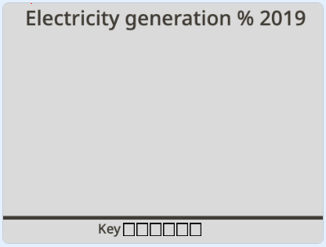
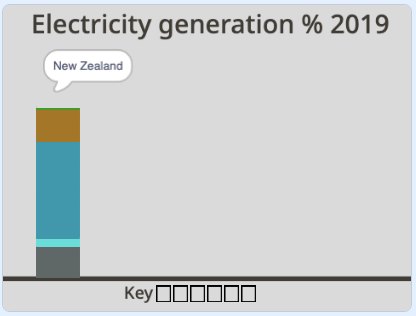
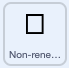
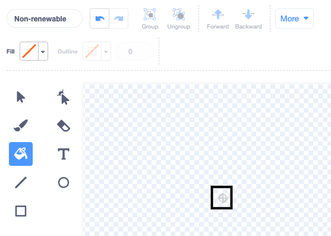
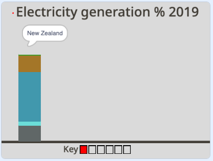
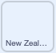
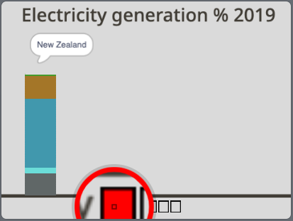
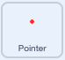
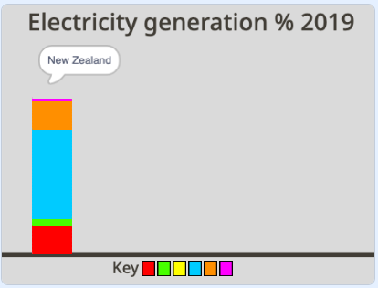

## Pick the colours

For this project, you will make an animated and interactive data visualisation. It's often easier to understand data when it is represented visually, especially when it involves lots of numbers. That's why pie charts and graphs can be so informative. They can help you compare pieces of information to one another. With computers, you can create exciting data visualisations which are animated or interactive. This project does both!

You'll create an animated and interactive data visualistation using a stacked column graph to compare the resources used by three countries to generate electricity.

--- task ---

**Online:** open the [starter project](http://rpf.io/electricity-generation-on){:target="_blank"} in Scratch.

**Offline:** open the [project starter file](http://rpf.io/p/en/electricity-generation-go){:target="_blank"} in the Scratch offline editor. If you need to, you can [download and install Scratch here](https://scratch.mit.edu/download){:target="_blank"}.

--- /task ---

You should see a background titled "Electricity generation % 2019" and, below, it a horizontal line.

{:width="400px"}

--- task ---

Run your project by clicking the green flag. An animation of a column is drawn by an invisible pen. It shows New Zealand's use of resources to generate electricity. You can then investigate the interactive column using your mouse.

{:width="400px"}

New Zealand produces a lot of their electricity using hydro power which is why there's a lot of blue in the example column graph above.

--- /task ---

At the bottom of the Stage you'll see an empty key. The key will show all the resources even if they are not currently used in the graph. This is because countries are always changing how they produce electricity and there is a move towards using more renewable resources in future. 

Choose the colours that will represent each of the resources on your graph. 

--- task ---

Click on the **Costumes** tab of the **Non-renewable** sprite. In the centre of the **Paint editor** is a square that has no fill colour. Click on the **Fill** tool and choose a colour of your choice by altering the Color, Saturation and Brightness sliders.





--- /task ---

--- task ---

Select the **Paint can** tool and click inside the square costume. You'll see on the Stage the first square in the key changes to the new colour. 



--- /task ---

You have chosen a new colour to represent non-renewable energy in the graph. Next you need to change the resource in the **New Zealand** sprite.

--- task ---

Click on the **Code** tab of the **New Zealand** sprite to view the code. Find the first `set pen color to`{:class="block3extensions"} block and `draw`{:class="block3myblocks"} `nonrenewable`{:class="block3variables"} block in the section of code where the colours of the bar graph are set. 



```blocks3

+set pen color to [#5e6766]
+draw (nonrenewable) ::custom
set pen color to [#37e4db]
draw (wind) ::custom
set pen color to [#e4d748]
draw (solar) ::custom
set pen color to [#169bb0]
draw (hydro) ::custom
set pen color to [#ab7519]
draw (geothermal) ::custom
set pen color to [#00a42c]
draw (bioenergy) ::custom

```

--- /task ---

--- task ---

Click on the coloured cirle of the first `set pen colour`{:class="block3extensions"} block and select the **Colour Picker** tool, which you will find below the three colour sliders. Move the mouse pointer until you are hovering over the **Non-renewable** sprite in the key to select that colour.

Your chosen **Non-renewable** resource colour should now be visible in the `set pen colour`{:class="block3extensions"} block:




```blocks3

set pen color to [#FF0000]
draw (nonrenewable) ::custom
```

--- /task ---

--- task ---

Run your project again. The non-renewable resource for New Zealand is now drawn in your new colour. Hover over your column and you'll notice there is no "non-renewable" speech bubble when you touch your new colour. 


--- /task ---

To create the interactive label for the non-renewable resource change the colour in the **Pointer** sprite.

--- task ---

Click on the **Pointer** sprite and find section of code when the colours are set. In the `touching color`{:class="block3sensing"} block above the `say Non-renewable`{:class="block3looks"} block, click on the circle and use the **Color picker** tool to select the new colour from the key:




```blocks3
+if {touching color (#5e6766)?} then
say [Non-renewable]
end
if {touching color (#37e4db)?} then
say [Wind]
end
if {touching color (#e4d748)?} then
say [Solar]
end
if {touching color (#169bb0)?} then
say [Hydro]
end
if {touching color (#ab7519)?} then
say [Geothermal]
end
if {touching color (#00a42c)?} then
say [Bioenergy]
end
if {touching color ()?} then
say ()
end

```


--- /task ---

--- task ---

Run your project again. The interactive label will say "Non-renewable" when you hover over the resource in your New Zealand column. 

--- /task ---

You will now choose your own colours to represent the other resources. Think about how you want the visualisation to represent the data with colour. For example, do you want each resource to be a different colour to show how they vary? Or do you want all the renewable energy resources to be different shades of one colour and the non-renewable resource to be a different colour?

--- task ---

Repeat the steps above for resource sprites: **Wind**, **Solar**, **Hydro**, **Geothermal** and **Bioenergy**. Remember to change the colour in your resource sprite first then find that resource code in the **New Zealand** sprite and **Pointer** sprite to update it there too.




--- /task ---

--- task ---

Run your project again. Check that the graph looks and interacts as you expected for all the resources. 

--- /task ---

--- save ---
