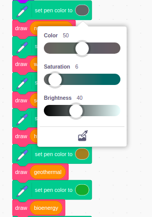

## Set up the columns

For this project you will be making an animated and interactive data visualisation. It's often easier to understand data when it is represented visually, especially when it's lots of numbers. That's why pie charts and graphs can be so informative. They help you compare pieces of information to one another. With computers, you can create exciting data visualisations which are animated or interactive. This project does both!

You'll create an animated and interactive data visualistation using a stacked column graph to compare the resources used by three countries to generate electricity.

--- task ---

**Online:** open the [starter project](http://rpf.io/electricity-generation-on){:target="_blank"} in Scratch.

**Offline:** open the [project starter file](http://rpf.io/p/en/serene-scene-go){:target="_blank"} in the Scratch offline editor. If you need to, you can [download and install Scratch here](https://scratch.mit.edu/download){:target="_blank"}.

--- /task ---

You should see a plain background titled "Electricity generation % 2019" and, below, it a horizontal line.

{:width="400px"}

--- task ---

Run your project by clicking the green flag. An animation of a column is drawn by an invisible pen. It shows New Zealand's use of resources to generate electricity. You can then investigate the interactive column using your mouse.

{:width="400px"}

New Zealand produces a lot of their electricity using hydro power which is why there's a lot of blue in the example column graph above.

--- /task ---

You are now going to choose the colours that will represent each of the resources

--- task ---

Click on **Code** the **New Zealand** sprite to view the code. Find the section of code where the colours of the bar graph are set:

```blocks3

set pen color to [#5e6766]
draw (nonrenewable)
set pen color to [#37e4db]
draw (wind)
set pen color to [#e4d748]
draw (solar)
set pen color to [#169bb0]
draw (hydro)
set pen color to [#ab7519]
draw (geothermal)
set pen color to [#00a42c]
draw (bioenergy)

```

--- /task ---

You will now choose your own colours to represent each resource. Think about how you want the visualisation to represent the data with colour. For example, do you want each resource to be a different colour to show all the distinctions? Or do you want all the renewable energy resources to be different shades of one colour and the non-renewable resource to be a different colour?

--- task ---

Go to the `set pen color to [#5e6766]`{:class="block3myblocks"} block and click on the colour for each resource, to change its colour.



--- /task ---

You are now going to create a column for the UK. To do this you will copy the **New Zealand** sprite.  

--- task ---

Click on the **New Zealand** sprite and right-click to select **duplicate**.

{:width="300px"}

--- /task ---
