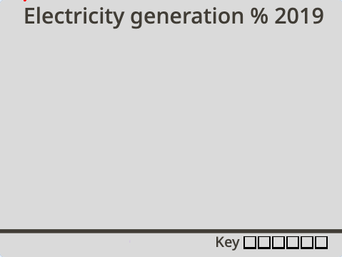

## Making a graph about the UK

For this project you will be making an animated and interactive data visualisation. It's often easier to understand data, especially lots of numbers, when they are represented visually. That why pie charts and graphs can be so informative. They also help you compare bits of information to one another. With computers, you can create exciting data visualisations which are animated or interactive. This project is both!

You'll create an animated and interactive data vsualistation, comparing electricity generated by three countries.

--- task ---

**Online:** open the [starter project](http://rpf.io/electricity-generation-on){:target="_blank"} in Scratch.
 
**Offline:** open the [project starter file](http://rpf.io/p/en/serene-scene-go){:target="_blank"} in the Scratch offline editor. If you need to, you can [download and install Scratch here](https://scratch.mit.edu/download){:target="_blank"}.

--- /task ---

You should see a plain background titled "Electricity generation % 2019" and a horizontal line.

{:width="400px"}

--- task ---

Run the project by clicking the green flag. An animation of a graph is drawn by an invisible pen showing New Zealand's use of resources used to generate electricity. You can then investigate the graph using your mouse.

{:width="400px"}

New Zealand produces a lot of their electricity using hydro power with the result that there's a lot of blue in the graph drawn by the **New Zealand** sprite.

--- /task ---

You are now going to create a graph for another country, starting with copying the **New Zealand** sprite.  

--- task ---

Click on the **New Zealand** sprite and right-click to select **duplicate**. Rename the new sprite **UK**. 

{:width="300px"}

--- /task ---

If you run the project the **UK** sprite code will appear to not run even though it is. This is because it is appearing on top of the **New Zealand** sprite in the Stage. You need to you move the position of where the **UK** sprite's graph is drawn on the Stage to be able to see it working.

--- task ---

Go to the**Code** tab of the **UK** sprite.

--- /task ---

--- task ---

Search for the `go to x: y:`{:class="block3motion"} block at the top-half of the script. It will have the values x: `-200` and y: `-140`. **Change only** the x value to `-20`:

```blocks3
go to x: (-20)y: (-140)
```
--- /task ---

--- task ---

Save your project.

--- /task ---

--- task ---

Click the green flag. You should be able to see the **UK** sprite graph now on the right-hand side.

--- /task ---

However noone won't know it's a graph about the UK because the title is still hidden behind the **New Zealand** sprite. You now need to move the position of where the title appears on the stage so you can see it.

--- task ---

Go to the **Code** tab of the **UK** sprite. At the very end of the long script find the `go to x:`{:class="block3motion"} `-200` `y:`{:class="block3motion"} `70`. **Change only** the x value to `-20`:

```blocks3
go to x: (-20)y: (70)
```

--- /task ---

--- task ---

Save your project.

--- /task ---

--- task ---

Click the green flag. You should be able to see the **UK** sprite title above the second graph. On no! It also says "New Zealand".

--- /task ---

You now need to change the text in the `say`{:class="block3looks"} block.

--- task ---

Below the `go to x:`{:class="block3motion"} `-20` `y:`{:class="block3motion"} `70`, add a `say`{:class="block3looks"} block and type in `UK`:

```blocks3
go to x: (-20)y: (70)
say (UK)
```
--- /task ---

--- task ---

Click the green flag. You should be able to see the **UK** sprite title now above the second graph. Have you saved your program?

--- /task ---

The graphs look identical because the **UK** sprite graph is still showing the energy values for the **New Zealand** sprite.

In the **Code** tab of the **UK** sprite, you will find a series of blocks which `set`{:class="block3variables"} a value for each resource variable. The value in each block represents the percentage (%) contribution of the listed resource to the overall total (100%). The `set`{:class="block3variables"} blocks currently show the data for **New Zealand**. 

In the **UK** sprite program, you need to replace the `set`{:class="block3variables"} block values with the figures given in the below table. 

Resource Type | UK |
--- | --- |
**Non-renewables** | 64 |
**Wind** | 20 |
**Solar** | 4 | 
**Hydro** | 2 |
**Geothermal** | 0 |
**Bioenergy** | 10 |

--- task ---

In the first block `set non-renewables to`{:class="block3variables"} add the value `64`. This value indicates that non-renewables represent 64% of the resources used to generate electricity in the UK.

```blocks3
set [nonrenewable v] to (64)
```
--- /task ---

--- task ---

Now complete the value for all the resources using the rest of the `set`{:class="block3variables"} blocks. Your program should now look like this:

```blocks3
set [nonrenewable v] to (64)
set [wind v] to (20)
set [solar v] to (4)
set [hydro v] to (2)
set [geothermal v] to (0)
set [bioenergy v] to (10)
```
--- /task ---

--- task ---

Check you have inputted the values correctly and, as a cross-check, add them up. Tnhey should total 100!.

--- /task ---

--- task ---

Run the program to compare what resourse the UK use to generate energy. You will notice the county UK uses less hydro and more bioenergy to generate electricity than the county New Zealand. The grey shows you how much non-renewable energy they use. How do the countries compare on the use of this resource?

--- /task ---

--- save ---
