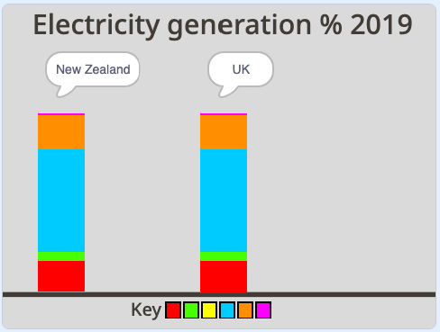

## Duplicate a second graph

For this project you will be making an animated and interactive data visualisation. It's often easier to understand data when it is represented visually, especially when it's lots of numbers. That's why pie charts and graphs can be so informative. They help you compare pieces of information to one another. With computers, you can create exciting data visualisations which are animated or interactive. This project is both!

You'll create an animated and interactive data vsualistation, comparing the resources used by three countries to generate electricity.

--- task ---

**Online:** open the [starter project](http://rpf.io/electricity-generation-on){:target="_blank"} in Scratch.
 
**Offline:** open the [project starter file](http://rpf.io/p/en/serene-scene-go){:target="_blank"} in the Scratch offline editor. If you need to, you can [download and install Scratch here](https://scratch.mit.edu/download){:target="_blank"}.

--- /task ---

You should see a plain background titled "Electricity generation % 2019" and, below, it a horizontal line.

{:width="400px"}

--- task ---

Run the project by clicking the green flag. An animation of a graph is drawn by an invisible pen showing New Zealand's use of resources used to generate electricity. You can then investigate the interactive graph using your mouse.

{:width="400px"}

New Zealand produces a lot of their electricity using hydro power which is why there's a lot of blue on the graph.

--- /task ---

You are now going to create a graph for another country. To do this you will copy the **New Zealand** sprite.  

--- task ---

Click on the **New Zealand** sprite and right-click to select **duplicate**.

{:width="300px"}

--- /task ---

--- task ---

Rename the new sprite **UK**. 

--- /task ---

If you run the program the **UK** sprite program will appear as if it's not running even though it is. This is because the **UK** sprite's drawn graph is appearing below the **New Zealand** sprite in the Stage. You will need to you move the position of where the **UK** sprite's graph starts to draw on the Stage to be able to see the **UK** sprite.

--- task ---

Go to the **Code** tab of the **UK** sprite.

--- /task ---

--- task ---

Search for the `go to x: y:`{:class="block3motion"} block at the top-half of the script. It will have the values x: `-200` and y: `-140`. Only change the x value to `-20`. The value can stay at -140.:

```blocks3
go to x: (-20)y: (-140)
```
--- /task ---

--- task ---

Save your project.

--- /task ---

--- task ---

Click the green flag. You should be able to see the **UK** sprite graph now on the right-hand side of the **New Zealand** sprite graph.

{:width="400px"}

--- /task ---

Noone will know it's a graph about the UK though because the title is still hidden behind the **New Zealand** sprite. You now need to move the position of where the title appears on the stage so you can see it.

--- task ---

Again, go to the **Code** tab of the **UK** sprite. At the very end of the long script find the `go to x:`{:class="block3motion"} `-200` `y:`{:class="block3motion"} `70`. Only change the x value to `-20`. The y value can stay at 70:

```blocks3
go to x: (-20)y: (70)
```

--- /task ---

--- task ---

Save your project.

--- /task ---

--- task ---

Click the green flag. You should be able to see the **UK** sprite title above the right-hand graph. On no! It still says "New Zealand".

{:width="400px"}

--- /task ---

You now need to change the text in the `say`{:class="block3looks"} block so that it says "UK".

--- task ---

Below the `go to x:`{:class="block3motion"} `-20` `y:`{:class="block3motion"} `70`, add a `say`{:class="block3looks"} block and type in `UK`:

```blocks3
go to x: (-20)y: (70)
say ()
```
--- /task ---

--- task ---

Click the green flag. You should be able to see the **UK** sprite title now above the right-hand graph. Have you saved your program?

{:width="400px"}

--- /task ---

--- task ---

So that the title "UK" is in the centre of the speech bubble, you can type three spaces on your keyboard and then type 'UK'.

{:width="300px"}

--- /task ---

The graphs look the same because the **UK** sprite graph is still showing the energy values for the **New Zealand** sprite.

{:width="400px"}

--- task ---

In the **Code** tab of the **UK** sprite, investigate the series of six `set`{:class="block3variables"} variable blocks which show a value for each resource variable. The value in each block represents the percentage (%) contribution of the resource to the overall total (100%). Remember the `set`{:class="block3variables"} blocks are still showing the data for **New Zealand**. 

```blocks3
set [nonrenewable v] to (18)
set [wind v] to (5)
set [solar v] to (0)
set [hydro v] to (57)
set [geothermal v] to (19)
set [bioenergy v] to (1)
```
--- /task ---

In the **UK** sprite program, you need to replace the `set`{:class="block3variables"} block values with the figures given in the below table. 

Resource Type | UK |
--- | --- |
**Non-renewables** | 64 |
**Wind** | 20 |
**Solar** | 4 | 
**Hydro** | 2 |
**Geothermal** | 0 |
**Bioenergy** | 10 |

--- task ---

In the first block `set non-renewables to`{:class="block3variables"} add the value `64`. This value indicates that non-renewables represent 64% of the resources used to generate electricity in the UK.

```blocks3
set [nonrenewable v] to (64)
```
--- /task ---

--- task ---

Now complete the value for all the resources using the rest of the `set`{:class="block3variables"} blocks. Your program should now look like this:

```blocks3
set [nonrenewable v] to (64)
set [wind v] to (20)
set [solar v] to (4)
set [hydro v] to (2)
set [geothermal v] to (0)
set [bioenergy v] to (10)
```
--- /task ---

--- task ---

Check you have inputted the values correctly? Add the values up to double-check: 64 + 20 + 4 + 2 + 0 + 10 = 100. The total always has to be 100 because the value in each block represents the percentage (%) contribution of the resource to the overall total which is 100%. 

--- /task ---

--- task ---

Run the program to compare what resourse the UK use to generate energy. You will notice the UK uses less hydro and more bioenergy to generate electricity than New Zealand. 

{:width="400px"}

The grey shows you how much non-renewable energy each country uses to generate electricity. How do the countries compare on their use of non-renewable resources?

--- /task ---

--- save ---
