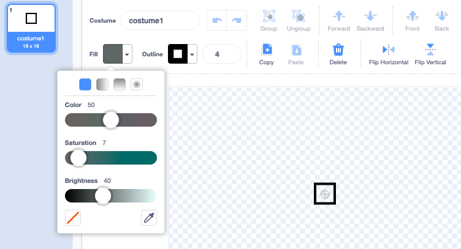
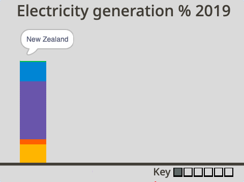
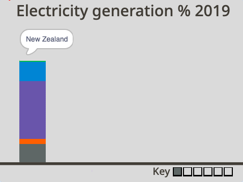

## Pick the colours

For this project, you will make an animated and interactive data visualisation. It's often easier to understand data when it is represented visually, especially when it involves lots of numbers. That's why pie charts and graphs can be so informative. They can help you compare pieces of information to one another. With computers, you can create exciting data visualisations which are animated or interactive. This project does both!

You'll use a stacked column graph to create an animated and interactive data visualistation that compares the resources used by three countries to generate electricity.

--- task ---

**Online:** open the [starter project](http://rpf.io/electricity-generation-on){:target="_blank"} in Scratch.

**Offline:** open the [project starter file](http://rpf.io/p/en/electricity-generation-go){:target="_blank"} in the Scratch offline editor. If you need to, you can [download and install Scratch here](https://scratch.mit.edu/download){:target="_blank"}.

--- /task ---

You should see a grey background with the title "Electricity generation % 2019". At the bottom of the page is a horizontal line.

{:width="400px"}

--- task ---

Run your project by clicking the green flag. An animation of a column is drawn by an invisible pen. It shows New Zealand's use of resources to generate electricity. You can then investigate the interactive column using your mouse. 

{:width="400px"}

New Zealand produces a lot of their electricity using hydropower, which is why there's a lot of purple in the column above.

Once you have investigated the column, click on the red stop button above the Stage to stop the program.  

--- /task ---

At the bottom of the Stage, you'll see an empty key with a square representing each resource: non-renewable, wind, solar, hydro, geothermal, and bioenergy. The key shows all the resources, even if they are not currently used in the graph. This is because countries are always changing how they produce electricity, and there has been a move towards renewable resources. 

Next you'll choose the colours to represent each of the resources on your graph. 

--- task ---

Click on the **Costumes** tab of the **Non-renewable** sprite. In the centre of the Paint editor, is a square that has no fill colour. Click on the **Fill** colour chooser and create a colour of your choice by altering the Color, Saturation, and Brightness sliders.




--- /task ---

--- task ---

Select the **Fill** tool (it looks like a paint can) and click inside the square costume. You'll see on the Stage the first square in the key changes to the new colour. 



--- /task ---

You have chosen a new colour to represent non-renewable energy in the graph. Next, you need to change the resource in the **New Zealand** sprite.

--- task ---

Click on the **Code** tab of the **New Zealand** sprite to view the code. Find the first `set pen color to`{:class="block3extensions"} block and `draw`{:class="block3myblocks"} `nonrenewable`{:class="block3variables"} block in the section of code where the colours of the bar graph are set. 


```blocks3

+set pen color to [#FCB711]
+draw (nonrenewable) ::custom
set pen color to [#F37021]
draw (wind) ::custom
set pen color to [#CC004C]
draw (solar) ::custom
set pen color to [#6460AA]
draw (hydro) ::custom
set pen color to [#0089D0]
draw (geothermal) ::custom
set pen color to [#0DB14B]
draw (bioenergy) ::custom

```

--- /task ---

--- task ---

Click on the coloured circle of the first `set pen colour`{:class="block3extensions"} block and select the **Colour picker** tool, which is below the three colour sliders. Move the mouse pointer until you hover over the **Non-renewable** sprite in the key to select that colour.


Your chosen **Non-renewable** resource colour should now be visible in the `set pen colour`{:class="block3extensions"} block:


```blocks3

set pen color to [#5e6766]
draw (nonrenewable) ::custom
```

--- /task ---

--- task ---

Run your project again. The non-renewable resource for New Zealand is now drawn in your new colour. Hover over your column and you'll notice there is no "non-renewable" speech bubble when you touch your new colour. Click on the red stop button above the Stage when you have finished your test.



--- /task ---

Next, create the interactive label for the non-renewable resource by changing the colour in the **Pointer** sprite.

--- task ---

Click on the **Pointer** sprite and find the section of code when the colours are set. In the `touching color`{:class="block3sensing"} block above the `say Non-renewable`{:class="block3looks"} block, click on the circle and use the **Colour picker** tool to select the new colour from the key:


```blocks3
+if {touching color (#5e6766)?} then
say [Non-renewable]
end
if {touching color (#F37021)?} then
say [Wind]
end
if {touching color (#CC004C)?} then
say [Solar]
end
if {touching color (#6460AA)?} then
say [Hydro]
end
if {touching color (#0089D0)?} then
say [Geothermal]
end
if {touching color (#0DB14B)?} then
say [Bioenergy]
end
if {touching color (#dadada)?} then
say ()
end

```


--- /task ---

--- task ---

Run your project again. The interactive label should say "Non-renewable" when you hover over the resource in your New Zealand column. Click on the red stop button above the Stage when you have finished your test.

--- /task ---

Now choose your own colours to represent the other resources. For example, do you want each resource to be a different colour to show how they vary? Or do you want all the renewable energy resources to be different shades of one colour and the non-renewable resource to be a different colour?

--- task ---

Repeat the steps above for resource sprites: **Wind**, **Solar**, **Hydro**, **Geothermal**, and **Bioenergy**. Remember to change the colour in your resource sprite first, then find that resource code in the **New Zealand** sprite and **Pointer** sprite to update it there too.


--- /task ---

--- task ---

Run your project again. Check that the graph looks and interacts as you expected for all the resources. 

--- /task ---

--- save ---
