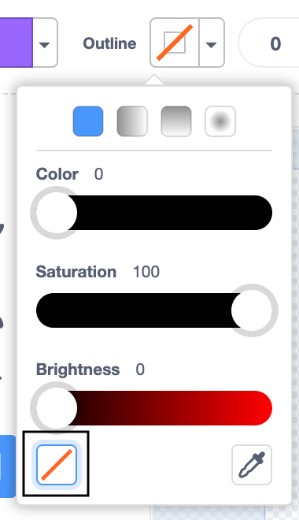
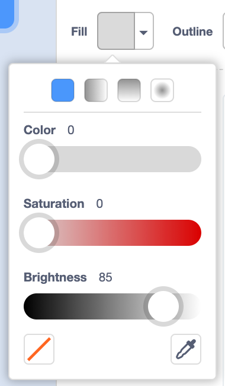
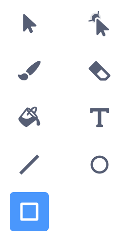
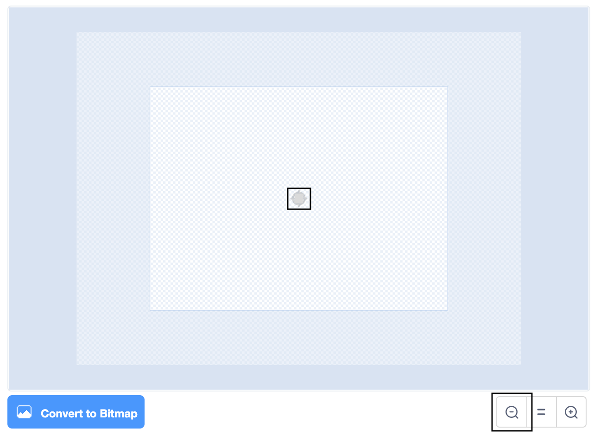

## Making a third column

In the this step you are going to start to create your own graph. 

--- task ---

Go to **Choose a Sprite** and select the **Paint** editor.

{:width="300px"}

--- /task ---

You may have noticed how the sprites seem invisible. The sprites use the `say`{:class="block3lookss"} block as a title but you cannot see the sprite itself. This is because the sprites are the same colour grey as the backdrop. You now need to create a sprite which is a grey square.

--- task ---

Go to the **Outline** tool and click the square with a red line through it to turn the **Outline** tool off.

{:width="250px"}

--- /task ---

--- task ---

Now add the following values in the **Fill** tool.

Color = 0
Saturation = 0
Brightness = 85

{:width="250px"}

--- /task ---

--- task ---

Now select the **Rectangle** tool and draw a very small square at the centre. Notice from the screen shot how small your rectangle needs to be. The grey square needs to be as small as the cross in the centre of the **Paint** editor. You may need to use the magnifying tool to change the scale so you can see the whole of the editor.

{:width="200px"}
{:width="400px"}

--- /task ---

Now that your new sprite is a grey square let's give it a name. Below is a table listing a number of countries and the percentage contribution of resources they  use to generate electricity. Choose a country to create a graph for. You could choose any country: one you are from (if it's not already represented), a neighbouring country, somewhere you've visited or what about a country which uses a large amount of one of the resource?

--- task ---

Investigate the table below and decide on which country you will now create a graph for.

Resource Type | Australia | Canada | China | India | Ireland | Norway | Singapore | S.Africa | USA |
| :---: | :---: | :---: | :---: | :---: | :---: | :---: | :---: 
**Non-renewable** | 80  | 34 | 73 | 81 | 65 | 2 | 99 | 94 | 80 |
**Wind** | 7 | 5 | 5 | 4 | 32 | 4 | 0 | 3 | 7 |
**Solar** | 6 | 1 | 3 | 3 | 0 | 0 | 1 | 1 | 2 |
**Hydro** | 6 | 58 | 17 | 11 | 4 | 93 | 0 | 2 | 7 |
**Geothermal** | 0 | 0 | 0 | 0 | 0 | 0 | 0 | 0 | 0 |
**Bioenergy** | 1 | 2 | 1 | 0 | 0 | 0 | 0 | 0 | 1 |
--- /task ---

--- task ---

Rename **Sprite1** with the name of the country you have chosen. In this resource, we will refer to this sprite as the **3rd Country** sprite.

{:width="300px"}

--- /task ---

When the program is run we want the **3rd Country** sprite to go to a position on the Stage and say its name, just like the **New Zealand** and the **UK** sprites do.

--- task ---

Go to the **Code** editor for the **3rd Country** sprite.

Add the following blocks: `when green flag clicked`{:class="block3events"}, `go to x:` `200`{:class="block3motion"} `y:`{:class="block3motion"} `70` and a `say`{:class="block3looks"} block where you will type in the name of the country you have chosen.

```blocks3
when green flag clicked
go to x: (200 )y: (70)
say  () ::looks
```

--- /task ---

--- task ---

Run your program. The sprite should be invisible and it should say its title in the top right-hand side of the Stage. The example says "3rd Country".

{:width="300px"}

Is the **3rd Country** sprite's `say`{:class="block3looks"} block in line with the speech bubbles saying "New Zealand" and the "UK"? If not, you need to go to the **3rd Country** sprite's **Costume** tab and check that the grey square costume is in the very centre of the editor (use the**magnifer** tool). Is the grey square as small as the centre cross?

--- /task ---

--- save ---
