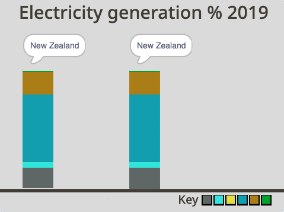
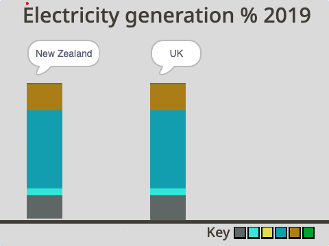

## Add a UK column

In this step, you are going to add a UK column and populate it with data so you can compare the results from New Zealand with the UK.

You are going to create a column for the UK. To do this, you will copy the **New Zealand** sprite.  

--- task ---

Click on the **New Zealand** sprite, and right-click to select **duplicate**.

{:width="300px"}

--- /task ---

--- task ---

Rename the new sprite `UK`.

--- /task ---

Run the program. You will see that the **UK** sprite program appears as if it's not running, even though it is. This is because the **UK** sprite's column is drawn underneath the **New Zealand** sprite's column on the graph. To be able to see the **UK** sprite, you need to move the position of where the **UK** sprite's column starts to draw on the Stage.

--- task ---

Go to the **Code** tab of the **UK** sprite.

--- /task ---

--- task ---

Search for the `go to x: y:`{:class="block3motion"} block at the top-half of the script. It has the values `x:`{:class="block3motion"} `-200` and `y:`{:class="block3motion"} `-140`. Only change the `x`{:class="block3motion"} value to `-20`. The `y`{:class="block3motion"} value can stay at `-140`:


```blocks3
go to x: (-20)y: (-140)
```
--- /task ---

--- task ---

Click the green flag. You should be able to see the **UK** sprite's column now on the right-hand side of the **New Zealand** sprite's column.

{:width="400px"}

--- /task ---

However, it won't be clear that it is a column about the UK, because the title is still hidden behind the **New Zealand** sprite's column. You need to move the position of where the title appears on the Stage so you can see it.

--- task ---

Again, go to the **Code** tab of the **UK** sprite. At the very end of the long script, find the `go to x:`{:class="block3motion"} `-200` `y:`{:class="block3motion"} `70` block. Only change the `x`{:class="block3motion"} value to `-20`. The `y`{:class="block3motion"} value can stay at `70`:


```blocks3
go to x: (-20)y: (70)
```

--- /task ---

--- task ---

Click the green flag. You should now be able to see the **UK** sprite title above the right-hand column. On no! It still says "New Zealand".

{:width="400px"}

--- /task ---

You need to change the text in the `say`{:class="block3looks"} block so that it says "UK".

--- task ---

Below the `go to x:`{:class="block3motion"} `-20` `y:`{:class="block3motion"} `70`, add a `say`{:class="block3looks"} block and type in `UK`. So that the title "UK" is in the centre of the speech bubble, press the space bar on your keyboard four times first and then type `UK`:


```blocks3
go to x: (-20) y: (70)
+ say [UK]
```
--- /task ---

--- task ---

Click the green flag. You should be able to see the **UK** sprite title now in the centre of the speech bubble and above the right-hand column.

{:width="300px"}

--- /task ---

The columns look the same because the **UK** sprite's column is still showing the energy values for the **New Zealand** sprite.

{:width="400px"}

--- task ---

In the **Code** tab of the **UK** sprite, investigate the series of six `set`{:class="block3variables"} variable blocks which show a value for each resource variable. The value in each block represents the percentage (%) contribution of the resource to the overall total (100%). Remember the `set`{:class="block3variables"} blocks are still showing the data for **New Zealand**:


```blocks3
set [nonrenewable v] to (18)
set [wind v] to (5)
set [solar v] to (0)
set [hydro v] to (57)
set [geothermal v] to (19)
set [bioenergy v] to (1)
```
--- /task ---

In the **UK** sprite program, you need to replace the `set`{:class="block3variables"} block values with the figures given in the table below.


Resource Type | UK |
- | - |
**Non-renewables** | 64 |
**Wind** | 20 |
**Solar** | 4 |
**Hydro** | 2 |
**Geothermal** | 0 |
**Bioenergy** | 10 |

<br/><br/>

--- task ---

In the first block `set non-renewables to`{:class="block3variables"}, add the value `64`. This value indicates that non-renewables represent 64 percent of the resources used to generate electricity in the UK:


```blocks3
set [nonrenewable v] to (64)
```
--- /task ---

--- task ---

Refer to the table above to complete the values for all the resources using the rest of the `set`{:class="block3variables"} blocks. Your program should now look like this:


```blocks3
set [nonrenewable v] to (64)
set [wind v] to (20)
set [solar v] to (4)
set [hydro v] to (2)
set [geothermal v] to (0)
set [bioenergy v] to (10)
```
--- /task ---

--- task ---

Check you have inputted the values correctly. Add the values up to double-check: 64 + 20 + 4 + 2 + 0 + 10 = 100. The total always has to be 100 because the value in each block represents the percentage (%) contribution of the resource to the overall total, which is 100 percent.

--- /task ---

--- task ---

Run the program to compare what resources New Zealand and the UK use to generate energy. You may notice the UK uses more bioenergy than New Zealand. You may also notice that New Zealand uses far more hydropower than the UK to generate electricity.

{:width="400px"}

Investigate how much non-renewable energy each country uses to generate electricity. How do the countries compare on their use of non-renewable resources?

--- /task ---

--- save ---
