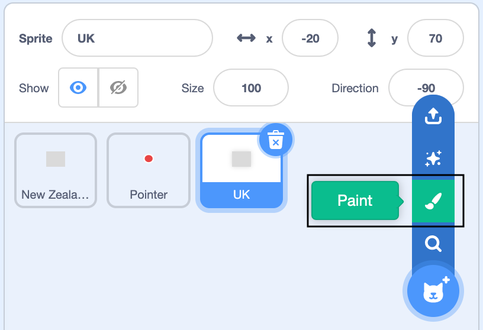
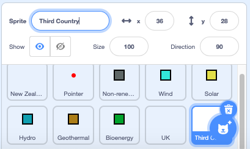

## Choose a third country

In this step you are going to start to create your own column.

You may have noticed how the country sprites do not have a graphic. This is because when the sprites moves in the program you only need to see their related actions of the `Pen`{:class="block3extensions"} and the speech bubble and not the sprite itself.

You now need to create a new sprite with no costume.

--- task ---

Go to **Choose a Sprite** and select the **Paint** editor.

{:width="300px"}

--- /task ---

Now give your new sprite a name. Below is a table listing a number of countries and the percentage contribution of resources they use to generate electricity. Choose any one of the listed countries. It could be one you are from (if it's not already represented), a neighbouring country, somewhere you've visited or even a country which uses a large amount of one of the resources?

--- task ---

Investigate the table below and decide on which country you will now create a graph for.

Resource Type | Brazil | Canada | Iceland | India | Ireland | Norway | Singapore | S.Africa | USA |
| --- | :---: | :---: | :---: | :---: | :---: | :---: | :---: | :---: | :---: |
**Non-renewable** | 18 | 34 | 0 | 81 | 64 | 2 | 99 | 94 | 83 |
**Wind** | 9 | 5 | 0 | 5 | 32 | 4 | 0 | 3 | 7 |
**Solar** | 1 | 1 | 0 | 3 | 0 | 0 | 1 | 1 | 2 |
**Hydro** | 63 | 58 | 70 | 11 | 4 | 94 | 0 | 2 | 7 |
**Geothermal** | 0 | 0 | 30 | 0 | 0 | 0 | 0 | 0 | 0 |
**Bioenergy** | 9 | 2 | 0 | 0 | 0 | 0 | 0 | 0 | 1 |
--- /task ---

--- task ---

Rename **Sprite1** with the name of the country you have chosen. In this resource, we will refer to this sprite as the **3rd Country** sprite.

{:width="300px"}

--- /task ---

When the program is run we want the **3rd Country** sprite to go to a position on the Stage and, using a speech bubble, say its name, just like the **New Zealand** and the **UK** sprites do.

--- task ---

Go to the **Code** editor for the **3rd Country** sprite.

Add the following blocks: `when green flag clicked`{:class="block3events"}, `go to x:` `200`{:class="block3motion"} `y:`{:class="block3motion"} `70` and a `say`{:class="block3looks"} block where you will type in the name of the country you have chosen.

```blocks3
when green flag clicked
go to x: (200 )y: (70)
say () ::looks
```

--- /task ---

--- task ---

Run your program. The sprite should be invisible and it should say its title in the top right-hand side of the Stage. The example says "3rd Country".

{:width="300px"}

--- /task ---

--- save ---
