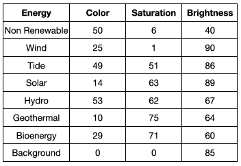

## Build a pen

In this step, you will learn how to use the Pen extension blocks to draw on the Stage. 

--- task ---

Click on the Code tab for your **3rd Country** sprite, and then click the **Add Extension** button in the bottom left-hand corner of the screen.

Select the **Pen** extension.


--- /task ---

Move your pen to the correct starting position.

--- task ---

Underneath your `when flag clicked`{:class="block3events"} block add three Motion blocks. Add a `go to x: y:`{:class="block3motion"} block changing the values to x: `120` and y: `-140`. Add a `set rotation style`{:class="block3motion"} block, selecting **don't rotate** from the drop down, and a `point in direction 90`{:class="block3motion"} block. 

```blocks3
when flag clicked
+ go to x:(120) y: (-140)
+ set rotation style [don't rotate v]
+ point in direction (90)
go to x: (160) y: (70)
say [3rd Country]
```

--- /task ---

Prepare the pen and set its size. 

--- task ---

Add a `set pen size to 1`{:class="block3extensions"} block changing the value to `2` so it is slightly thicker. Insert a `pen down`{:class="block3extensions"} block to get ready to draw. 

```blocks3
when flag clicked
go to x:(120) y: (-140)
set rotation style [don't rotate v]
point in direction (90)
+set pen size to (2)
+pen down
go to x: (160) y: (70)
say [3rd Country]
```

--- /task ---

--- task ---

Test your project. The pen will draw as the **3rd Country** sprite moves into place. 


--- /task ---

Reset the stage and move to the starting position without drawing a line everytime you begin your program. 

--- task ---

Add an `erase all`{:class="block3extensions"} block and a `pen up`{:class="block3extensions"} block at the top of your code underneath `when flag clicked`{:class="block3events"}

```blocks3
when flag clicked
+ erase all
+ pen up
go to x:(120) y: (-140)
set rotation style [don't rotate v]
point in direction (90)
set pen size to (2)
pen down
go to x: (160) y: (70)
say [3rd Country]
```

--- /task ---

The pen colour will change as it draws each electricity category, set the colours to match those used for the example countries. After the pen has finished drawing the categories it will turn to the colour of te background.

--- task ---

Add eight `set pen colour to`{:class="block3extensions"} blocks into your code. These will represent the seven categories plus an additional colour to represent the background. 

Change the colours of each block in turn to represent a different colour, the values are in the table below and you can look back to making the grey square on the last step if you need more help about how to change them. 



```blocks3
when flag clicked
pen up
go to x:(120) y: (-140)
set rotation style [don't rotate v]
point in direction (90)
set pen size to (2)
pen down
+ set pen color to [#5e6766]
+ set pen color to [#e4e7e2]
+ set pen color to [#37e4db]
+ set pen color to [#e4d748]
+ set pen color to [#169bb0]
+ set pen color to [#ab7519]
+ set pen color to [#00a42c]
+ set pen color to [#dadada]
go to x: (160) y: (70)
say [3rd Country]
```

--- /task ---

Lift the pen when the column has finished drawing.

--- task ---

Add a `pen up`{:class="block3extensions"} block to your code.

```blocks3
when flag clicked
pen up
go to x:(120) y: (-140)
set rotation style [don't rotate v]
point in direction (90)
set pen size to (2)
pen down
set pen color to [#5e6766]
set pen color to [#e4e7e2]
set pen color to [#37e4db]
set pen color to [#e4d748]
set pen color to [#169bb0]
set pen color to [#ab7519]
set pen color to [#00a42c]
set pen color to [#dadada]
+pen up
go to x: (160) y: (70)
say [3rd Country]
```

--- /task ---

--- task ---

Test your project by clicking on the green flag. Though the **3rd Country** sprite is set up it doesn't draw a graph as we haven't yet told it how to move or by what amount. 

--- /task ---
