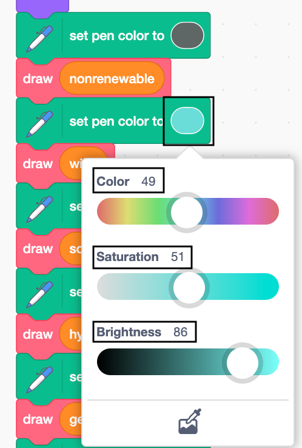

## Build a pen

In this step, you will learn how to use the `Pen`{:class="block3extensions"} extension blocks to draw on the Stage.

--- task ---

Click on the **Code** tab for your **3rd Country** sprite, and then click the `Pen`{:class="block3extensions"} extension block (in the bottom left-hand corner of the screen).

{:width="400px"}

--- /task ---

Move your pen to the correct starting position.

--- task ---

Underneath your `when flag clicked`{:class="block3events"} block add three `Motion`{:class="block3motion"} blocks. Add a `go to x: y:`{:class="block3motion"} block and change the values to x: `120` and y: `-140`. Add a `set rotation style`{:class="block3motion"} block, selecting `don't rotate`{:class="block3motion"} from the drop down, and a `point in direction 90`{:class="block3motion"} block.

```blocks3
when flag clicked
+ go to x:(120) y: (-140)
+ set rotation style [don't rotate v]
+ point in direction (90)
go to x: (160) y: (70)
say [3rd Country]
```

--- /task ---

Prepare the pen and set its size.

--- task ---

Add a `set pen size to 1`{:class="block3extensions"} block changing the value to `2` so the pen is slightly thicker. Insert a `pen down`{:class="block3extensions"} block to get ready to draw.

```blocks3
when flag clicked
go to x:(120) y: (-140)
set rotation style [don't rotate v]
point in direction (90)
+set pen size to (2)
+pen down
go to x: (160) y: (70)
say [3rd Country]
```

--- /task ---

You need to make sure that the program clears the pen marks from the stage and lifts the pen up `when flag clicked`{:class="block3events"}.

--- task ---

Add an `erase all`{:class="block3extensions"} block and a `pen up`{:class="block3extensions"} block at the top of your code underneath `when flag clicked`{:class="block3events"}

```blocks3
when flag clicked
+ erase all
+ pen up
go to x:(120) y: (-140)
set rotation style [don't rotate v]
point in direction (90)
set pen size to (2)
pen down
go to x: (160) y: (70)
say [3rd Country]
```

--- /task ---

The pen colour will change as it draws each resource. In order to compare the resources generated across multiple countries, the colour representing each resource needs to match. After the pen has finished drawing the categories it will turn to the colour of the backdrop i.e. grey.

--- task ---

Add seven `set pen colour to`{:class="block3extensions"} blocks into your code. These will represent the six categories plus an additional colour to represent the background.

```blocks3
when flag clicked
pen up
go to x:(120) y: (-140)
set rotation style [don't rotate v]
point in direction (90)
set pen size to (2)
pen down
+ set pen color to []
+ set pen color to []
+ set pen color to []
+ set pen color to []
+ set pen color to []
+ set pen color to []
+ set pen color to []
go to x: (160) y: (70)
say [3rd Country]
```

--- /task ---

You now need to change the colours of each block in turn to represent the different colours you have chosen to represent the resources. 

--- task ---

Do the colours for the `set pen colour to`{:class="block3extensions"} blocks in turn so you don't get the order of the resource colours muddled up. You will need to use both of these methods: **eye dropper** AND **Color**, **Saturation** and **Brightness** values for the resources. 

**eye dropper**:
Click on the first `set pen colour to`{:class="block3extensions"} block that you have created. 

With the **eye dropper** go to the related resource colour in either of the **New Zealand** or **UK** sprites columns on the Stage. Click. The **eye dropper** will pick up the related colour and added it to  the `set pen colour to`{:class="block3extensions"} block which will now show the correct colour for that resource. 

**Color**, **Saturation** and **Brightness** value:
Some of the resources are not represented in the columns. That's because countries tend not to use all the resources available to them to generate their electricity. Take the three values of the missing resource colours from the **New Zealand** sprite by going to its **Code** tab. Click on the related `set pen colour to`{:class="block3extensions"} block to find out the **Color**, **Saturation** and **Brightness** of the colour.

You may need to write the values of the  **Color**, **Saturation** and **Brightness** on a piece of pen and paper! Now go to the **3rd Country** sprite to type in the correct values in the relevant set pen colour to block.

{:width="400px"}

Using the methods above, complete each colour in turn.

Don't forget to use the backdrop colour for the seventh `set pen colour to`{:class="block3extensions"} block.

--- /task ---

--- task ---


--- /task ---

Lift the pen when the column has finished drawing.

--- task ---

Add a `pen up`{:class="block3extensions"} block to your code.

```blocks3
when flag clicked
pen up
go to x:(120) y: (-140)
set rotation style [don't rotate v]
point in direction (90)
set pen size to (2)
pen down
set pen color to [#5e6766]
set pen color to [#37e4db]
set pen color to [#e4d748]
set pen color to [#169bb0]
set pen color to [#ab7519]
set pen color to [#00a42c]
set pen color to [#dadada]
+pen up
go to x: (160) y: (70)
say [3rd Country]
```

--- /task ---

--- task ---

You cannot usefully check your code. Although the **3rd Country** sprite is set up it doesn't draw a graph as you haven't inputted any resource data yet.

--- /task ---

--- save ---
