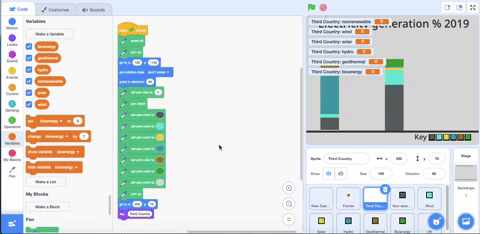

## Create the resource variables

In this step, you are going to create new resource variables for the **3rd Country** sprite. You will add values to the variables, and then use those values to draw the column for the **3rd Country** sprite. You need to use local variables so that if you update the value for one sprite, it does not change it for the others.

First, you will create a variable for non-renewable resources.

--- task ---

Create a new variable by clicking on the `Variables`{:class="block3variables"} blocks menu.

Then click on the **Make a Variable** button.

--- /task ---

You need a title for the variable. To create a variable that contains a value specific to your chosen country, you also need to make sure that the variable is created for this sprite only. Even though the other sprites also have a variable titled `nonrenewable`{:class="block3variables"}, each variable holds a different value. The **3rd Country** nonrenewable variable will hold its own unique value for that resource related to your chosen country.

--- task ---

Title this variable `nonrenewable`.

**Important**: Click **For this sprite only**.

Then click **OK**. 

{:width="400px"}

--- /task ---

Create the remaining resource variables.

--- task ---

Create new variables in the same way. Remember to select **For this sprite only** for each new variable:
+ `wind`{:class="block3variables"}
+ `solar`{:class="block3variables"}
+ `hydro`{:class="block3variables"}
+ `geothermal`{:class="block3variables"}
+ `bioenergy`{:class="block3variables"}

--- /task ---

Hide the variables from view.

--- task ---

All the new energy variables are listed in the **Variables** menu. They are also automatically shown on the Stage, but you don't need them shown there for this project.

Click on the tickboxes next to each variable to hide them from view.

--- no-print ---



--- /no-print ---

--- /task ---

Now you can input the resources data for your chosen country. Below is the table to help you identify the values.

Resource Type | Brazil | Canada | Iceland | India | Ireland | Norway | Singapore | S.Africa | USA |
| --- | :---: | :---: | :---: | :---: | :---: | :---: | :---: | :---: | :---: |
**Non-renewable** | 18 | 34 | 0 | 81 | 64 | 2 | 99 | 94 | 83 |
**Wind** | 9 | 5 | 0 | 5 | 32 | 4 | 0 | 3 | 7 |
**Solar** | 1 | 1 | 0 | 3 | 0 | 0 | 1 | 1 | 2 |
**Hydro** | 63 | 58 | 70 | 11 | 4 | 94 | 0 | 2 | 7 |
**Geothermal** | 0 | 0 | 30 | 0 | 0 | 0 | 0 | 0 | 0 |
**Bioenergy** | 9 | 2 | 0 | 0 | 0 | 0 | 0 | 0 | 1 |

--- task ---

Add in six `set my variable to`{:class="block3variables"} blocks, one for each type of resource. The below code uses South Africa as example data for the **3rd Country** sprite, but you'll input figures for your chosen country.

```blocks3
when flag clicked
erase all
+set (nonrenewable) to (94)
+set (wind) to (3)
+set (solar) to (1)
+set (hydro) to (2)
+set (geothermal) to (0)
+set (bioenergy) to (0)
pen up
go to x:(120) y: (-140)
set rotation style [don't rotate v]
point in direction (90)
set pen size to (2)
pen down
set pen color to [#5e6766]
set pen color to [#37e4db]
set pen color to [#e4d748]
set pen color to [#169bb0]
set pen color to [#ab7519]
set pen color to [#00a42c]
set pen color to [#dadada]
pen up
go to x: (160) y: (70)
say [3rd Country]
```

--- /task ---

--- task ---

Double-check that the values for the resources add up to 100.

--- /task ---

--- save ---
