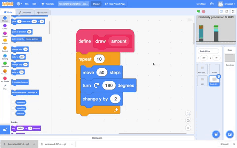

## Draw the third column

Now it's time to use the resource variables that you created in the previous step to draw the column for the **Third Country** sprite.

In Scratch, you can make a block that starts a new script and can add any Scratch blocks into this new script. You can then reuse the script elsewhere in your program.

--- task ---

Go to the `My Blocks`{:class="block3myblocks"} menu and click on **Make a Block**. Call the block name `draw` and click on **Add an input number or text**. Change the value `number or text` to `amount`, then click **OK**.

--- no-print ---


--- /no-print ---

You'll see a new `define`{:class="block3myblocks"} block has been created in the Code area of the **Third Country** sprite:

```blocks3
define draw (amount)
```

--- /task ---

To create the first line in the column, move the **Third Country** sprite with the pen down, then turn it round, and move up the Stage slightly.

--- task ---

Add three `Motion`{:class="block3motion"} blocks to your new `draw`{:class="block3extensions"} block: `move`{:class="block3motion"} `50` `steps`{:class="block3motion"}, `turn right`{:class="block3motion"} `180` `degrees`{:class="block3motion"}, and `change y by`{:class="block3motion"} `2`:

```blocks3
define draw (amount)
+move (50) steps
+turn right (180) degrees
+change y by (2)
```

--- /task ---

Use your newly defined `draw`{:class="block3myblocks"} block to draw the correct number of lines for each resource.

--- task ---

From the `My Blocks`{:class="block3myblocks"} menu, insert a `draw`{:class="block3myblocks"} block after each of the `set pen color to`{:class="block3extensions"} blocks. Drag each variable across to the `draw`{:class="block3myblocks"} blocks in the following order:
+ `nonrenewable`{:class="block3variables"}
+ `wind`{:class="block3variables"}
+ `solar`{:class="block3variables"}
+ `hydro`{:class="block3variables"}
+ `geothermal`{:class="block3variables"}
+ `bioenergy`{:class="block3variables"}. 

In the last remaining `draw`{:class="block3myblocks"} block, type the value `1`. This adds a line that is the same colour as the backdrop, to clean up the end of the column:

```blocks3
when flag clicked
erase all
set (nonrenewable) to (17)
set (wind) to (17)
set (solar) to (17)
set (hydro) to (17)
set (geothermal) to (17)
set (bioenergy) to (15)
pen up
go to x:(120) y: (-140)
set rotation style [don't rotate v]
point in direction (90)
set pen size to (2)
pen down
set pen color to [#5e6766]
+draw (nonrenewable)
set pen color to [#37e4db]
+draw (wind)
set pen color to [#e4d748]
+draw (solar)
set pen color to [#169bb0]
+draw (hydro)
set pen color to [#ab7519]
+draw (geothermal)
set pen color to [#00a42c]
+draw (bioenergy)
set pen color to [#dadada]
+draw (1)
pen up
go to x: (160) y: (70)
say [Third Country]
```

--- /task ---

--- task ---

Run your program. In the **Third Country** sprite, you should see that the pen draws just one thin line for each resource. To make the pen draw the correct amount for each resource, you need to set the `repeat`{:class="block3control"} to the amount of each resource type.

--- /task ---

Your `draw`{:class="block3myblocks"} blocks are set up to store the amount of electricity for each resource, but the code you defined still only runs once (each time it appears in your script). Use the stored `amount`{:class="block3myblocks"} to control how many times the `draw`{:class="block3myblocks"} block repeats itself.  

--- task ---

Add a `repeat`{:class="block3control"} block underneath the `define`{:class="block3myblocks"} block. Drag the rounded block `amount`{:class="block3myblocks"} from the `define`{:class="block3myblocks"} block into the `repeat`{:class="block3control"} block:

--- no-print ---



--- /no-print ---

```blocks3
define draw (amount)
+repeat (amount)
move (50) steps
turn right (180) degrees
change y by (2)
end
```

--- /task ---

--- task ---

Test your project. The column for the **Third Country** sprite should now be complete, and show the values you have chosen. When you hover over each resource, the label should appear.

--- /task ---

--- save ---
