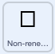

## रंग चुनें

इस प्रोजेक्ट के लिए, आप एक एनिमेटेड और इंटरैक्टिव डेटा विज़ुअलाइज़ेशन बनाएंगे। जब डेटा को दृष्टिगत रूप से दर्शाया जाता है, तो इसे समझना अक्सर आसान होता है, खासकर जब इसमें बहुत सारी संख्याएँ शामिल हों। इसलिए पाई चार्ट और ग्राफ़ इतने जानकारीपूर्ण हो सकते हैं। वे जानकारी के टुकड़ों की एक दूसरे से तुलना करने में आपकी सहायता कर सकते हैं। कंप्यूटर के साथ, आप रोमांचक डेटा विज़ुअलाइज़ेशन बना सकते हैं जो एनिमेटेड या इंटरैक्टिव हैं। यह प्रोजेक्ट दोनों करता है!

आप एक एनिमेटेड और इंटरैक्टिव डेटा विज़ुअलाइज़ेशन बनाने के लिए स्टैक्ड कॉलम ग्राफ़ का उपयोग करेंगे जो बिजली उत्पन्न करने के लिए तीन देशों द्वारा उपयोग किए गए संसाधनों की तुलना करता है।

--- task ---

**ऑनलाइन**: Scratch में [स्टार्टर प्रोजेक्ट](http://rpf.io/electricity-generation-on){:target="_blank"} खोलें।

**ऑफ़लाइन:** Scratch के ऑफ़लाइन संपादक में [प्रोजेक्ट स्टार्टर फ़ाइल](http://rpf.io/p/hi-IN/electricity-generation-go){:target="_blank"} खोलें। यदि आपको ज़रूरत है तो, आप [यहां Scratch डाउनलोड और इंस्टॉल ](https://scratch.mit.edu/download){:target="_blank"} कर सकते हैं

--- /task ---

आपको "इलेक्ट्रिसिटी जनरेशन % 2019" शीर्षक के साथ एक ग्रे पृष्ठभूमि दिखाई देनी चाहिए। पृष्ठ के निचले भाग में एक क्षैतिज रेखा है।

{:width="400px"}

--- task ---

हरी झंडी पर क्लिक करके अपना प्रोजेक्ट चलाएँ। एक कॉलम का एनिमेशन एक अदृश्य पेन द्वारा खींचा जाता है। यह बिजली पैदा करने के लिए न्यूजीलैंड के संसाधनों के उपयोग को दर्शाता है। फिर आप अपने माउस का उपयोग करके इंटरेक्टिव कॉलम की जांच कर सकते हैं।

{:width="400px"}

न्यूजीलैंड जलविद्युत का उपयोग करके अपनी बहुत सारी बिजली का उत्पादन करता है, यही कारण है कि ऊपर के कॉलम में बहुत अधिक बैंगनी रंग है।

एक बार जब आप कॉलम की जांच कर लेते हैं, तो प्रोग्राम को रोकने के लिए मंच के ऊपर लाल स्टॉप बटन पर क्लिक करें।

--- /task ---

Stage के निचले भाग में, आपको प्रत्येक संसाधन का प्रतिनिधित्व करने वाले वर्ग के साथ एक खाली कुंजी दिखाई देगी: गैर-नवीकरणीय, पवन, सौर, हाइड्रो, भूतापीय और बायोएनेर्जी। कुंजी सभी संसाधनों को दिखाती है, भले ही वे वर्तमान में ग्राफ़ में उपयोग न किए गए हों। ऐसा इसलिए है क्योंकि देश अपने बिजली उप्तादन के तरीकों को हमेशा बदलते रहते हैं, और अक्षय संसाधनों की ओर एक कदम बढ़ा है।

इसके बाद आप अपने ग्राफ़ पर प्रत्येक संसाधन का प्रतिनिधित्व करने के लिए रंग चुनेंगे।

--- task ---

**Non-renewable** स्प्राइट के **Costumes** टैब पर क्लिक करें। Paint एडिटर के केंद्र में, एक वर्ग है जिसमें कोई रंग नहीं है। **Fill** रंग चयनकर्ता पर क्लिक करें और Color, Saturation और Brightness स्लाइडर को बदलकर अपनी पसंद का रंग बनाएं।




--- /task ---

--- task ---

**Fill** टूल चुनें (यह पेंट कैन जैसा दिखता है) और चौकोर पोशाक के अंदर क्लिक करें। आप Stage पर नए रंग के मुख्य परिवर्तनों में पहला वर्ग देखेंगे।


--- /task ---

आपने ग्राफ़ में गैर-नवीकरणीय ऊर्जा का प्रतिनिधित्व करने के लिए एक नया रंग चुना है। इसके बाद आपको **New Zealand** स्प्राइट में संसाधन बदलने की ज़रुरत है।

--- task ---

कोड देखने के लिए **New Zealand** स्प्राइट के **Code** टैब पर क्लिक करें। कोड के जिस भाग में बार ग्राफ के कलर सेट किए गये हैं उसमे `set pen color to`{:class="block3extensions"} ब्लॉक खोजें और `draw`{:class="block3myblocks"} `nonrenewable`{:class="block3variables"}।


```blocks3

+set pen color to [#FCB711]
+draw (nonrenewable) ::custom
set pen color to [#F37021]
draw (wind) ::custom
set pen color to [#CC004C]
draw (solar) ::custom
set pen color to [#6460AA]
draw (hydro) ::custom
set pen color to [#0089D0]
draw (geothermal) ::custom
set pen color to [#0DB14B]
draw (bioenergy) ::custom

```

--- /task ---

--- task ---

`set pen colour`{:class="block3extensions"} ब्लॉक के रंगीन सर्कल पर क्लिक करें और **Colour picker** टूल चुनें, जो तीन कलर स्लाइडर के नीचे है। माउस पॉइंटर को तब तक हिलाएं जब तक कि आप उस रंग का चयन करने के लिए कुंजी में **Non-renewable** स्प्राइट के आस पास पहुंच जाएँ ।


आपका चुना हुआ **Non-renewable** संसाधन रंग अब `set pen colour`{:class="block3extensions"} ब्लॉक में दिखाई देना चाहिए:


```blocks3

set pen color to [#5e6766]
draw (nonrenewable) ::custom
```

--- /task ---

--- task ---

अपना प्रोजेक्ट फिर से चलाएँ। न्यूजीलैंड के लिए गैर-नवीकरणीय संसाधन अब आपके नए रंग में आ गया है। अपने कॉलम पर होवर करें और जब आप अपने नए रंग को स्पर्श करेंगे तो आप देखेंगे कि कोई "गैर-नवीकरणीय" स्पीच बबल नहीं है। जब आप अपनी परिक्षण समाप्त कर लें तो Stage के ऊपर लाल स्टॉप बटन पर क्लिक करें।


--- /task ---

इसके बाद **Pointer** स्प्राइट में रंग बदलकर गैर-नवीकरणीय संसाधन के लिए इंटरैक्टिव लेबल बनाएं।

--- task ---

**Pointer** स्प्राइट पर क्लिक करें और रंग सेट होने पर कोड का सेक्शन ढूंढें। `say Non-renewable`{:class="block3looks"} ब्लॉक के ऊपर `touching color`{:class="block3sensing"} ब्लॉक में, गोले पर और नया कलर चुनने के लिए कुंजी से **Colour picker** का उपयोग करें:


```blocks3
+if {touching color (#5e6766)?} then
say [Non-renewable]
end
if {touching color (#F37021)?} then
say [Wind]
end
if {touching color (#CC004C)?} then
say [Solar]
end
if {touching color (#6460AA)?} then
say [Hydro]
end
if {touching color (#0089D0)?} then
say [Geothermal]
end
if {touching color (#0DB14B)?} then
say [Bioenergy]
end
if {touching color (#dadada)?} then
say ()
end

```


--- /task ---

--- task ---

अपना प्रोजेक्ट फिर से चलाएँ। जब आप अपने न्यूज़ीलैंड कॉलम में संसाधन पर होवर करते हैं तो इंटरैक्टिव लेबल में "Non-renewable" लिखा होना चाहिए। जब आप अपनी परिक्षण समाप्त कर लें तो Stage के ऊपर लाल स्टॉप बटन पर क्लिक करें।

--- /task ---

अब अन्य संसाधनों का प्रतिनिधित्व करने के लिए अपने स्वयं के रंग चुनें। उदाहरण के लिए, क्या आप चाहते हैं कि प्रत्येक संसाधन एक अलग रंग का हो, यह दिखाने के लिए कि वे कैसे भिन्न हैं? या क्या आप चाहते हैं कि सभी अक्षय ऊर्जा संसाधन एक रंग के अलग-अलग रंग हों और गैर-नवीकरणीय संसाधन एक अलग रंग के हों?

--- task ---

संसाधन स्प्राइट के लिए उपरोक्त चरणों को दोहराएं: **Wind**, **Solar**, **Hydro**, **Geothermal**, और **Bioenergy**। पहले अपने संसाधन स्प्राइट में रंग बदलना याद रखें, फिर उस संसाधन कोड को **New Zealand** स्प्राइट और **Pointer** स्प्राइट में भी अपडेट करने के लिए ढूंढें।


--- /task ---

--- task ---

अपना प्रोजेक्ट फिर से चलाएँ। जांचें कि ग्राफ़ सभी संसाधनों के लिए आपकी अपेक्षा के अनुरूप दिखता है और इंटरैक्ट करता है।

--- /task ---

--- save ---
