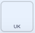
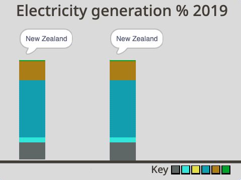
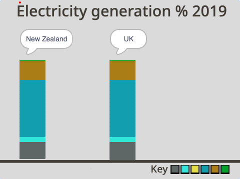

## UK कॉलम जोड़ें

इस चरण में, आप एक UK कॉलम जोड़ने जा रहे हैं और इसे डेटा से भरने जा रहे हैं ताकि आप यूके के साथ न्यूजीलैंड के परिणामों की तुलना कर सकें।

आप UK के लिए एक कॉलम बनाने जा रहे हैं। ऐसा करने के लिए, आप **New Zealand** स्प्राइट को कॉपी करेंगे।

--- task ---

**New Zealand** स्प्राइट पर क्लिक करें और **duplicate** चुनने के लिए राइट-क्लिक करें।

{:width="300px"}

--- /task ---

--- task ---

नए स्प्राइट का नाम <`UK` में बदलें।

--- /task ---

प्रोग्राम चलाएँ। आप देखेंगे कि **UK** स्प्राइट प्रोग्राम ऐसा प्रतीत होता है जैसे कि यह नहीं चल रहा है, यद्यपि वह चल रहा है। ऐसा इसलिए है क्योंकि **UK** **New Zealand** स्प्राइट के कॉलम के नीचे बनाया गया है। **UK** स्प्राइट को देखने में सक्षम होने के लिए, आपको उस स्थिति को स्थानांतरित करने की आवश्यकता है जहां **UK** स्प्राइट का कॉलम मंच पर बनना शुरू होता है।

--- task ---

**Code** स्प्राइट के **Code** टैब पर जाएं।

--- /task ---

--- task ---

स्क्रिप्ट के ऊपरी आधे भाग में `go to x: y:`{:class="block3motion"} ब्लॉक खोजें। इसमें मान `x:`{:class="block3motion"} `-200` और `y:`{:class="block3motion"} `-140` हैं । केवल `x`{:class="block3motion"} मान को `-20` में बदलें। `y`{:class="block3motion"} का मान `-140`पर रह सकता है:



```blocks3
go to x: (-20)y: (-140)
```

--- /task ---

--- task ---

हरे झंडे पर क्लिक करें । आपको अब **New Zealand** स्प्राइट के कॉलम के दाईं ओर **UK** स्प्राइट का कॉलम दिखना चाहिए।

{:width="400px"}

--- /task ---

हालांकि, यह स्पष्ट नहीं होगा कि यह UK के बारे में एक कॉलम है, क्योंकि शीर्षक अभी भी **New Zealand** स्प्राइट के कॉलम के पीछे छिपा हुआ है। आपको उस स्थान को स्थानांतरित करने की आवश्यकता है जहां शीर्षक Stage पर दिखाई देता है ताकि आप इसे देख सकें।

--- task ---

दोबारा, **UK** स्प्राइट के **कोड** टैब पर जाएं। लंबी स्क्रिप्ट के बिल्कुल अंत में, `go to x:`{:class="block3motion"} `-200` `y:`{:class="block3motion"} `70` ब्लॉक खोजें। केवल `x`{:class="block3motion"} मान को `-20` बदलें। `y`{:class="block3motion"} मान `70` पर रह सकता है:


```blocks3
go to x: (-20)y: (70)
```

--- /task ---

--- task ---

हरे झंडे पर क्लिक करें । अब आप दाहिने हाथ के कॉलम के ऊपर **UK** स्प्राइट शीर्षक दिखना चाहिए। ओह, नहीं! यह अभी भी " "New Zealand" कहता है।

{:width="400px"}

--- /task ---

`say`{:class="block3looks"} ब्लॉक में टेक्स्ट को बदलना होगा ताकि वह "UK" कहे।

--- task ---

`go to x:`{:class="block3motion"} `-20` `y:`{:class="block3motion"} `70` कोड के नीचे, एक `say`{:class="block3looks"} ब्लॉक जोड़ें और `UK` टाइप करें। ताकि "UK" शीर्षक स्पीच बबल के केंद्र में हो, अपने कीबोर्ड पर स्पेस बार को पहले चार बार दबाएं और फिर `UK`टाइप करें:


```blocks3
go to x: (-20) y: (70)
+ say [UK]
```
--- /task ---

--- task ---

हरे झंडे पर क्लिक करें । अब आपको स्पीच बबल के केंद्र में और दाहिने हाथ के कॉलम के ऊपर **UK** स्प्राइट शीर्षक दिखना चाहिए।

{:width="300px"}

--- /task ---

कॉलम समान दिखते हैं क्योंकि **UK** स्प्राइट का कॉलम अभी भी **New Zealand** स्प्राइट के लिए ऊर्जा मान दिखा रहा है।

{:width="400px"}

--- task ---

**UK** स्प्राइट के **Code** टैब में, छह `set`{:class="block3variables"} वेरिएबल ब्लॉक की श्रृंखला की जांच करें जो प्रत्येक संसाधन वेरिएबल के लिए एक मान दिखाते हैं। प्रत्येक ब्लॉक में मान समग्र कुल (100%) में संसाधन के प्रतिशत (%) योगदान का प्रतिनिधित्व करता है। याद रखें कि `set`{:class="block3variables"} ब्लॉक अभी भी **New Zealand** लिए डेटा दिखा रहे हैं:


```blocks3
set [nonrenewable v] to (18)
set [wind v] to (5)
set [solar v] to (0)
set [hydro v] to (57)
set [geothermal v] to (19)
set [bioenergy v] to (1)
```
--- /task ---

**UK** स्प्राइट प्रोग्राम में, आपको `set`{:class="block3variables"} ब्लॉक मानों को नीचे दी गई तालिका में दिए गए आंकड़ों से बदलना होगा।

संसाधन प्रकार | UK |
- | - |
**Non-renewables** | 64 |
**Wind** | 20 |
**Solar** | 4 |
**Hydro** | 2 |
**Geothermal** | 0 |
**Bioenergy** | 10 |

<br/><br/>

--- task ---

पहले ब्लॉक `set non-renewables to`{:class="block3variables"} पर मान `64` जोड़ें। यह मान इंगित करता है कि UK में बिजली उत्पन्न करने के लिए उपयोग किए जाने वाले संसाधनों का 64 प्रतिशत गैर-नवीकरणीय है:


```blocks3
set [nonrenewable v] to (64)
```

--- /task ---

--- task ---

बचे हुए `set`{:class="block3variables"} ब्लॉक का उपयोग करके सभी संसाधनों के मानों को पूरा करने के लिए ऊपर दी गई तालिका देखें। आपका प्रोग्राम अब इस तरह दिखना चाहिए:


```blocks3
set [nonrenewable v] to (64)
set [wind v] to (20)
set [solar v] to (4)
set [hydro v] to (2)
set [geothermal v] to (0)
set [bioenergy v] to (10)
```

--- /task ---

--- task ---

जांचें कि आपने मानों को सही ढंग से इनपुट किया है। दोबारा जांचने के लिए मान जोड़ें: 64 + 20 + 4 + 2 + 0 + 10 = 100। कुल हमेशा 100 ही होना चाहिए क्योंकि प्रत्येक ब्लॉक में मूल्य समग्र कुल में संसाधन के प्रतिशत (%) योगदान का प्रतिनिधित्व करता है, जो 100 प्रतिशत है।

--- /task ---

--- task ---

ऊर्जा उत्पन्न करने के लिए न्यूजीलैंड और यूके द्वारा उपयोग किए जाने वाले संसाधनों की तुलना करने के लिए प्रोग्राम चलाएं। आप देख सकते हैं कि यूके न्यूजीलैंड की तुलना में अधिक बायोएनेर्जी का उपयोग करता है। आप यह भी देख सकते हैं कि न्यूजीलैंड बिजली पैदा करने के लिए ब्रिटेन की तुलना में कहीं अधिक जल विद्युत का उपयोग करता है।

{:width="400px"}

जांच करें कि प्रत्येक देश बिजली पैदा करने के लिए कितनी गैर-नवीकरणीय ऊर्जा का उपयोग करता है। गैर-नवीकरणीय संसाधनों के उपयोग पर देश कैसे तुलना करते हैं?

--- /task ---

--- save ---
