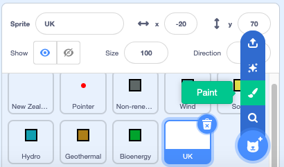

## तीसरा देश चुनें

इस चरण में, आप अपना खुद का कॉलम बनाना शुरू करने जा रहे हैं।

आपने देखा होगा कि देशीय स्प्राइट्स में ग्राफिक नहीं होता है। ऐसा इसलिए है क्योंकि जब प्रोग्राम में स्प्राइट्स चलते हैं, तो आपको केवल `Pen`{:class="block3extensions"} और स्पीच बबल की उनकी संबंधित क्रियाओं को देखने की आवश्यकता होती है, स्प्राइट को नहीं।

अब आपको बिना पोशाक के एक नया स्प्राइट बनाने की जरूरत है।

--- task ---

**Choose a Sprite** पर जाएँ और **Paint** संपादक चुनें।

{:width="300px"}

--- /task ---

अपने नए स्प्राइट को एक नाम दें। नीचे एक तालिका है जो कई देशों और बिजली पैदा करने के लिए उनके द्वारा उपयोग किए जाने वाले संसाधनों के प्रतिशत योगदान को सूचीबद्ध करती है। सूचीबद्ध देशों में से कोई एक चुनें। यह वह हो सकता है जिससे आप हैं (यदि यह पहले से प्रतिनिधित्व नहीं है), एक पड़ोसी देश, कहीं आप गए हैं, या यहां तक कि एक देश जो संसाधनों में से एक का बड़ी मात्रा में उपयोग करता है।

--- task ---

नीचे दी गई तालिका की जांच करें और तय करें कि आप ग्राफ़ के लिए किस देश का उपयोग करना चाहते हैं।

Resource type | Brazil | Canada | Iceland | India | Ireland | Norway | Singapore | S.Africa | USA | | --- | :---: | :---: | :---: | :---: | :---: | :---: | :---: | :---: | :---: | **Non-renewable** | 18 | 34 | 0 | 81 | 64 | 2 | 99 | 94 | 83 | **Wind** | 9 | 5 | 0 | 5 | 32 | 4 | 0 | 3 | 7 | **Solar** | 1 | 1 | 0 | 3 | 0 | 0 | 1 | 1 | 2 | **Hydro** | 63 | 58 | 70 | 11 | 4 | 94 | 0 | 2 | 7 | **Geothermal** | 0 | 0 | 30 | 0 | 0 | 0 | 0 | 0 | 0 | **Bioenergy** | 9 | 2 | 0 | 0 | 0 | 0 | 0 | 0 | 1 |

--- /task ---

--- task ---

आपके द्वारा चुने गए देश के नाम के साथ **Sprite1** का नाम बदलें। इस संसाधन में, इस स्प्राइट को **Third Country** स्प्राइट कहा जाएगा।

{:width="300px"}

--- /task ---

जब प्रोग्राम चलाया जाता है, तो आप चाहते हैं कि **Third Country** स्प्राइट मंच पर एक जगह में जाए और स्पीच बबल का उपयोग करके उसका नाम कहें, ठीक उसी तरह जैसे **New Zealand** और **UK** स्प्राइट करते हैं।

--- task ---

**Third Country** स्प्राइट के**Code** संपादक पर जाएं।

आपके द्वारा चुने गए देश का नाम टाइप करने के लिए निम्नलिखित ब्लॉक जोड़ें: `when green flag clicked`{:class="block3events"}, `go to x:`{:class="block3motion"} `200` `y:`{:class="block3motion"} `70`, और एक `say`{:class="block3looks"} ब्लॉक।

```blocks3
when flag clicked
go to x: (200 )y: (70)
say [Third Country] ::looks
```

--- /task ---

--- task ---

अपना प्रोग्राम चलाएं। स्प्राइट अदृश्य होना चाहिए और मंच के ऊपर दाईं ओर अपना शीर्षक कहना चाहिए। उदाहरण "Third Country" कहता है।

{:width="300px"}

--- /task ---

--- save ---
