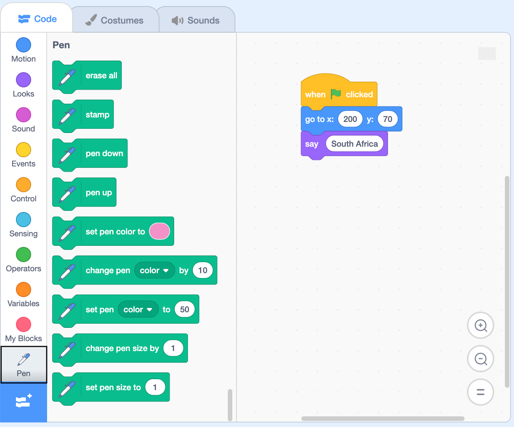

## एक कलम बनाएँ

इस चरण में, आप सीखेंगे कि `Pen`{:class="block3extensions"} एक्सटेंशन ब्लॉक का उपयोग मंच पर कुछ बनाने के लिए कैसे करें।

सबसे पहले, **Third Country** स्प्राइट को ग्राफ़ के निचले भाग में ले जाएँ ताकि यह कॉलम बनाना शुरू करने के लिए सही स्थिति में हो।

--- task ---

अपने `when green flag clicked`{:class="block3events"} ब्लॉक के नीचे,, तो तीन `Motion`{:class="block3motion"} ब्लॉक डालें:
+ `go to x: y:`{:class="block3motion"} ब्लॉक में, मानों को `x:`{:class="block3motion"} `120` और `120` and `y:`{:class="block3motion"} <0>-140</0> में बदलें
+ `set rotation style`{:class="block3motion"} ब्लॉक में, और ड्रॉप डाउन मेन्यू में से `don't rotate`{:class="block3motion"} चुनें
+ एक `point in direction 90`{:class="block3motion"} ब्लॉक

```blocks3
when flag clicked
+ go to x:(120) y: (-140)
+ set rotation style [don't rotate v]
+ point in direction (90)
go to x: (200) y: (70)
say [Third Country]
```

--- /task ---

अब `Pen`{:class="block3extensions"} एक्सटेंशन ब्लॉक मेन्यू जोड़ें।

--- task ---

अपने **Third Country** स्प्राइट के लिए **Code** टैब पर क्लिक करें, और फिर `Pen`{:class="block3extensions"} एक्सटेंशन ब्लॉक (स्क्रीन के निचले बाएं कोने में) पर क्लिक करें।

{:width="400px"}

--- /task ---

कलम तैयार करें और उसका आकार निर्धारित करें।

--- task ---

`set pen size to 1`{:class="block3extensions"} ब्लॉक जोड़ें, और मान को `2` में बदलें ताकि पेन थोड़ा मोटा हो। ड्रा करने के लिए तैयार होने के लिए एक `pen down`{:class="block3extensions"} ब्लॉक डालें।

```blocks3
when flag clicked
go to x:(120) y: (-140)
set rotation style [don't rotate v]
point in direction (90)
+set pen size to (2)
+pen down
go to x: (200) y: (70)
say [Third Country]
```

--- /task ---

आपको यह सुनिश्चित करने की आवश्यकता है कि प्रोग्राम मंच से पेन के निशान को हटाता है और हरे झंडे पर क्लिक करने पर पेन को ऊपर उठाता है।

--- task ---

`when green flag clicked`{:class="block3events"} ब्लॉक के नीचे अपने कोड के शीर्ष पर एक `erase all`{:class="block3extensions"} ब्लॉक और एक `pen up`{:class="block3extensions"} ब्लॉक जोड़ें।

```blocks3
when flag clicked
+ erase all
+ pen up
go to x:(120) y: (-140)
set rotation style [don't rotate v]
point in direction (90)
set pen size to (2)
pen down
go to x: (200) y: (70)
say [Third Country]
```

--- /task ---

पेन का रंग बदल जाएगा क्योंकि यह प्रत्येक संसाधन को खींचता है। अनेक देशों में उत्पन्न संसाधनों की तुलना करने के लिए, प्रत्येक संसाधन का प्रतिनिधित्व करने वाला रंग प्रत्येक देश के लिए समान होना चाहिए। पेन द्वारा श्रेणियों को चित्रित करना समाप्त करने के बाद, यह पृष्ठभूमि के रंग यानी ग्रे में बदल जाएगा।

--- task ---

अपने कोड में सात `set pen colour to`{:class="block3extensions"} ब्लॉक जोड़ें। ये छह श्रेणियों का प्रतिनिधित्व करेंगे, साथ ही पृष्ठभूमि का प्रतिनिधित्व करने के लिए एक अतिरिक्त रंग भी।

```blocks3
when flag clicked
pen up
go to x:(120) y: (-140)
set rotation style [don't rotate v]
point in direction (90)
set pen size to (2)
pen down
+ set pen color to []
+ set pen color to []
+ set pen color to []
+ set pen color to []
+ set pen color to []
+ set pen color to []
+ set pen color to []
go to x: (200) y: (70)
say [Third Country]
```

--- /task ---

संसाधनों के लिए आपके द्वारा चुने गए विभिन्न रंगों का प्रतिनिधित्व करने के लिए अब आपको प्रत्येक ब्लॉक के रंगों को बदलने की जरूरत है।

--- task ---

पहले `set pen colour to`{:class="block3extensions"} ब्लॉक पर क्लिक करें और **Colour picker** टूल चुनें। अपनी कुंजी में पहले संसाधन पर क्लिक करें। फिर गोला आपके चुने हुए रंग में बदल जाएगा।

प्रत्येक संसाधन के लिए इसे बारी-बारी से दोहराएं, ताकि आप संसाधन रंगों के क्रम गड़बड़ी न करें ।

सांतवे `set pen colour to`{:class="block3extensions"} ब्लॉक के लिए बैकड्रॉप कलर का उपयोग करना न भूलें, आप इसे मंच की पृष्ठभूमि पर कहीं भी होवर करके प्राप्त कर सकते हैं।

--- /task ---

जब कॉलम का ड्राइंग समाप्त हो जाए तो पेन उठाएं।

--- task ---

अपने कोड में `pen up`{:class="block3extensions"} ब्लॉक जोड़ें।

```blocks3
when flag clicked
pen up
go to x:(120) y: (-140)
set rotation style [don't rotate v]
point in direction (90)
set pen size to (2)
pen down
set pen color to [#5e6766]
set pen color to [#37e4db]
set pen color to [#e4d748]
set pen color to [#169bb0]
set pen color to [#ab7519]
set pen color to [#00a42c]
set pen color to [#dadada]
+pen up
go to x: (200) y: (70)
say [Third Country]
```

--- /task ---

--- task ---

हालांकि **Third Country** स्प्राइट सेट किया गया है, यह ग्राफ़ पर दिखाई नहीं देता क्योंकि आपने कोई संसाधन डेटा इनपुट नहीं किया है। आपके पास अगले चरण में डेटा इनपुट करने और अपना कोड जांचने का मौका होगा।

--- /task ---

--- save ---
