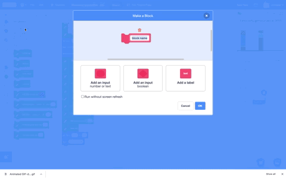
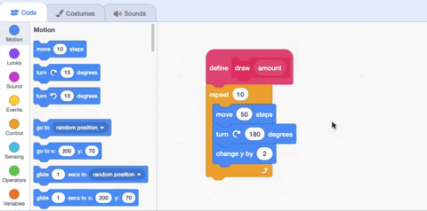

## तीसरा कॉलम बनाएं

अब आपके द्वारा पिछले चरण में बनाए गए संसाधन वेरिएबल का उपयोग करने का समय आ गया है, ताकि **Third Country** स्प्राइट के लिए कॉलम तैयार किया जा सके।

Scratch में, आप एक ब्लॉक बना सकते हैं जो एक नई स्क्रिप्ट शुरू करता है और इस नई स्क्रिप्ट में कोई भी Scratch ब्लॉक जोड़ सकते हैं । फिर आप अपने प्रोग्राम में कहीं और स्क्रिप्ट का पुन: उपयोग कर सकते हैं।

--- task ---

`My Blocks`{:class="block3myblocks"} मेन्यू में जाएं और **Make a Block**पर क्लिक करें। ब्लॉक का नाम `draw` रखें और **Add an input number or text** पर क्लिक करें। `number or text`का मान `amount` में बदलें फिर **OK**क्लिक करें।

--- no-print ---



--- /no-print ---

आप देखेंगे की **Third Country** स्प्राइट के कोड एरिया में एक नया `define`{:class="block3myblocks"} ब्लॉक बनाया गया है:

```blocks3
define draw (amount)
```

--- /task ---

कॉलम में पहली लाइन बनाने के लिए, **Third Country** स्प्राइट को पेन से नीचे की ओर ले जाएँ, फिर उसे वापस घुमांयें, और स्टेमंच पर थोड़ा ऊपर ले जाएँ।

--- task ---

अपने नए `draw`{:class="block3extensions"} ब्लॉक में तीन `Motion`{:class="block3motion"} ब्लॉक जोड़ें: `move`{:class="block3motion"} `50` `steps`{:class="block3motion"}, `turn right`{:class="block3motion"} `180` `degrees`{:class="block3motion"}, और `change y by`{:class="block3motion"} `2`:

```blocks3
define draw (amount)
+move (50) steps
+turn right (180) degrees
+change y by (2)
```

--- /task ---

प्रत्येक संसाधन के लिए सही संख्या में रेखाएँ खींचने के लिए अपने नए परिभाषित `draw`{:class="block3myblocks"} ब्लॉक का उपयोग करें।

--- task ---

`My Blocks`{:class="block3myblocks"} मेन्यू से प्रत्येक `set pen color to`{:class="block3extensions"} blocks के बाद एक `draw`{:class="block3myblocks"} ब्लॉक सम्मिलित करें । निम्नलिखित क्रम में प्रत्येक वेरिएबल को `draw`{:class="block3myblocks"} ब्लॉक में खींचें:
+ `nonrenewable`{:class="block3variables"}
+ `wind`{:class="block3variables"}
+ `solar`{:class="block3variables"}
+ `hydro`{:class="block3variables"}
+ `geothermal`{:class="block3variables"}
+ `bioenergy`{:class="block3variables"}.

अंतिम शेष `draw`{:class="block3myblocks"} ब्लॉक में, मान `1`टाइप करें। यह कॉलम के अंत में थोड़ी सफाई दीखाने के लिए एक पंक्ति जोड़ता है जो पृष्ठभूमि के समान रंग है:

```blocks3
when flag clicked
erase all
set (nonrenewable) to (17)
set (wind) to (17)
set (solar) to (17)
set (hydro) to (17)
set (geothermal) to (17)
set (bioenergy) to (15)
pen up
go to x:(120) y: (-140)
set rotation style [don't rotate v]
point in direction (90)
set pen size to (2)
pen down
set pen color to [#5e6766]
+draw (nonrenewable)
set pen color to [#37e4db]
+draw (wind)
set pen color to [#e4d748]
+draw (solar)
set pen color to [#169bb0]
+draw (hydro)
set pen color to [#ab7519]
+draw (geothermal)
set pen color to [#00a42c]
+draw (bioenergy)
set pen color to [#dadada]
+draw (1)
pen up
go to x: (160) y: (70)
say [Third Country]
```

--- /task ---

--- task ---

अपना प्रोग्राम चलाएं। **Third Country** स्प्राइट में, आपको यह दिखना चाहिए कि पेन प्रत्येक संसाधन के लिए केवल एक पतली रेखा खींचता है। प्रत्येक संसाधन के लिए पेन द्वारा सही मात्रा भरने के लिए, आपको `repeat`{:class="block3control"} को हर संसाधन के लिए सेट करना होगा।

--- /task ---

आपके `draw`{:class="block3myblocks"} ब्लॉक प्रत्येक संसाधन के लिए बिजली की मात्रा को स्टोर करने के लिए सेट किए गए हैं, लेकिन आपके द्वारा परिभाषित कोड अभी भी केवल एक बार चलता है, हर बार यह आपकी स्क्रिप्ट में दिखाई देता है। संग्रहित `amount`{:class="block3myblocks"} का उपयोग यह नियंत्रित करने के लिए करें कि `draw`{:class="block3myblocks"} ब्लॉक कितनी बार खुद को दोहराता है।

--- task ---

`define`{:class="block3myblocks"} ब्लॉक के नीचे एक `repeat`{:class="block3control"} ब्लॉक जोड़ें। गोल ब्लॉक `amount`{:class="block3myblocks"} को `define`{:class="block3myblocks"} ब्लॉक से `repeat`{:class="block3control"} ब्लॉक में खींचें:

--- no-print ---



--- /no-print ---

```blocks3
define draw (amount)
+repeat (amount)
move (50) steps
turn right (180) degrees
change y by (2)
end
```

--- /task ---

--- task ---

अपने प्रोजेक्ट का परीक्षण करें। **Third Country** स्प्राइट के लिए कॉलम अब पूरा हो जाना चाहिए, और आपके द्वारा चुने गए मानों को दिखाएं। जब आप प्रत्येक संसाधन पर होवर करते हैं, तो लेबल प्रकट होना चाहिए।

--- /task ---

--- save ---
