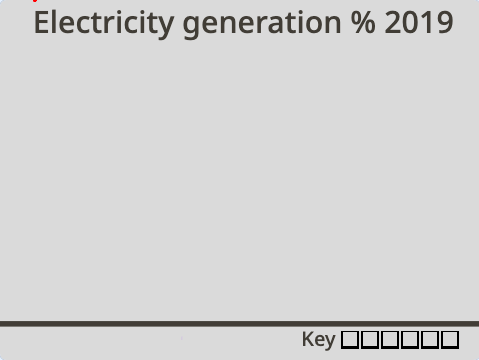
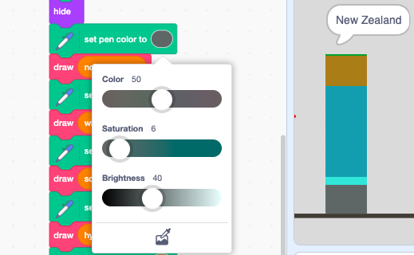
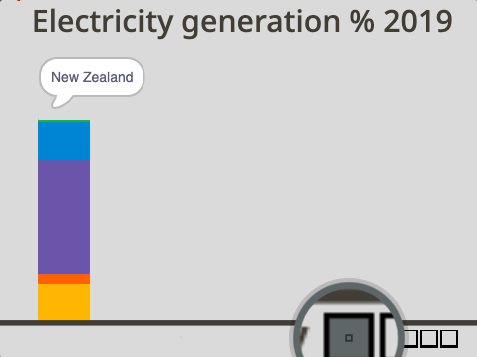
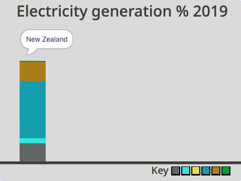

## ಬಣ್ಣಗಳನ್ನು ಆಯ್ದುಕೊಳ್ಳಿ

ಈ ಪ್ರೊಜೆಕ್ಟ್‌ಗಾಗಿ, ನೀವು ಒಂದು ಅನಿಮೇಟೆಡ್‌ ಮತ್ತು ಸಂವಾದಾತ್ಮಕ ದತ್ತಾಂಶ ದೃಶ್ಯೀಕರಣವನ್ನು ಮಾಡುವಿರಿ. ದತ್ತಾಂಶವನ್ನು ದೃಶ್ಯರೂಪದಲ್ಲಿ ಪ್ರತಿನಿಧಿಸಿದಾಗ ಯಾವಾಗಲೂ ಅರ್ಥಮಾಡಿಕೊಳ್ಳುವುದು ಸುಲಭವಾಗುತ್ತದೆ, ಅದರಲ್ಲೂ ವಿಶೇಷವಾಗಿ ಅದು ಬಹಳಷ್ಟು ಸಂಖ್ಯೆಗಳನ್ನು ಒಳಗೊಂಡಿರುವಾಗ. ಆದುದರಿಂದ ಪೈನಕ್ಷೆಗಳು ಮತ್ತು ರೇಖಾನಕ್ಷೆಗಳು ತುಂಬಾ ಮಾಹಿತಿಕೊಡಬಹುದು. ಅವುಗಳು ಮಾಹಿತಿಯ ತುಣುಕುಗಳನ್ನು ಹೋಲಿಕೆ ಮಾಡಲು ನಿಮಗೆ ಸಹಾಯಕವಾಗಬಹುದು. ಕಂಪ್ಯೂಟರ್‌ನಿಂದ, ನೀವು ಅನಿಮೇಟೆಡ್‌ ಅಥವಾ ಸಂವಾದಾತ್ಮಕ ಅತ್ಯಾಕರ್ಷಕ ದತ್ತಾಂಶ ದೃಶ್ಯೀಕರಣವನ್ನು ರಚಿಸಬಹುದು. ಈ ಪ್ರಾಜೆಕ್ಟ್‌ ಎರಡನ್ನೂ ಮಾಡುತ್ತದೆ!

ಮೂರು ದೇಶಗಳು ವಿದ್ಯುತ್‌ ಉತ್ಪಾದನೆ ಮಾಡಲು ಉಪಯೋಗಿಸುವ ಸಂಪನ್ಮೂಲಗಳನ್ನು ಹೋಲಿಸುವ ಅನಿಮೇಟೆಡ್‌ ಮತ್ತು ಸಂವಾದಾತ್ಮಕ ದತ್ತಾಂಶ ದೃಶ್ಯೀಕರಣವನ್ನು ರಚಿಸಲು ನೀವು ಪೇರಿಸಿದ ಸ್ತಂಭಾಲೇಖ ಉಪಯೋಗಿಸುವಿರಿ.

--- task ---

**ಆನ್‌ಲೈನ್:** Scratch ನಲ್ಲಿ [starter project](http://rpf.io/electricity-generation-on){:target="_blank"} ತೆರೆಯಿರಿ.

**ಆಫ್‌ಲೈನ್:** Scratch ಆಫ್‌ಲೈನ್‌ ಎಡಿಟರ್‌ನಲ್ಲಿ [ಪ್ರಾಜೆಕ್ಟ್‌ ಪ್ರಾರಂಭಿಕ ಫೈಲ್](http://rpf.io/p/en/electricity-generation-go){:target="_blank"} ತೆರೆಯಿರಿ. ನಿಮಗೆ ಬೇಕಾದರೆ, ನೀವು [ಇಲ್ಲಿ Scratch ಡೌನ್‌ಲೋಡ್‌ ಮಾಡಿಕೊಂಡು ಇನ್‌ಸ್ಟಾಲ್‌ ಮಾಡಬಹುದು](https://scratch.mit.edu/download){:target="_blank"}.

--- /task ---

ನೀವು "Electricity generation % 2019" ಶೀರ್ಷಿಕೆಯುಳ್ಳ ಬೂದುಬಣ್ಣದ ಹಿನ್ನೆಲೆ ನೋಡಬೇಕು. ಪುಟದ ಕೆಳಗೆ ಸಮತಲ ರೇಖೆಯಿರುತ್ತದೆ.

{:width="400px"}

--- task ---

ಹಸಿರು ಬಾವುಟದ ಮೇಲೆ ಕ್ಲಿಕ್‌ ಮಾಡಿ ನಿಮ್ಮ ಪ್ರಾಜೆಕ್ಟ್‌ ರನ್‌ ಮಾಡಿ. ಸ್ತಂಭದ ಅನಿಮೇಶನ್‌ನ್ನು ಒಂದು ಅದೃಶ್ಯ ಪೆನ್‌ ಚಿತ್ರಿಸುತ್ತದೆ. ಇದು ವಿದ್ಯುತ್‌ ಉತ್ಪಾದಿಸಲು ನ್ಯೂಜಿಲೆಂಡ್‌ನ ಸಂಪನ್ಮೂಲಗಳ ಬಳಕೆಯನ್ನು ತೋರಿಸುತ್ತದೆ. ನೀವು ಆಮೇಲೆ ನಿಮ್ಮ ಮೌಸ್‌ ಉಪಯೋಗಿಸಿ ಸಂವಾದಾತ್ಮಕ ಸ್ತಂಭವನ್ನು ಪರಿಶೀಲಿಸಬಹುದು.

{:width="400px"}

ನ್ಯೂಜಿಲೆಂಡ್‌ ಅದರ ಬಹಳಷ್ಟು ವಿದ್ಯುಚ್ಛಕ್ತಿಯನ್ನು ಜಲಶಕ್ತಿಯನ್ನು ಉಪಯೋಗಿಸಿ ಉತ್ಪಾದಿಸುತ್ತದೆ, ಅದರಿಂದಾಗಿಯೇ ಮೇಲಿನ ಸ್ತಂಭದಲ್ಲಿ ತುಂಬಾ ನೇರಳೆ ಬಣ್ಣವಿದೆ.

ಒಮ್ಮೆ ನೀವು ಸ್ತಂಭವನ್ನು ಪರಿಶೀಲಿಸಿದ ನಂತರ, ಪ್ರೋಗ್ರಾಮ್‌ನ್ನು ನಿಲ್ಲಿಸಲು ಸ್ಟೇಜ್‌ ಮೇಲ್ಗಡೆ ಇರುವ ಕೆಂಪು ನಿಲ್ಲಿಸು ಬಟನ್‌ ಮೇಲೆ ಕ್ಲಿಕ್‌ ಮಾಡಿ.

--- /task ---

Stage ಕೆಳಭಾಗದಲ್ಲಿ, ನೀವು ಪ್ರತಿಯೊಂದು ಸಂಪನ್ಮೂಲವನ್ನು ಪ್ರತಿನಿಧಿಸುವ ಚೌಕದೊಂದಿಗಿನ ಖಾಲಿ ಕೀಯನ್ನು ನೋಡುವಿರಿ: ನವೀಕರಿಸಲಾಗದ, ಗಾಳಿ, ಸೌರ, ಜಲ, ಭೂ ಶಾಖ, ಮತ್ತು ಜೈವಿಕಶಕ್ತಿ. ಅವುಗಳು ಈಗ ರೇಖಾನಕ್ಷೆಯಲ್ಲಿ ಉಪಯೋಗಿಸಲ್ಪಡದಿದ್ದರೂ, ಕೀ ಎಲ್ಲಾ ಸಂಪನ್ಮೂಲಗಳನ್ನೂ ತೋರಿಸುತ್ತದೆ. ಅದು ಯಾಕೆಂದರೆ ದೇಶಗಳು ಯಾವಾಗಲೂ ಅವುಗಳು ಹೇಗೆ ವಿದ್ಯುತ್‌ ಉತ್ಪಾದಿಸುತ್ತವೆ ಎಂಬುವುದನ್ನು ಬದಲಾಯಿಸುತ್ತಿರುತ್ತವೆ, ಮತ್ತು ನವೀಕರಿಸಲಾಗುವ ಸಂಪನ್ಮೂಲಗಳೆಡೆಗೆ ಸಾಗುತ್ತಿವೆ.

ನಂತರ ನೀವು ನಿಮ್ಮ ರೇಖಾನಕ್ಷೆಯ ಮೇಲೆ ಪ್ರತಿಯೊಂದು ಸಂಪನ್ಮೂಲಗಳನ್ನು ಪ್ರತಿನಿಧಿಸಲು ಬಣ್ಣಗಳನ್ನು ಆಯ್ಕೆ ಮಾಡುವಿರಿ.

--- task ---

**Non-renewable** ಸ್ಪ್ರೈಟ್‌ನ **Costumes** ಟ್ಯಾಬ್‌ ಮೇಲೆ ಕ್ಲಿಕ್‌ ಮಾಡಿ. Paint ಎಡಿಟರ್‌ನ ಮಧ್ಯದಲ್ಲಿ, ಬಣ್ಣ ತುಂಬಿಲ್ಲದ ಚೌಕವೊಂದಿದೆ. **Fill** ಬಣ್ಣಗಳ ಆಯ್ಕೆಯ ಮೇಲೆ ಕ್ಲಿಕ್‌ ಮಾಡಿ ಮತ್ತು Color, Saturation, ಮತ್ತು Brightness ಸ್ಲೈಡರ್‌ಗಳನ್ನು ಬದಲಾಯಿಸಿ ನಿಮ್ಮ ಆಯ್ಕೆಯ ಬಣ್ಣವನ್ನು ರಚಿಸಿ.


--- /task ---

--- task ---

**Fill** ಉಪಕರಣವನ್ನು ಆಯ್ಕೆಮಾಡಿಕೊಳ್ಳಿ (ಅದು ಬಣ್ಣದ ಕ್ಯಾನಿನಂತೆ ಕಾಣುತ್ತದೆ) ಮತ್ತು ಚೌಕ ಉಡುಪಿನ ಒಳಗಡೆ ಕ್ಲಿಕ್‌ ಮಾಡಿ. Stage ಮೇಲೆ ಮೊದಲನೆಯ ಕೀ ಹೊಸ ಬಣ್ಣಕ್ಕೆ ಬದಲಾಗುವುದನ್ನು ನೀವು ನೋಡುವಿರಿ.


--- /task ---

ರೇಖಾನಕ್ಷೆಯಲ್ಲಿ ನವೀಕರಿಸಲಾಗದ ಶಕ್ತಿಯನ್ನು ಪ್ರತಿನಿಧಿಸಲು ನೀವು ಹೊಸ ಬಣ್ಣವನ್ನು ಆಯ್ಕೆ ಮಾಡಿಕೊಂಡಿದ್ದೀರಿ. ನಂತರ, ನೀವು **New Zealand** ಸ್ಪ್ರೈಟ್‌ನಲ್ಲಿ ಸಂಪನ್ಮೂಲವನ್ನು ಬದಲಾಯಿಸಬೇಕು.

--- task ---

ಕೋಡ್‌ನ್ನು ನೋಡಲು **New Zealand** ಸ್ಪ್ರೈಟ್‌ನ **Code** ಟ್ಯಾಬ್‌ ಮೇಲೆ ಕ್ಲಿಕ್‌ ಮಾಡಿ. ಸ್ತಂಭಾಲೇಖದ ಬಣ್ಣಗಳನ್ನು ಹೊಂದಿಸಿರುವ ವಿಭಾಗದಲ್ಲಿ ಮೊದಲನೆಯ `set pen color to`{:class="block3extensions"} ಬ್ಲಾಕ್‌ ಮತ್ತು `draw`{:class="block3myblocks"} `nonrenewable`{:class="block3variables"} ಬ್ಲಾಕ್‌ನ್ನು ಪತ್ತೆಮಾಡಿ.


```blocks3

+set pen color to [#FCB711]
+draw (nonrenewable) ::custom
set pen color to [#F37021]
draw (wind) ::custom
set pen color to [#CC004C]
draw (solar) ::custom
set pen color to [#6460AA]
draw (hydro) ::custom
set pen color to [#0089D0]
draw (geothermal) ::custom
set pen color to [#0DB14B]
draw (bioenergy) ::custom

```

--- /task ---

--- task ---

ಮೊದಲನೆಯ `set pen colour`{:class="block3extensions"} ಬ್ಲಾಕ್‌ನ ಬಣ್ಣವಿರುವ ವೃತ್ತದ ಮೇಲೆ ಕ್ಲಿಕ್‌ ಮಾಡಿ ಮತ್ತು **Colour picker** ಉಪಕರಣವನ್ನು ಆಯ್ಕೆಮಾಡಿ, ಅದು ಮೂರು ಬಣ್ಣದ ಸ್ಲೈಡರ್‌ಗಳ ಕೆಳಗೆ ಇದೆ. ಕೀನಲ್ಲಿ ಬಣ್ಣವನ್ನು ಆಯ್ಕೆ ಮಾಡಲು **Non-renewable** ಸ್ಪ್ರೈಟ್‌ನ ಮೇಲೆ ಸುಳಿದಾಡುವವರೆಗೆ ಮೌಸ್‌ ಪಾಯಿಂಟರ್‌ನ್ನು ಚಲಿಸಿ.



ನಿಮ್ಮ ಆಯ್ಕೆಯ **Non-renewable** ಸಂಪನ್ಮೂಲದ ಬಣ್ಣ ಈಗ `set pen colour`{:class="block3extensions"}ಬ್ಲಾಕ್‌ನಲ್ಲಿ ಕಾಣಬೇಕು:




```blocks3

set pen color to [#5e6766]
draw (nonrenewable) ::custom
```

--- /task ---

--- task ---

ನಿಮ್ಮ ಪ್ರಾಜೆಕ್ಟ್‌ನ್ನು ಮತ್ತೆ ರನ್‌ ಮಾಡಿ. ನ್ಯೂಜಿಲೆಂಡ್‌ನ ನವೀಕರಿಸಲಾಗದ ಸಂಪನ್ಮೂಲವನ್ನು ಈಗ ನಿಮ್ಮ ಹೊಸ ಬಣ್ಣದಲ್ಲಿ ಚಿತ್ರಿಸಲಾಗಿದೆ. ನಿಮ್ಮ ಸ್ತಂಭದಮೇಲೆ ಸುಳಿದಾಡಿ ಮತ್ತು ನೀವು ನಿಮ್ಮ ಹೊಸ ಬಣ್ಣವನ್ನು ಸ್ಪರ್ಶಿಸಿದಾಗ "non-renewable" ಎಂಬ ಮಾತಿನ ಗುಳ್ಳೆ ಇಲ್ಲದಿರುವುದನ್ನು ನೀವು ಗಮನಿಸಬಹುದು. ನೀವು ನಿಮ್ಮ ಪರೀಕ್ಷೆಯನ್ನು ಮುಗಿಸಿದ ನಂತರ Stage ಮೇಲ್ಗಡೆ ಇರುವ ಕೆಂಪು ನಿಲ್ಲಿಸು ಬಟನ್‌ ಕ್ಲಿಕ್‌ ಮಾಡಿ.


--- /task ---

ನಂತರ, **Pointer** ಸ್ಪ್ರೈಟ್‌ನಲ್ಲಿ ಬಣ್ಣವನ್ನು ಬದಲಾವಣೆ ಮಾಡುವ ಮೂಲಕ ನವೀಕರಿಸಲಾಗದ ಸಂಪನ್ಮೂಲಕ್ಕೆ ಸಂವಾದಾತ್ಮಕ ಗುರುತಿನ ಚೀಟಿಯನ್ನು ರಚಿಸಿ.

--- task ---

**Pointer** ಸ್ಪ್ರೈಟ್‌ ಮೇಲೆ ಕ್ಲಿಕ್‌ ಮಾಡಿ ಮತ್ತು ಬಣ್ಣಗಳನ್ನು ಹೊಂದಿಸಿದ ನಂತರ ಕೋಡ್‌ನ ವಿಭಾಗವನ್ನು ಪತ್ತೆಮಾಡಿ. ಮೇಲಿನ `touching color`{:class="block3sensing"} ಬ್ಲಾಕ್‌ನಲ್ಲಿ `say Non-renewable`{:class="block3looks"} ಬ್ಲಾಕ್, ವೃತ್ತದ ಮೇಲೆ ಕ್ಲಿಕ್‌ ಮಾಡಿ ಮತ್ತು **Colour picker** ಟೂಲ್‌ ಉಪಯೋಗಿಸಿ ಕೀಯಿಂದ ಹೊಸ ಬಣ್ಣವನ್ನು ಆಯ್ಕೆ ಮಾಡಿ:


```blocks3
+if {touching color (#5e6766)?} then
say [Non-renewable]
end
if {touching color (#F37021)?} then
say [Wind]
end
if {touching color (#CC004C)?} then
say [Solar]
end
if {touching color (#6460AA)?} then
say [Hydro]
end
if {touching color (#0089D0)?} then
say [Geothermal]
end
if {touching color (#0DB14B)?} then
say [Bioenergy]
end
if {touching color (#dadada)?} then
say ()
end

```


--- /task ---

--- task ---

ನಿಮ್ಮ ಪ್ರಾಜೆಕ್ಟ್‌ನ್ನು ಮತ್ತೆ ರನ್‌ ಮಾಡಿ. ನಿಮ್ಮ ನ್ಯೂಜಿಲೆಂಡ್‌ ಸ್ತಂಭದಲ್ಲಿ ನೀವು ಸುಳಿದಾಡಿದಾಗ ಸಂವಾದಾತ್ಮಕ ಗುರುತಿನ ಚೀಟಿ "Non-renewable" ಎಂದು ಹೇಳಬೇಕು. ನೀವು ನಿಮ್ಮ ಪರೀಕ್ಷೆಯನ್ನು ಮುಗಿಸಿದ ನಂತರ Stage ಮೇಲ್ಗಡೆ ಇರುವ ಕೆಂಪು ನಿಲ್ಲಿಸು ಬಟನ್‌ ಕ್ಲಿಕ್‌ ಮಾಡಿ.

--- /task ---

ಉಳಿದ ಸಂಪನ್ಮೂಲಗಳನ್ನು ಪ್ರತಿನಿಧಿಸಲು ನಿಮ್ಮದೇ ಬಣ್ಣವನ್ನು ಆಯ್ಕೆ ಮಾಡಿಕೊಳ್ಳಿ. ಉದಾಹರಣೆಗೆ, ಸಂಪನ್ಮೂಲಗಳು ಹೇಗೆ ವ್ಯತ್ಯಾಸವಾಗುತ್ತವೆ ಎಂದು ತೋರಿಸಲು ನಿಮಗೆ ಪ್ರತಿಯೊಂದಕ್ಕೆ ಬೇರೆ ಬೇರೆ ಬಣ್ಣ ಬೇಕೆ? ಅಥವಾ ನಿಮಗೆ ಎಲ್ಲಾ ನವೀಕರಿಸಲಾಗುವ ಶಕ್ತಿಯ ಸಂಪನ್ಮೂಲಗಳು ಒಂದೇ ಬಣ್ಣದ ಬೇರೆ ಬೇರೆ ಛಾಯೆಗಳಾಗಿರಬೇಕೆ ಮತ್ತು ನವೀಕರಿಸಲಾಗದ ಸಂಪನ್ಮೂಲವು ಬೇರೆ ಬಣ್ಣದ್ದಾಗಿರಬೇಕೆ?

--- task ---

ಮೇಲಿನ ಹಂತಗಳನ್ನು ಸಂಪನ್ಮೂಲ ಸ್ಪ್ರೈಟ್‌ಗಳಿಗೆ ಪುನರಾವರ್ತಿಸಿ: **Wind**, **Solar**, **Hydro**, **Geothermal**, and **Bioenergy**. ನಿಮ್ಮ ಸಂಪನ್ಮೂಲ ಸ್ಪ್ರೈಟ್‌ನಲ್ಲಿ ಮೊದಲಿಗೆ ಬಣ್ಣ ಬದಲಾಯಿಸಲು ಮರೆಯಬೇಡಿ, ನಂತರ **New Zealand** ಸ್ಪ್ರೈಟ್‌ನಲ್ಲಿ ಮತ್ತು **Pointer** ಸ್ಪ್ರೈಟ್‌ನಲ್ಲಿ ಆ ಸಂಪನ್ಮೂಲ ಕೋಡ್‌ ಪತ್ತೆ ಮಾಡಿ ಅಲ್ಲಿಯೂ ಅಪ್‌ಡೇಟ್‌ ಮಾಡಿ.




--- /task ---

--- task ---

ನಿಮ್ಮ ಪ್ರಾಜೆಕ್ಟ್‌ನ್ನು ಮತ್ತೆ ರನ್‌ ಮಾಡಿ. ಎಲ್ಲಾ ಸಂಪನ್ಮೂಲಗಳಿಗೆ ರೇಖಾನಕ್ಷೆಯು ನೀವು ನೀರಿಕ್ಷಿಸಿದಂತೆ ನೋಟ ಹೊಂದಿದೆಯೇ ಮತ್ತು ಸಂವಾದ ನಡೆಸುತ್ತದೆಯೇ ಎಂದು ಪರಿಶೀಲಿಸಿ.

--- /task ---

--- save ---
