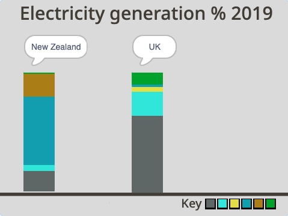

## ಯುಕೆ ಕಾಲಮ್‌ ಸೇರಿಸಿ

ಈ ಹಂತದಲ್ಲಿ, ನೀವು ಯುಕೆ ಸ್ತಂಭವನ್ನು ಸೇರಿಸುತ್ತೀರಿ ಮತ್ತು ಅದನ್ನು ದತ್ತಾಶದಿಂದ ತುಂಬಿಸಿ, ಆಗ ನೀವು ನ್ಯೂಜಿಲೆಂಡ್‌ನ ಫಲಿತಾಂಶವನ್ನು ಯುಕೆ ಜೊತೆ ಹೋಲಿಸಬಹುದು.

ನೀವು ಯುಕೆಗೆ ಸ್ತಂಭ ರಚಿಸುತ್ತೀರಿ. ಇದನ್ನು ಮಾಡಲು, ನೀವು **New Zealand** ಸ್ಪ್ರೈಟ್‌ನ ನಕಲು ಮಾಡುತ್ತೀರಿ.

--- task ---

**New Zealand** ಸ್ಪ್ರೈಟ್‌ ಮೇಲೆ ಕ್ಲಿಕ್‌ ಮಾಡಿ, ಮತ್ತು **duplicate** ಆಯ್ಕೆ ಮಾಡಲು ರೈಟ್-ಕ್ಲಿಕ್‌ ಮಾಡಿ.

{:width="300px"}

--- /task ---

--- task ---

ಹೊಸ ಸ್ಪ್ರೈಟ್‌ನ್ನು `UK` ಎಂದು ಮರುನಾಮಕರಣ ಮಾಡಿ.

--- /task ---

ಪ್ರೋಗ್ರಾಮ್‌ ರನ್‌ ಮಾಡಿ. **UK** ಸ್ಪ್ರೈಟ್‌ ಪ್ರೋಗ್ರಾಮ್‌ ರನ್‌ ಆಗುತ್ತಿದ್ದರೂ ಅದು ಆಗುತ್ತಿಲ್ಲದಂತೆ ಕಾಣಿಸುತ್ತದೆ. ಅದು ಏಕೆಂದರೆ **UK** ಸ್ಪ್ರೈಟ್‌ನ ಸ್ತಂಭವನ್ನು ರೇಖಾನಕ್ಷೆಯಲ್ಲಿ **New Zealand** ಸ್ಪ್ರೈಟ್‌ನ ಅಡಿಯಲ್ಲಿ ಚಿತ್ರಿಸಲಾಗಿದೆ. **UK** ಸ್ಪ್ರೈಟ್‌ನ್ನು ನೋಡಲು ಸಾಧ್ಯವಾಗಲು, ನೀವು Stage ಮೇಲೆ **UK** ಸ್ಪ್ರೈಟ್‌ನ ಸ್ತಂಭವನ್ನು ಚಿತ್ರಿಸಲು ಪ್ರಾರಂಭಿಸುವ ಸ್ಥಾನವನ್ನು ಚಲಿಸಬೇಕು.

--- task ---

**UK** ಸ್ಪ್ರೈಟ್‌ನ **Code** ಟ್ಯಾಬ್‌ಗೆ ಹೋಗಿ.

--- /task ---

--- task ---

ಬರಹದ ಮೇಲಿನ ಅರ್ಧ ಭಾಗದಲ್ಲಿ `go to x: y:`{:class="block3motion"} ಬ್ಲಾಕ್‌ನ್ನು ಹುಡುಕಿ. ಅದು `x:`{:class="block3motion"} `-200` ಮತ್ತು `y:`{:class="block3motion"} `-140` ಮೌಲ್ಯಗಳನ್ನು ಹೊಂದಿದೆ. `x`{:class="block3motion"} ಮೌಲ್ಯವನ್ನು ಮಾತ್ರ `-20` ಕ್ಕೆ ಬದಲಾಯಿಸಿ. `y`{:class="block3motion"} ಮೌಲ್ಯವು `-140`ರಲ್ಲಿಯೇ ಇರಬಹುದು:


```blocks3
go to x: (-20)y: (-140)
```

--- /task ---

--- task ---

ಹಸಿರು ಬಾವುಟವನ್ನು ಕ್ಲಿಕ್‌ ಮಾಡಿ. **UK** ಸ್ಪ್ರೈಟ್‌ನ ಸ್ತಂಭವನ್ನು ನೀವು ಈಗ **New Zealand** ಸ್ಪ್ರೈಟ್‌ನ ಸ್ತಂಭದ ಬಲಭಾಗದಲ್ಲಿ ನೋಡಲು ಸಾಧ್ಯವಾಗಬೇಕು.

{:width="400px"}

--- /task ---

ಆದರೆ, ಈ ಸ್ತಂಭವು UK ಬಗೆಗ ಎಂಬುವುದು ಸ್ಪಷ್ಟವಾಗುವುದಿಲ್ಲ, ಏಕೆಂದರೆ ಶೀರ್ಷಿಕೆಯು ಇನ್ನೂ **New Zealand** ಸ್ಪ್ರೈಟ್‌ನ ಸ್ತಂಭದ ಹಿಂದೆ ಮರೆಯಾಗಿದೆ. ನೀವು ನೋಡಲು ಸಾಧ್ಯವಾಗುವಂತೆ Stage ಮೇಲೆ ಶೀರ್ಷಿಕೆಯು ಎಲ್ಲಿ ಕಾಣುತ್ತದೆ ಅಲ್ಲಿಗೆ ಸ್ತಾನವನ್ನು ಚಲಿಸಬೇಕು.

--- task ---

ಮತ್ತೆ, **UK** ಸ್ಪ್ರೈಟ್‌ನ **Code** ಟ್ಯಾಬ್‌ಗೆ ಹೋಗಿ. ಉದ್ದ ಬರಹದ ಅತ್ಯಂತ ಕೊನೆಯಲ್ಲಿ, `go to x:`{:class="block3motion"} `-200` `y:`{:class="block3motion"} `70` ಬ್ಲಾಕ್‌ನ್ನು ಪತ್ತೆಮಾಡಿ. `x`{:class="block3motion"} ಮೌಲ್ಯವನ್ನು ಮಾತ್ರ `-20` ಕ್ಕೆ ಬದಲಾಯಿಸಿ. `y`{:class="block3motion"} ಮೌಲ್ಯವು `70` ರಲ್ಲಿಯೇ ಉಳಿಯಬಹುದು:


```blocks3
go to x: (-20)y: (70)
```

--- /task ---

--- task ---

ಹಸಿರು ಬಾವುಟವನ್ನು ಕ್ಲಿಕ್‌ ಮಾಡಿ. ನೀವು ಈಗ **UK** ಸ್ಪ್ರೈಟ್‌ನ ಶೀರ್ಷಿಕೆಯನ್ನು ಬಲಭಾಗದ ಸ್ತಂಭದ ಮೇಲೆ ನೋಡಲು ಸಾಧ್ಯವಾಗಬೇಕು. ಅಯ್ಯೋ! ಅದು ಇನ್ನೂ "New Zealand" ಹೇಳುತ್ತಿದೆ.

{:width="400px"}

--- /task ---

ಅದು "UK" ಹೇಳಲು ನೀವು `say`{:class="block3looks"} ಬ್ಲಾಕ್‌ನಲ್ಲಿ ಪಠ್ಯವನ್ನು ಬದಲಾಯಿಸಬೇಕು.

--- task ---

`go to x:`{:class="block3motion"} `-20` `y:`{:class="block3motion"} `70` ಕೆಳಗೆ, `say`{:class="block3looks"} ಬ್ಲಾಕ್‌ ಸೇರಿಸಿ ಮತ್ತು `UK` ಎಂದು ಟೈಪ್‌ ಮಾಡಿ. ಶೀರ್ಷಿಕೆ "UK" ಎನ್ನುವುದು ಮಾತಿನ ಗುಳ್ಳೆಯ ಮಧ್ಯದಲ್ಲಿ ಇರಲು, ಮೊದಲಿಗೆ ನಿಮ್ಮ ಕೀಬೋರ್ಡ್‌ನಲ್ಲಿ ಸ್ಪೇಸ್‌ ಬಾರ್‌ನ್ನು ನಾಲ್ಕು ಬಾರಿ ಒತ್ತಿ ಮತ್ತು ನಂತರ `UK` ಎಂದು ಟೈಪ್‌ ಮಾಡಿ:


```blocks3
go to x: (-20) y: (70)
+ say [UK]
```
--- /task ---

--- task ---

ಹಸಿರು ಬಾವುಟವನ್ನು ಕ್ಲಿಕ್‌ ಮಾಡಿ. ನೀವು ಈಗ **UK** ಸ್ಪ್ರೈಟ್‌ನ ಶೀರ್ಷಿಕೆಯನ್ನು ಮಾತಿನ ಗುಳ್ಳೆಯ ಮಧ್ಯದಲ್ಲಿ ಮತ್ತು ಬಲಭಾಗದ ಸ್ತಂಭದ ಮೇಲ್ಗಡೆ ನೋಡಲು ಸಾಧ್ಯವಾಗಬೇಕು.

{:width="300px"}

--- /task ---

ಸ್ತಂಭವು ಒಂದೇ ರೀತಿ ಕಾಣಿಸುತ್ತದೆ ಏಕೆಂದರೆ **UK** ಸ್ಪ್ರೈಟ್‌ನ ಸ್ತಂಭವು ಇನ್ನೂ **New Zealand** ಸ್ಪ್ರೈಟ್‌ನ ಶಕ್ತಿಯ ಮೌಲ್ಯಗಳನ್ನು ತೋರಿಸುತ್ತಿದೆ.

{:width="400px"}

--- task ---

**UK** ಸ್ಪ್ರೈಟ್‌ನ **Code** ಟ್ಯಾಬ್‌ನಲ್ಲಿ, ಪ್ರತಿಯೊಂದು ಸಂಪನ್ಮೂಲ ವೇರಿಯೇಬಲ್‌ನ ಮೌಲ್ಯ ತೋರಿಸುವ ಆರು `set`{:class="block3variables"} ವೇರಿಯೇಬಲ್‌ ಬ್ಲಾಕ್‌ಗಳ ಸರಣಿಯನ್ನು ಪರಿಶೀಲಿಸಿ. ಪ್ರತಿಯೊಂದು ಬ್ಲಾಕ್‌ನಲ್ಲಿನ ಮೌಲ್ಯವು ಒಟ್ಟಾರೆ ಮೊತ್ತ (100%) ಗೆ ಸಂಪನ್ಮೂಲದ ಶೇಕಡಾವಾರು (%) ಕೊಡುಗೆಯನ್ನು ಪ್ರತಿನಿಧಿಸುತ್ತದೆ. `set`{:class="block3variables"} ಬ್ಲಾಕ್‌ಗಳು ಇನ್ನೂ **New Zealand**ನ ದತ್ತಾಂಶವನ್ನು ತೋರಿಸುತ್ತಿವೆ ಎಂಬುವುದು ನೆನಪಿರಲಿ:


```blocks3
set [nonrenewable v] to (18)
set [wind v] to (5)
set [solar v] to (0)
set [hydro v] to (57)
set [geothermal v] to (19)
set [bioenergy v] to (1)
```
--- /task ---

**UK** ಸ್ಪ್ರೈಟ್‌ ಪ್ರೋಗ್ರಾಮ್‌ನಲ್ಲಿ, ನೀವು `set`{:class="block3variables"} ಬ್ಲಾಕ್‌ನ ಮೌಲ್ಯಗಳನ್ನು ಕೆಳಗಿನ ಕೋಷ್ಟಕದಲ್ಲಿ ಕೊಟ್ಟಿರುವ ಅಂಕೆಗಳಿಂದ ಬದಲಾಯಿಸಬೇಕು.
ಸಂಪನ್ಮೂಲ ವಿಧ | UK |
- | - | **Non-renewables** | 64 | **Wind** | 20 | **Solar** | 4 | **Hydro** | 2 | **Geothermal** | 0 | **Bioenergy** | 10 |

<br/><br/>

--- task ---

ಮೊದಲನೆಯ `set non-renewables to`{:class="block3variables"}ಬ್ಲಾಕ್‌ನಲ್ಲಿ, ಮೌಲ್ಯ `64` ನ್ನು ಸೇರಿಸಿ. ಮೌಲ್ಯವು ಯುಕೆಯಲ್ಲಿ ವಿದ್ಯತ್‌ ಉತ್ಪಾದಿಸಲು ಉಪಯೋಗಿಸುವ ಸಂಪನ್ಮೂಲಗಳ ಶೇಕಡಾ 64 ನ್ನು ನವೀಕರಿಸಲಾಗದ ಪ್ರತಿನಿಧಿಸುತ್ತದೆ ಎಂದು ಸೂಚಿಸುತ್ತದೆ:


```blocks3
set [nonrenewable v] to (64)
```

--- /task ---

--- task ---

ಉಳಿದ `set`{:class="block3variables"} ಬ್ಲಾಕ್‌ಗಳನ್ನು ಉಪಯೋಗಿಸಿಕೊಂಡು ಎಲ್ಲಾ ಸಂಪನ್ಮೂಲಗಳಿಗೆ ಮೌಲ್ಯಗಳನ್ನು ಪೂರ್ಣಗೊಳಿಸಲು ಮೇಲಿನ ಕೋಷ್ಟಕವನ್ನು ನೋಡಿ. ನಿಮ್ಮ ಪ್ರೋಗ್ರಾಮ್‌ ಈಗ ಈ ರೀತಿ ಕಾಣಬೇಕು:


```blocks3
set [nonrenewable v] to (64)
set [wind v] to (20)
set [solar v] to (4)
set [hydro v] to (2)
set [geothermal v] to (0)
set [bioenergy v] to (10)
```

--- /task ---

--- task ---

ನೀವು ಮೌಲ್ಯಗಳನ್ನು ಸರಿಯಾಗಿ ಇನ್‌ಪುಟ್‌ ಮಾಡಿದ್ದೀರೆಂಬುವುದನ್ನು ಪರಿಶೀಲಿಸಿ. ಖಾತ್ರಿಪಡಿಸಿಕೊಳ್ಳಲು ಮೌಲ್ಯಗಳನ್ನು ಕೂಡಿಸಿ: 64 + 20 + 4 + 2 + 0 + 10 = 100. ಮೊತ್ತವು ಯಾವಾಗಲೂ 100 ಇರಬೇಕು ಏಕೆಂದರೆ ಪ್ರತಿಯೊಂದು ಬ್ಲಾಕ್‌ನಲ್ಲಿರುವ ಮೌಲ್ಯವು ಒಟ್ಟಾರೆ ಮೊತ್ತ, ಅದು ಶೇಕಡಾ 100ಗೆ ಸಂಪನ್ಮೂಲದ ಶೇಕಡಾ (%) ಕೊಡುಗೆಯನ್ನು ಪ್ರತಿನಿಧಿಸುತ್ತದೆ.

--- /task ---

--- task ---

ಶಕ್ತಿಯ ಉತ್ಪಾದನೆಗೆ ನ್ಯೂಜಿಲೆಂಡ್‌ ಮತ್ತು ಯುಕೆ ಯಾವ ಸಂಪನ್ಮೂಲಗಳನ್ನು ಉಪಯೋಗಿಸುತ್ತವೆ ಎಂಬುವುದನ್ನು ಹೋಲಿಕೆ ಮಾಡಲು ಪ್ರೋಗ್ರಾಮ್‌ ರನ್‌ ಮಾಡಿ. ಯುಕೆ ನ್ಯೂಜಿಲೆಂಡ್‌ಗಿಂತ ಹೆಚ್ಚು ಜೈವಿಕ ಶಕ್ತಿಯನ್ನು ಉಪಯೋಗಿಸುವುದನ್ನು ನೀವು ಗಮನಿಸಬಹುದು. ವಿದ್ಯುತ್‌ ಉತ್ಪಾದಿಸಲು ನ್ಯೂಜಿಲೆಂಡ್‌ ಯುಕೆಗಿಂತ ಬಹಳ ಹೆಚ್ಚು ಜಲಶಕ್ತಿಯನ್ನು ಉಪಯೋಗಿಸುತ್ತದೆ ಎಂಬುವುದನ್ನು ನೀವು ಗಮನಿಸಬಹುದು.

{:width="400px"}

ಪ್ರತಿ ದೇಶವು ವಿದ್ಯುತ್ ಉತ್ಪಾದಿಸಲು ಎಷ್ಟು ನವೀಕರಿಸಲಾಗದ ಶಕ್ತಿಯನ್ನು ಉಪಯೋಗಿಸುತ್ತದೆ ಎಂಬುದನ್ನು ಪರಿಶೀಲಿಸಿ. ದೇಶಗಳು ತಮ್ಮ ನವೀಕರಿಸಲಾಗದ ಸಂಪನ್ಮೂಲಗಳ ಬಳಕೆಯನ್ನು ಹೇಗೆ ಹೋಲಿಸುತ್ತವೆ?

--- /task ---

--- save ---
