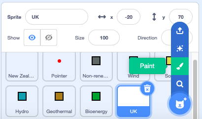
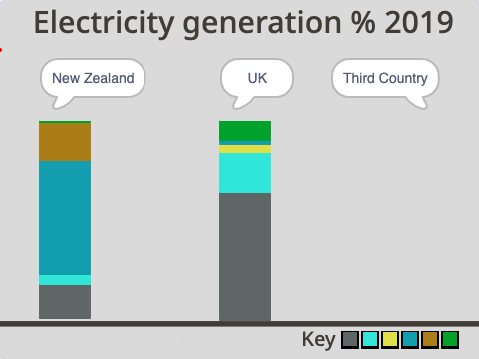

## ಮೂರನೆಯ ದೇಶವನ್ನು ಆಯ್ಕೆ ಮಾಡಿಕೊಳ್ಳಿ

ಈ ಹಂತದಲ್ಲಿ, ನೀವು ನಿಮ್ಮ ಸ್ವಂತ ಸ್ತಂಭಗಳನ್ನು ರಚಿಸಲು ಪ್ರಾರಂಭಿಸುವಿರಿ.

ದೇಶದ ಸ್ಪ್ರೈಟ್‌ಗಳು ಗ್ರಾಫಿಕ್ಸ್‌ ಹೊಂದಿಲ್ಲದಿರುವುದನ್ನು ನೀವು ಗಮನಿಸಿರಬಹುದು. ಅದು ಏಕೆಂದರೆ ಪ್ರೋಗ್ರಾಮ್‌ನಲ್ಲಿ ಸ್ಪ್ರೈಟ್‌ಗಳು ಒಳಕ್ಕೆ ಚಲಿಸಿದಾಗ, ನೀವು ಅವುಗಳ `Pen`{:class="block3extensions"}ಗಳಿಗೆ ಸಂಬಂಧಿಸಿದ ಕ್ರಿಯೆಗಳನ್ನು ಮತ್ತು ಮಾತಿನ ಗುಳ್ಳೆಯನ್ನು ಮಾತ್ರ ನೋಡಬೇಕು, ಸ್ಪ್ರೈಟ್‌ನ್ನೇ ಅಲ್ಲ.

ಈಗ ನೀವು ಉಡುಪು ಇಲ್ಲದ ಹೊಸ ಸ್ಪ್ರೈಟ್‌ ರಚಿಸಬೇಕು.

--- task ---

**Choose a Sprite** ಗೆ ಹೋಗಿ ಮತ್ತು **Paint** ಎಡಿಟರ್‌ ಆಯ್ಕೆ ಮಾಡಿಕೊಳ್ಳಿ.

{:width="300px"}

--- /task ---

ನಿಮ್ಮ ಹೊಸ ಸ್ಪ್ರೈಟ್‌ಗೆ ಹೆಸರು ಕೊಡಿ. ಹಲವಾರು ದೇಶಗಳ ಪಟ್ಟಿ ಮತ್ತು ಅವುಗಳು ವಿದ್ಯುತ್‌ ಉತ್ಪಾದನೆಗೆ ಉಪಯೋಗಿಸುವ ಸಂಪನ್ಮೂಲಗಳ ಶೇಕಡಾವಾರು ಕೊಡುಗೆಯನ್ನು ಈ ಕೆಳಗಿನ ಕೋಷ್ಟಕದಲ್ಲಿ ಕೊಡಲಾಗಿದೆ. ಪಟ್ಟಿಯಲ್ಲಿರುವ ಯಾವುದಾದರೂ ಒಂದು ದೇಶವನ್ನು ಆಯ್ದುಕೊಳ್ಳಿ. ಅದು ನಿಮ್ಮದೇ ದೇಶವಾಗಿರಬಹುದು( ಅದು ಈಗಾಗಲೇ ಪ್ರತಿನಿಧಿಸಲ್ಪಡದಿದ್ದರೆ), ನೆರೆಯ ದೇಶವಾಗಬಹುದು, ನೀವು ಯಾವಾಗಲಾದರೂ ಭೇಟಿನೀಡಿದ್ದಾಗಿರಬಹುದು, ಅಥವಾ ಅದು ದೊಡ್ಡ ಪ್ರಮಾಣದ ಯಾವುದಾದರೊಂದು ಸಂಪನ್ಮೂಲವನ್ನು ಉಪಯೋಗಿಸುವ ದೇಶವಾಗಿರಬಹುದು.

--- task ---

ಈ ಕೆಳಗಿನ ಕೋಷ್ಟಕವನ್ನು ಪರಿಶೀಲಿಸಿ ಮತ್ತು ರೇಖಾನಕ್ಷೆಗೆ ಯಾವ ದೇಶವನ್ನು ಉಪಯೋಗಿಸಲು ಇಚ್ಛಿಸುತ್ತೀರಿ ಎಂದು ನಿರ್ಧಾರ ಮಾಡಿ.

Resource type | Brazil | Canada | Iceland | India | Ireland | Norway | Singapore | S.Africa | USA | | --- | :---: | :---: | :---: | :---: | :---: | :---: | :---: | :---: | :---: | **Non-renewable** | 18 | 34 | 0 | 81 | 64 | 2 | 99 | 94 | 83 | **Wind** | 9 | 5 | 0 | 5 | 32 | 4 | 0 | 3 | 7 | **Solar** | 1 | 1 | 0 | 3 | 0 | 0 | 1 | 1 | 2 | **Hydro** | 63 | 58 | 70 | 11 | 4 | 94 | 0 | 2 | 7 | **Geothermal** | 0 | 0 | 30 | 0 | 0 | 0 | 0 | 0 | 0 | **Bioenergy** | 9 | 2 | 0 | 0 | 0 | 0 | 0 | 0 | 1 |

--- /task ---

--- task ---

**Sprite1** ನ್ನು ನೀವು ಆಯ್ಕೆ ಮಾಡಿದ ದೇಶದಿಂದ ಮರುನಾಮಕರಣ ಮಾಡಿ. ಈ ಸಂಪನ್ಮೂಲದಲ್ಲಿ, ಈ ಸ್ಪ್ರೈಟ್‌ನ್ನು **Third Country** ಸ್ಪ್ರೈಟ್‌ ಎಂದು ಉಲ್ಲೇಖಿಸಲಾಗುತ್ತದೆ.

{:width="300px"}

--- /task ---

ಪ್ರೋಗ್ರಾಮ್‌ ರನ್‌ ಆದಾಗ, ನೀವು **Third Country** ಸ್ಪ್ರೈಟ್‌ Stage ಮೇಲೆ ಒಂದು ಸ್ಥಾನಕ್ಕೆ ಹೋಗಬೇಕು ಮತ್ತು ಮಾತಿನ ಗುಳ್ಳೆ ಉಪಯೋಗಿಸಿ, **New Zealand** ಮತ್ತು **UK** ಸ್ಪ್ರೈಟ್‌ಗಳು ಮಾಡಿದಂತೆ ಅದರ ಹೆಸರನ್ನು ಹೇಳಬೇಕು ಎಂದು ಬಯಸುತ್ತೀರಿ.

--- task ---

**Third Country** ಸ್ಪ್ರೈಟ್‌ನ **Code** ಎಡಿಟರ್‌ಗೆ ಹೋಗಿ.

ಈ ಕೆಳಗಿನ ಬ್ಲಾಕ್‌ಗಳನ್ನು ಸೇರಿಸಿ: `when green flag clicked`{:class="block3events"}, `go to x:`{:class="block3motion"} `200` `y:`{:class="block3motion"} `70`, ಮತ್ತು ನೀವು ಆಯ್ಕೆ ಮಾಡಿಕೊಂಡ ದೇಶದ ಹೆಸರನ್ನು ಟೈಪ್‌ ಮಾಡಲು `say`{:class="block3looks"} ಬ್ಲಾಕ್:

```blocks3
when flag clicked
go to x: (200 )y: (70)
say [Third Country] ::looks
```

--- /task ---

--- task ---

‌ನಿಮ್ಮ ಪ್ರೋಗ್ರಾಮ್‌ ರನ್‌ ಮಾಡಿ. ಸ್ಪ್ರೈಟ್‌ ಅದೃಶ್ಯವಾಗಿರಬೇಕು ಮತ್ತು Stage ಮೇಲಿನ ಬಲಭಾಗದಲ್ಲಿ ಅದರ ಶೀರ್ಷಿಕೆಯನ್ನು ಹೇಳಬೇಕು. ಉದಾಹರಣೆ "Third Country" ಹೇಳುತ್ತದೆ.

{:width="300px"}

--- /task ---

--- save ---
