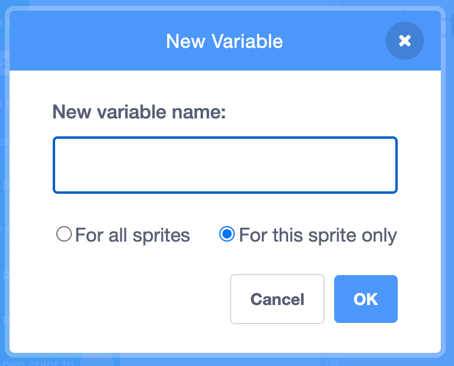
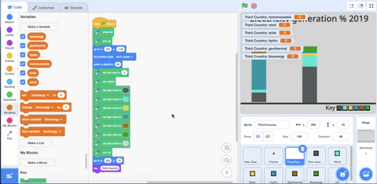

## ಸಂಪನ್ಮೂಲ ವೇರಿಯೇಬಲ್‌ಗಳನ್ನು ರಚಿಸಿ

ಈ ಹಂತದಲ್ಲಿ, ನೀವು **Third Country** ಸ್ಪ್ರೈಟ್‌ಗೆ ಹೊಸ ಸಂಪನ್ಮೂಲ ವೇರಿಯೇಬಲ್‌ಗಳನ್ನು ರಚಿಸುತ್ತೀರಿ. ನೀವು ವೇರಿಯೇಬಲ್‌ಗಳಿಗೆ ಮೌಲ್ಯಗಳನ್ನು ಸೇರಿಸುವಿರಿ, ಮತ್ತು ನಂತರ ಆ ಮೌಲ್ಯಗಳನ್ನು **Third Country** ಸ್ಪ್ರೈಟ್‌ಗೆ ಸ್ತಂಭ ಚಿತ್ರಿಸಲು ಉಪಯೋಗಿಸುವಿರಿ.

ಮೊದಲಿಗೆ, ನೀವು ನವೀಕರಿಸಲಾಗದ ಸಂಪನ್ಮೂಲಗಳಿಗೆ ವೇರಿಯೇಬಲ್‌ ರಚಿಸುತ್ತೀರಿ.

--- task ---

`Variables`{:class="block3variables"} ಬ್ಲಾಕ್‌ಗಳ ಮೆನು ಮೇಲೆ ಕ್ಲಿಕ್‌ ಮಾಡುವುದರ ಮೂಲಕ ಹೊಸ ವೇರಿಯೇಬಲ್‌ ರಚಿಸಿ.

ನಂತರ **Make a Variable** ಬಟನ್‌ ಮೇಲೆ ಕ್ಲಿಕ್‌ ಮಾಡಿ.

--- /task ---

ನಿಮಗೆ ವೇರಿಯೇಬಲ್‌ಗೆ ಶೀರ್ಷಿಕೆ ಬೇಕು. ವೇರಿಯೇಬಲ್‌ ಈ ಸ್ಪ್ರೈಟ್‌ಗೆ ಮಾತ್ರ ರಚಿಸಲ್ಪಟ್ಟಿದೆ, ಆದುದರಿಂದ ನೀವು ಈ ಸ್ಪ್ರೈಟ್‌ಗೆ ಮೌಲ್ಯವನ್ನು ಅಪ್‌ಡೇಟ್‌ ಮಾಡಿದಾಗ, ಅದು ಉಳಿದವುಗಳನ್ನು ಬದಲಾಯಿಸುವುದಿಲ್ಲ ಎಂಬುವುದನ್ನೂ ಸಹ ನೀವು ಖಚಿತಪಡಿಸಿಕೊಳ್ಳಬೇಕು. ಉಳಿದ ಸ್ಪ್ರೈಟ್‌ಗಳೂ `nonrenewable`{:class="block3variables"} ಶೀರ್ಷಿಕೆಯುಳ್ಳ ವೇರಿಯೇಬಲ್‌ ಹೊಂದಿವೆಯಾದರೂ, ಪ್ರತಿಯೊಂದು ವೇರಿಯೇಬಲ್‌ ಪ್ರತಿಯೊಂದು ದೇಶಕ್ಕೆ ಬೇರೆ ಬೇರೆ ಮೌಲ್ಯವನ್ನು ಇಟ್ಟುಕೊಳ್ಳುತ್ತದೆ.

--- task ---

ಈ ವೇರಿಯೇಬಲ್‌ನ್ನು `nonrenewable` ಎಂದು ಕರೆಯಿರಿ.

**ಮಹತ್ವವಾದುದು**: **For this sprite only** ಕ್ಲಿಕ್‌ ಮಾಡಿ.

ನಂತರ **OK** ಕ್ಲಿಕ್‌ ಮಾಡಿ.

{:width="400px"}

--- /task ---

ಉಳಿದಿರುವ ಸಂಪನ್ಮೂಲ ವೇರಿಯೇಬಲ್‌ಗಳನ್ನು ರಚಿಸಿ.

--- task ---

ಅದೇ ರೀತಿಯಲ್ಲಿ ಹೊಸ ವೇರಿಯೇಬಲ್‌ಗಳನ್ನು ರಚಿಸಿ. ಪ್ರತಿಯೊಂದು ಹೊಸ ವೇರಿಯೇಬಲ್‌ಗೆ **For this sprite only** ಆಯ್ಕೆ ಮಾಡುವುದು ನೆನಪಿರಲಿ:
+ `wind`{:class="block3variables"}
+ `solar`{:class="block3variables"}
+ `hydro`{:class="block3variables"}
+ `geothermal`{:class="block3variables"}
+ `bioenergy`{:class="block3variables"}

--- /task ---

ವೇರಿಯೇಬಲ್‌ಗಳನ್ನು ವೀಕ್ಷಣೆಯಿಂದ ಮರೆಮಾಡಿ.

--- task ---

ಶಕ್ತಿಯ ಎಲ್ಲಾ ಹೊಸ ವೇರಿಯೇಬಲ್‌ಗಳೂ `Variables`{:class="block3variables"} ಬ್ಲಾಕ್‌ಗಳ ಮೆನುನಲ್ಲಿ ಪಟ್ಟಿಯಾಗಿವೆ. ಅವುಗಳು ಸಹ ಸ್ವಯಂಚಾಲಿತವಾಗಿ Stage ಮೇಲೆ ಕಾಣಿಸಿಕೊಳ್ಳುತ್ತವೆ, ಆದರೆ ಈ ಪ್ರಾಜೆಕ್ಟ್‌ಗೆ ನಿಮಗೆ ಅವುಗಳು ಅಲ್ಲಿ ಕಾಣಿಸುವುದು ಬೇಡ.

ಪ್ರತಿಯೊಂದು ವೇರಿಯೇಬಲ್‌ ಮುಂದಿನ ಚೆಕ್‌ಬಾಕ್ಸ್‌ಗಳನ್ನು ಕ್ಲಿಕ್‌ ಮಾಡಿ ಅವುಗಳು ಕಾಣದಂತೆ ಮರೆಯಾಗುವಂತೆ ಮಾಡಿ.

--- no-print ---



--- /no-print ---

--- /task ---

ಈಗ ನೀವು ನಿಮ್ಮ ಆಯ್ಕೆಯ ದೇಶಕ್ಕೆ ಸಂಪನ್ಮೂಲಗಳ ದತ್ತಾಂಶವನ್ನು ಇನ್‌ಪುಟ್‌ ಮಾಡಬಹುದು. ನಿಮಗೆ ದತ್ತಾಂಶ ಇನ್‌ಪುಟ್‌ ಮಾಡಲು ಸಹಾಯವಾಗಲು ಮತ್ತೆ ಈ ಕೆಳಗಿನ ಕೋಷ್ಟಕವಿದೆ.

ಸಂಪನ್ಮೂಲ ವಿಧ | Brazil | Canada | Iceland | India | Ireland | Norway | Singapore | S.Africa | USA |
| --- | :---: | :---: | :---: | :---: | :---: | :---: | :---: | :---: | :---: |
**Non-renewable** | 18 | 34 | 0 | 81 | 64 | 2 | 99 | 94 | 83 |
**Wind** | 9 | 5 | 0 | 5 | 32 | 4 | 0 | 3 | 7 |
**Solar** | 1 | 1 | 0 | 3 | 0 | 0 | 1 | 1 | 2 |
**Hydro** | 63 | 58 | 70 | 11 | 4 | 94 | 0 | 2 | 7 |
**Geothermal** | 0 | 0 | 30 | 0 | 0 | 0 | 0 | 0 | 0 |
**Bioenergy** | 9 | 2 | 0 | 0 | 0 | 0 | 0 | 0 | 1 |

--- task ---

ಪ್ರತಿಯೊಂದು ವಿಧದ ಸಂಪನ್ಮೂಲಕ್ಕೆ ಒಂದರಂತೆ, ಆರು `set my variable to`{:class="block3variables"} ಬ್ಲಾಕ್‌ಗಳನ್ನು ಸೇರಿಸಿ. ಈ ಕೆಳಗಿನ ಕೋಡ್‌ ಸೌತ್‌ ಆಫ್ರಿಕಾವನ್ನು **Third Country** ಸ್ಪ್ರೈಟ್‌ಗೆ ಉದಾಹರಣೆಯ ದತ್ತಾಂಶವಾಗಿ ಉಪಯೋಗಿಸುತ್ತದೆ, ಆದರೆ ನೀವು ನಿಮ್ಮ ಆಯ್ಕೆಯ ದೇಶಕ್ಕೆ ಅಂಕಿಗಳನ್ನು ಇನ್‌ಪುಟ್‌ ಮಾಡುತ್ತೀರಿ.

```blocks3
when flag clicked
erase all
+set (nonrenewable) to (94)
+set (wind) to (3)
+set (solar) to (1)
+set (hydro) to (2)
+set (geothermal) to (0)
+set (bioenergy) to (0)
pen up
go to x:(120) y: (-140)
set rotation style [don't rotate v]
point in direction (90)
set pen size to (2)
pen down
set pen color to [#5e6766]
set pen color to [#37e4db]
set pen color to [#e4d748]
set pen color to [#169bb0]
set pen color to [#ab7519]
set pen color to [#00a42c]
set pen color to [#dadada]
pen up
go to x: (160) y: (70)
say [Third Country]
```

--- /task ---

--- task ---

ಸಂಪನ್ಮೂಲಗಳ ಮೌಲ್ಯಗಳನ್ನು ಕೂಡಿದರೆ ಅದು 100 ಆಗುತ್ತದೆ ಎಂದು ಖಚಿತಪಡಿಸಿಕೊಳ್ಳಿ.

--- /task ---

--- save ---
