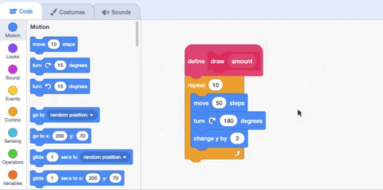

## ಮೂರನೆಯ ಸ್ತಂಭ ಚಿತ್ರಿಸಿ

ನೀವು ಹಿಂದಿನ ಹಂತದಲ್ಲಿ ರಚಿಸಿದ ಸಂಪನ್ಮೂಲ ವೇರಿಯೇಬಲ್‌ಗಳನ್ನು ಈಗ **Third Country** ಸ್ಪ್ರೈಟ್‌ಗೆ ಸ್ತಂಭ ಚಿತ್ರಿಸಲು ಉಪಯೋಗಿಸುವ ಸಮಯ.

Scratch ನಲ್ಲಿ, ನೀವು ಹೊಸ ಬರಹವನ್ನು ಪ್ರಾರಂಭಿಸುವ ಬ್ಲಾಕ್‌ನ್ನು ಮಾಡಬಹುದು ಮತ್ತು ನೀವು ಯಾವುದೇ Scratch ಬ್ಲಾಕ್‌ಗಳನ್ನು ಈ ಹೊಸ ಬರಹಕ್ಕೆ ಸೇರಿಸಬಹುದು. ನೀವು ನಂತರ ಬರಹವನ್ನು ನಿಮ್ಮ ಪ್ರೋಗ್ರಾಮ್‌ನಲ್ಲಿ ಎಲ್ಲಿಯಾದರೂ ಮರುಬಳಕೆ ಮಾಡಬಹುದು.

--- task ---

`My Blocks`{:class="block3myblocks"} ಮೆನುಗೆ ಹೋಗಿ ಮತ್ತು **Make a Block** ಮೇಲೆ ಕ್ಲಿಕ್‌ ಮಾಡಿ. ಬ್ಲಾಕ್‌ ಹೆಸರನ್ನು `draw` ಎಂದು ಕರೆಯಿರಿ ಮತ್ತು **Add an input number or text** ಮೇಲೆ ಕ್ಲಿಕ್‌ ಮಾಡಿ. ಮೌಲ್ಯವನ್ನು`number or text` `amount`ಗೆ ಬದಲಾಯಿಸಿ, ನಂತರ **OK** ಕ್ಲಿಕ್‌ ಮಾಡಿ.

--- no-print ---


--- /no-print ---

**Third Country** ಸ್ಪ್ರೈಟ್‌ನ Code ಪ್ರದೇಶದಲ್ಲಿ ಹೊಸ `define`{:class="block3myblocks"} ಬ್ಲಾಕ್‌ ರಚನೆಯಾಗಿರುವುದನ್ನು ನೀವು ನೋಡುವಿರಿ:

```blocks3
define draw (amount)
```

--- /task ---

ಸ್ತಂಭದಲ್ಲಿ ಮೊದಲನೆಯ ಗೆರೆಯನ್ನು ರಚಿಸಲು, ಪೆನ್ನನ್ನು ಕೆಳಗೆ ಮಾಡಿ **Third Country** ಸ್ಪ್ರೈಟ್‌ ಚಲಿಸಿ, ನಂತರ ಅದನ್ನು ಸುತ್ತಲೂ ತಿರುಗಿಸಿ, ಮತ್ತು Stage ನ ಸ್ವಲ್ಪ ಮೇಲ್ಗಡೆಗೆ ಚಲಿಸಿ.

--- task ---

ಮೂರು `Motion`{:class="block3motion"} ಬ್ಲಾಕ್‌ಗಳನ್ನು ನಿಮ್ಮ ಹೊಸ `draw`{:class="block3extensions"} ಬ್ಲಾಕ್‌ಗೆ ಸೇರಿಸಿ: `move`{:class="block3motion"} `50` `steps`{:class="block3motion"}, `turn right`{:class="block3motion"} `180` `degrees`{:class="block3motion"}, ಮತ್ತು `change y by`{:class="block3motion"} `2`:

```blocks3
define draw (amount)
+move (50) steps
+turn right (180) degrees
+change y by (2)
```

--- /task ---

ಹೊಸದಾಗಿ ವ್ಯಾಖ್ಯಾನಿಸಿದ ನಿಮ್ಮ `draw`{:class="block3myblocks"} ಬ್ಲಾಕ್‌ನ್ನು ಪ್ರತಿಯೊಂದು ಸಂಪನ್ಮೂಲಕ್ಕೆ ಸರಿಯಾದ ಗೆರೆಗಳನ್ನು ಚಿತ್ರಿಸಲು ಉಪಯೋಗಿಸಿ.

--- task ---

`My Blocks`{:class="block3myblocks"} ಮೆನುನಿಂದ, `draw`{:class="block3myblocks"} ಬ್ಲಾಕ್‌ನ್ನು ಪ್ರತಿಯೊಂದು `set pen color to`{:class="block3extensions"} ಬ್ಲಾಕ್‌ಗಳ ನಂತರ ಸೇರಿಸಿ. ಪ್ರತಿಯೊಂದು ವೇರಿಯೇಬಲ್‌ನ್ನು `draw`{:class="block3myblocks"} ಬ್ಲಾಕ್‌ಗಳಿಗೆ ಈ ಕೆಳಗಿನ ಕ್ರಮದಲ್ಲಿ ಎಳೆಯಿರಿ:
+ `nonrenewable`{:class="block3variables"}
+ `wind`{:class="block3variables"}
+ `solar`{:class="block3variables"}
+ `hydro`{:class="block3variables"}
+ `geothermal`{:class="block3variables"}
+ `bioenergy`{:class="block3variables"}.

ಉಳಿದಿರುವ ಕೊನೆಯ `draw`{:class="block3myblocks"} ಬ್ಲಾಕ್‌ನಲ್ಲಿ, ಮೌಲ್ಯ `1` ನ್ನು ಟೈಪ್‌ ಮಾಡಿ. ಸ್ತಂಭದ ತುದಿಯನ್ನು ಸ್ವಚ್ಛಗೊಳಿಸಲು, ಇದು ಹಿನ್ನೆಲೆಯ ಬಣ್ಣದ ಗೆರೆಯನ್ನು ಸೇರಿಸುತ್ತದೆ:

```blocks3
when flag clicked
erase all
set (nonrenewable) to (17)
set (wind) to (17)
set (solar) to (17)
set (hydro) to (17)
set (geothermal) to (17)
set (bioenergy) to (15)
pen up
go to x:(120) y: (-140)
set rotation style [don't rotate v]
point in direction (90)
set pen size to (2)
pen down
set pen color to [#5e6766]
+draw (nonrenewable)
set pen color to [#37e4db]
+draw (wind)
set pen color to [#e4d748]
+draw (solar)
set pen color to [#169bb0]
+draw (hydro)
set pen color to [#ab7519]
+draw (geothermal)
set pen color to [#00a42c]
+draw (bioenergy)
set pen color to [#dadada]
+draw (1)
pen up
go to x: (160) y: (70)
say [Third Country]
```

--- /task ---

--- task ---

‌ನಿಮ್ಮ ಪ್ರೋಗ್ರಾಮ್‌ ರನ್‌ ಮಾಡಿ. **Third Country** ಸ್ಪ್ರೈಟ್‌ನಲ್ಲಿ, ಪೆನ್ನು ಪ್ರತಿಯೊಂದು ಸಂಪನ್ಮೂಲಕ್ಕೆ ಒಂದು ತೇಳು ಗೆರೆಯನ್ನಷ್ಟೆ ಚಿತ್ರಿಸುವುದನ್ನು ನೀವು ನೋಡಬೇಕು. ಪೆನ್ನು ಪ್ರತಿಯೊಂದು ಸಂಪನ್ಮೂಲಕ್ಕೆ ಸರಿಯಾದ ಪ್ರಮಾಣವನ್ನು ಚಿತ್ರಿಸುವಂತೆ ಮಾಡಲು, ನೀವು `repeat`{:class="block3control"} ನ್ನು ಪ್ರತಿಯೊಂದು ವಿಧದ ಸಂಪನ್ಮೂಲದ ಪ್ರಮಾಣಕ್ಕೆ ಹೊಂದಿಸಬೇಕು.

--- /task ---

ನಿಮ್ಮ `draw`{:class="block3myblocks"} ಬ್ಲಾಕ್‌ಗಳು ಪ್ರತಿಯೊಂದು ಸಂಪನ್ಮೂಲಕ್ಕೆ ವಿದ್ಯುತ್ತಿನ ಪ್ರಮಾಣವನ್ನು ಸಂಗ್ರಹಿಸಲು ಹೊಂದಿಕೆಯಾಗಿವೆ, ಆದರೆ ನೀವು ವ್ಯಾಖ್ಯಾನಿಸಿದ ಕೋಡ್‌ ನಿಮ್ಮ ಬರಹದಲ್ಲಿ ಅದು ಪ್ರತಿಬಾಋಇ ಕಾಣಿಸಿಕೊಂಡಾಗ, ಇನ್ನೂ ಒಂದು ಬಾರಿ ಮಾತ್ರ ರನ್‌ ಆಗುತ್ತದೆ. ಸಂಗ್ರಹವಾದ `amount`{:class="block3myblocks"} ನ್ನು `draw`{:class="block3myblocks"} ಬ್ಲಾಕ್‌ ಸ್ವತಃ ಎಷ್ಪುಬಾರಿ ಪುನರಾವರ್ತನೆಯಾಗುತ್ತದೆ ಎಂಬುವುದನ್ನು ನಿಯಂತ್ರಿಸಲು ಉಪಯೋಗಿಸಿ.

--- task ---

`repeat`{:class="block3control"} ಬ್ಲಾಕ್‌ನ್ನು `define`{:class="block3myblocks"} ಬ್ಲಾಕ್‌ ಅಡಿಯಲ್ಲಿ ಸೇರಿಸಿ. `define`{:class="block3myblocks"} ಬ್ಲಾಕ್‌ನಿಂದ `repeat`{:class="block3control"} ಬ್ಲಾಕ್‌ ಒಳಕ್ಕೆ ಪೂರ್ಣವಾದ ಬ್ಲಾಕ್ `amount`{:class="block3myblocks"} ನ್ನು ಎಳೆಯಿರಿ:

--- no-print ---



--- /no-print ---

```blocks3
define draw (amount)
+repeat (amount)
move (50) steps
turn right (180) degrees
change y by (2)
end
```

--- /task ---

--- task ---

ನಿಮ್ಮ ಪ್ರಾಜೆಕ್ಟನ್ನು ಪರೀಕ್ಷಿಸಿ. **Third Country** ಸ್ಪ್ರೈಟ್‌ನ ಸ್ತಂಭವು ಈಗ ಪೂರ್ಣಗೊಂಡಿರಬೇಕು, ಮತ್ತು ನೀವು ಆಯ್ಕೆ ಮಾಡಿಕೊಂಡ ಮೌಲ್ಯಗಳನ್ನು ತೋರಿಸಬೇಕು. ನೀವು ಪ್ರತಿಯೊಂದು ಸಂಪನ್ಮೂಲದ ಮೇಲೆ ಸುಳಿದಾಡಿದಾಗ, ಗುರುತಿನ ಚೀಟಿ ಕಾಣಿಸಿಕೊಳ್ಳಬೇಕು.

--- /task ---

--- save ---
