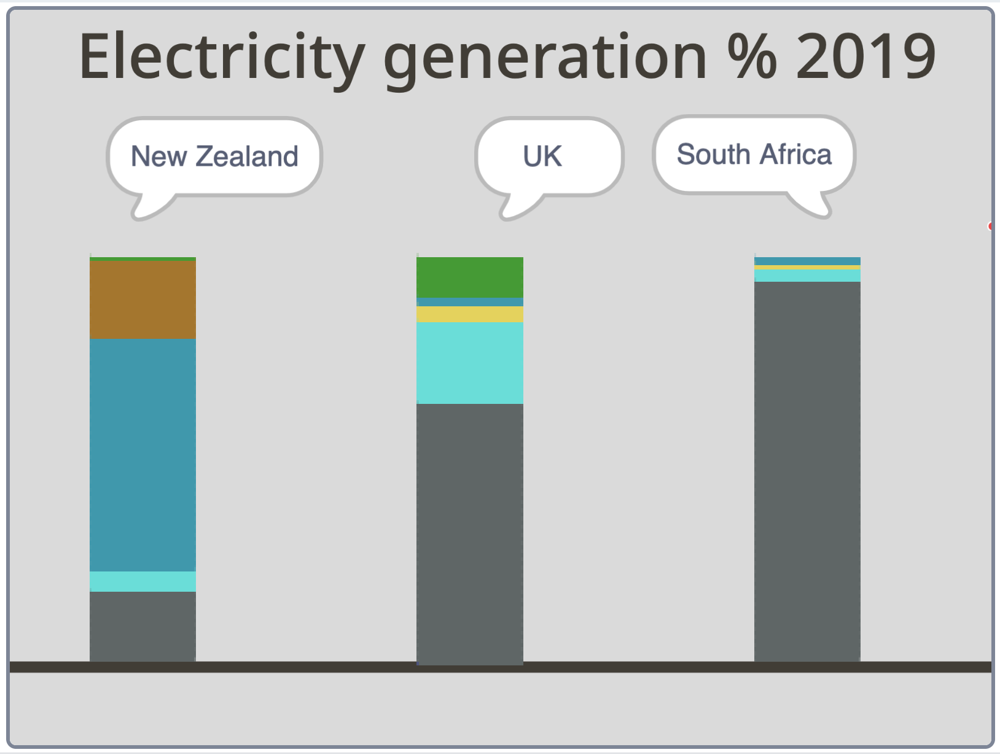

## परिचय

जगभरातील देशांनी वीज निर्मितीसाठी वापरल्या जाणार्‍या नैसर्गिक संसाधनांचा प्रकार आणि प्रमाणावरील वास्तविक डेटा इनपुट करण्यासाठी Scratch वापरा. त्यानंतर, ऍनिमेटेड डेटा व्हिज्युअलायजेशन वापरून परिणामांची तुलना करा. वीज महत्वाची आहे. शेवटी, ता तुम्ही वापरत असलेल्या कंप्युटरला पॉवर देते!

विविध नैसर्गिक संसाधनांमधून वीज निर्माण केली जाते ज्याचा पर्यावरणावर वेगवेगळ्या प्रकारे प्रभाव पडतो. जीवाश्म इंधन (कोळसा, वायू आणि तेल) (coal, gas, and oil) आणि अणुऊर्जा यांसारखी निसर्ग बदलू शकत नाही अशा संसाधनांचा वापर करून अनवीकरणक्षम ऊर्जा तयार केली जाते. नवीकरणक्षम ऊर्जा हवा (पवन ऊर्जा) (wind power), सूर्य (सौर ऊर्जा) (solar energy), पाणी (जलविद्युत) (hydropower), जमीन (भू-औष्णिक ऊर्जा) (geothermal energy), आणि लाकूड आणि पिके (जैव ऊर्जा) (bioenergy) यांसारख्या सेंद्रिय सामग्रीद्वारे तयार केली जाऊ शकते.

हा प्रोजेक्ट United Nations शाश्वत विकास उद्दिष्टांपैकी तीनवर भर देतो:
+ [परवडणारी आणि स्वच्छ ऊर्जा](https://www.undp.org/sustainable-development-goals#affordable-and-clean-energy){:target="_blank"}
+ [जबाबदार उपभोग आणि उत्पादन](https://www.undp.org/sustainable-development-goals#responsible-consumption-and-production){:target="_blank"}
+ [हवामान कृती](https://www.undp.org/sustainable-development-goals#climate-action){:target="_blank"}

हे आंतरराष्ट्रीय ऊर्जा एजन्सीने संकलित केलेल्या डेटाचा वापर करतात.

### तुम्ही काय तयार करणार आहात

--- no-print ---

ऍनिमेशन चालू करण्यासाठी हिंरव्या झेंड्यावर क्लिक करा. रंगांची श्रृंखला रेखाटणे पूर्ण झाल्यावर, रंग दर्शविणारी संसाधने एक्सप्लोर करण्यासाठी तुमचा माऊस किंवा टचस्क्रीन वापरा. त्यानंतर तीन देशांमधील नवीकरणयोग्य आणि अनवीकरणयोग्य ऊर्जेच्या वापराची तुलना करा.

<iframe src="https://scratch.mit.edu/projects/427746039/embed" allowtransparency="true" width="485" height="402" frameborder="0" scrolling="no" allowfullscreen></iframe>

--- /no-print ---

--- print-only ---

{:width="450px"}

--- /print-only ---

--- collapse ---
---
title: तुम्हाला काय लागणार
---

#### हार्डवेअर

+ Scracth चालवण्यास सक्षम असलेले कंप्युटर किंवा टॅबलेट

#### सॉफ्टवेअर

+ Scratch 3 (एकतर [ऑनलाईन](https://scratch.mit.edu/){:target="_blank"} किंवा [ऑफलाईन](https://scratch.mit.edu/download){:target="_blank"})

### डाउनलोड्स

+ तुम्ही ऑफलाइन काम करत असल्यास, [प्रोजेक्ट स्टार्टर फाइल](https://rpf.io/p/mr-IN/electricity-generation-go){:target="_blank"} डाऊनलोड करा

--- /collapse ---

--- collapse ---
---
title: तुम्ही काय शिकणार
---

+ `My Blocks`{:class="block3myblocks"} चा वापर करून तुमचा प्रोग्राम कसा तयार करायचा
+ `Pen`{:class="block3extensions"} एक्सटेंशन ब्लॉक्स सह स्तंभालेख कसे काढायचे
+ वास्तविक जगाचा डेटा (संख्या) ऍनिमेटेड आणि परस्परसंवादी डेटा व्हिज्युअलायझेशनमध्ये कसा बदलायचा

--- /collapse ---

--- collapse ---
---
title: शिक्षकांसाठी अतिरिक्त माहिती
---

तुम्ही [येथे पूर्ण केलेला प्रोजेक्ट शोधू शकता](https://rpf.io/p/mr-IN/electricity-generation-get){:target="_blank"}.

तुम्हाला हा प्रोजेक्ट प्रिंट करणे आवश्यक असल्यास, कृपया [प्रिंटर अनुकूल आवृत्ती](https://projects.raspberrypi.org/mr-IN/projects/electricity-generation/print){:target="_blank"}.

--- /collapse ---
