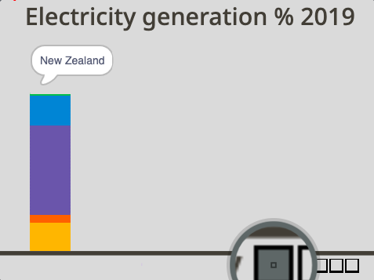
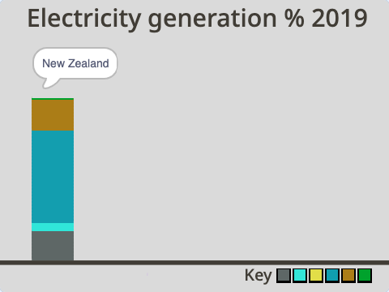

## रंग निवडा

या प्रोजेक्टसाठी, तुम्ही ऍनिमेटेड आणि परस्परसंवादी डेटा व्हिज्युअलायझेशन कराल. डेटा दृश्य पद्धतीने दर्शविला जातो तेव्हा तो अनेकदा समजून घेणे सोपे असते, विशेष करून त्यात अनेक संख्या असतांना. त्यामुळेच पाय तक्ता आणि आलेख माहितीपूर्ण असू शकतात. ते तुम्हाला एकमेकांशी माहितीची तुलना करण्यास मदत करू शकतात. कंप्युटर सह, तुम्ही आकर्षक डेटा व्हिज्युअलायझेशन तयार करू शकता जे ऍनिमेटेड किंवा परस्परसंवादी आहेत. हा प्रोजेक्ट दोन्ही करतो!

तुम्ही ऍनिमेटेड आणि परस्परसंवादी डेटा व्हिज्युअलायझेशन तयार करण्यासाठी तयार केलेला स्तंभालेख वापराल जो तीन देशांनी वीज निर्माण करण्यासाठी वापरलेल्या संसाधनांची तुलना करतो.

--- task ---

**ऑनलाईन:** Scratch मधील [स्टार्टर प्रोजेक्ट](http://rpf.io/electricity-generation-on){:target="_blank"} उघडा.

**ऑफलाईन:** Scratch ऑफलाईन एडिटर मध्ये [ प्रोजेक्ट स्टार्टर फाईल](http://rpf.io/p/en/electricity-generation-go){:target="_blank"} उघडा. तुम्हाला आवश्यकता असल्यास, तुम्ही [येथे Scratch डाऊनलोड आणि इंस्टॉल करू शकता](https://scratch.mit.edu/download){:target="_blank"}.

--- /task ---

तुम्हाला "Electricity generation % 2019" या शीर्षकासह राखाडी बॅकग्राऊंड दिसायला हवी. पेज च्या तळाशी आडवी रेष आहे.

{:width="400px"}

--- task ---

हिरव्या झेंड्यावर क्लिक करून तुमचा प्रोजेक्ट रन करा. अदृश्य पेन ने काढलेले कॉलम चे ऍनिमेशन. तो वीज निर्मीतीसाठी New Zealand ने संसाधनांचा केलेला वापर दर्शवतो. तुम्ही त्यानंतर तुमचा माऊस वापरून संवादात्मक कॉलम तपासू शकता.

{:width="400px"}

New Zealand जलविद्युत वापरून (hydropower) त्यांची भरपूर वीज निर्मीत करतो, म्हणूनच वरील कॉलम भरपूर जांभळा आहे.

तुम्ही कॉलम तपासल्यानंतर, प्रोग्राम थांबवण्यासाठी Stage च्या वरील लाल stop बटनवर क्लिक करा.

--- /task ---

Stage च्या खाली, तुम्हाला प्रत्येक संसाधन दर्शविणारी चौरसासह रिकामी की दिसेल: अनवीकरणयोग्य, हवा, सौर, जल, भू-औष्णिक आणि जैव ऊर्जा. (non-renewable, wind, solar, hydro, geothermal, and bioenergy). की सर्व संसाधने त्यांचा सध्या वापर होत नसलात तरी दाखवते. हे यामुळे कारण देश नेहमी ते वीज कशी निर्माण करणार ते बदलत असतात, आणि ते नवीकरणयोग्य संसाधनांच्या दिशेने वाटचाल करतात.

पुढे, तुमच्या आलेखावर प्रत्येक संसाधन दर्शवण्यासाठी तुम्ही रंग निवडाल.

--- task ---

**Non-renewable** स्प्राईटच्या **Costumes** टॅब वर क्लिक करा. Paint एडिटरच्या मध्यभागी, चौरस आहे ज्यात रंग भरलेला नाही. **Fill** कलर चूजरवर क्लिक करा आणि रंग, सॅच्युरेशन, आणि ब्राईटनेस स्लाइडर बदलून तुमच्या आवडीचे रंग तयार करा.


--- /task ---

--- task ---

**Fill** टूल (तो पेंट सारखा दिसू शकतो) निवडा आणि चौरस कॉश्चुमच्या आत क्लिक करा. तुम्हाला Stage वर नवीन रंगातील मुख्य बदलांमध्ये पहिला चौरस दिसेल.


--- /task ---

तुम्ही आलेखात अनवीकरणयोग्य ऊर्जा दर्शवण्यासाठी नवीन रंग निवडला आहे. पुढे, तुम्हाला **New Zealand** स्प्राईटमध्ये संसाधन बदलण्याची आवश्यकता आहे.

--- task ---

**New Zealand** स्प्राईटच्या **Code** वर कोड बघण्यासाठी क्लिक करा. प्रथम `set pen color to`{:class="block3extensions"} ब्लॉक आणि `draw`{:class="block3myblocks"} `nonrenewable`{:class="block3variables"} ब्लॉक कोडच्या विभागात जेथे स्तंभालेखाचे रंग सेट केलेले आहेत तेथे शोधा.


```blocks3

+set pen color to [#FCB711]
+draw (nonrenewable) ::custom
set pen color to [#F37021]
draw (wind) ::custom
set pen color to [#CC004C]
draw (solar) ::custom
set pen color to [#6460AA]
draw (hydro) ::custom
set pen color to [#0089D0]
draw (geothermal) ::custom
set pen color to [#0DB14B]
draw (bioenergy) ::custom

```

--- /task ---

--- task ---

पहिल्या `set pen colour`{:class="block3extensions"} ब्लॉकच्या रंगीत वर्तुळावर क्लिक करा आणि **Colour picker** टूल निवडा, जो तीन रंगाच्या स्लाइडरच्या खाली आहे. तो रंग निवडण्यासाठी की मधील **Non-renewable** स्प्राइट वर फिरेपर्यंत माउस पॉइंटर हलवा.


तुमचा निवडलेला **Non-renewable** संसाधन रंग आता `set pen colour`{:class="block3extensions"} ब्लॉक मध्ये दिसायला हवा:




```blocks3

set pen color to [#5e6766]
draw (nonrenewable) ::custom
```

--- /task ---

--- task ---

तुमचा प्रोजेक्ट पुन्हा रन करा. New Zealand साठीचा अवीकरणयोग्य संसाधन आता तुमच्या नवीन रंगात काढला गेला. तुमचा कॉलम फिरवा आणि तुम्हाला लक्षात येईल की, तुमच्या नवीन रंगाला तुम्ही स्पर्श करता तेव्हा कोणताही "non-renewable" स्पीच बबल नाही. तुम्ही चाचणी पूर्ण केल्यावर Stage च्या वरील लाल stop बटनवर क्लिक करा.


--- /task ---

पुढे, अवनीकरणयोग्य संसाधनासाठी **Pointer** स्प्राईट मधील रंग बदलून परस्परसंवादी लेबल तयार करा.

--- task ---

**Pointer** स्प्राईटवर क्लिक करा आणि रंग सेट केल्यावर कोडचा विभाग शोधा. जर `touching color`{:class="block3sensing"} ब्लॉक `say Non-renewable`{:class="block3looks"} ब्लॉकच्या वर असेल, वर्तुळावर क्लिक करा आणि की मधून नवीन रंग निवडण्यासाठी **Colour picker** टूल वापरा:


```blocks3
+if {touching color (#5e6766)?} then
say [Non-renewable]
end
if {touching color (#F37021)?} then
say [Wind]
end
if {touching color (#CC004C)?} then
say [Solar]
end
if {touching color (#6460AA)?} then
say [Hydro]
end
if {touching color (#0089D0)?} then
say [Geothermal]
end
if {touching color (#0DB14B)?} then
say [Bioenergy]
end
if {touching color (#dadada)?} then
say ()
end

```


--- /task ---

--- task ---

तुमचा प्रोजेक्ट पुन्हा रन करा. तुम्ही तुमच्या New Zealand कॉलम मध्ये संसाधन फिरवल्यावर परस्परसंवादी लेबलने "Non-renewable" म्हणायला हवे. तुमची चाचणी संपल्यावर Stage वरील लाल stop बटनवर क्लिक करा.

--- /task ---

इतर संसाधने प्रदर्शीत करण्यासाठी तुमचे स्वतःचे रंग आता निवडा. उदाहरणार्थ, ते कसे बदलतात हे दाखवण्यासाठी प्रत्येक संसाधनाचा रंग वेगळा असावा असे तुम्हाला वाटते का? किंवा सर्व नवीकरणयोग्य ऊर्जा संसाधने एका रंगाच्या वेगवेगळ्या शेड्सची आणि अनवीकरणयोग्य ऊर्जा संसाधने वेगळ्या रंगाची असावीत असे तुम्हाला वाटते का?

--- task ---

संसाधने स्प्राइट्ससाठी वरील टप्पे पुन्हा करा: **Wind**, **Solar**, **Hydro**, **Geothermal**, and **Bioenergy**. तुमच्या संसाधन स्प्राईटमध्ये प्रथम रंग बदलण्याचे लक्षात ठेवा, त्यानंतर तो संसाधन कोड **New Zealand** स्प्राईट आणि **Pointer** स्प्राईटमध्ये अपडेट सुद्धा व्हावा यासाठी शोधा.




--- /task ---

--- task ---

तुमचा प्रोजेक्ट पुन्हा रन करा. सर्व संसाधनांसाठी तुम्हाला अपेक्षित असल्याप्रमाणे आलेख दिसतो आणि परस्पर संवाद साधतो ते तपासा.

--- /task ---

--- save ---
