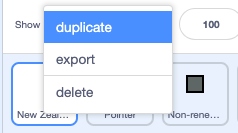
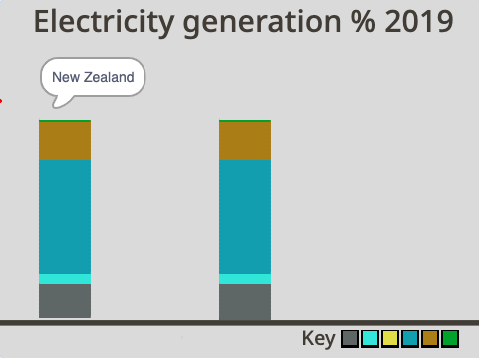
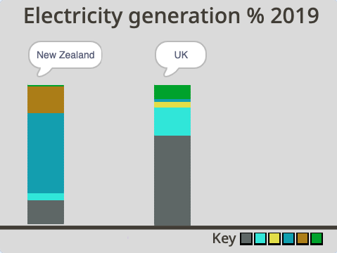

## UK कॉलम जोडा

या टप्प्यात, तुम्ही UK कॉलम जोडता आहात आणि त्या डेटा भरणार आहात ज्यामुळे तुम्ही UK सह New Zealand च्या परिणामांची तुलना करू शकता.

तुम्ही UK साठी कॉलन तयार करणार आहात. हे करण्यासाठी, तुम्ही **New Zealand** स्प्राईटची कॉपी कराल.

--- task ---

**New Zealand** स्प्राईटवर क्लिक करा, आणि **duplicate** निवडण्यासाठी राईट-क्लिक करा.

{:width="300px"}

--- /task ---

--- task ---

नवीन स्प्राईटला रीनेम करा `UK`.

--- /task ---

प्रोग्राम रन करा. तुम्हाला दिसेल की, **UK** स्प्राईट प्रोग्राम तो रन होत नसल्याचे दिसेल, तो असला तरीसुद्धा. याचे कारण म्हणजे **UK** स्प्राईटचा कॉलन हा आलेखावर **New Zealand** स्प्राईटच्या कॉलम खाली काढला गेला. **UK** स्प्राईट बघणे शक्य होण्यासाठी, तुम्हाला Stage वर **UK** स्प्राईट काढणे चालू करायचे आहे त्याठिकाणी पोजिशन हलवण्याची आवश्यकता आहे.

--- task ---

**UK** स्प्राईटच्या **Code** टॅबवर जा.

--- /task ---

--- task ---

स्क्रिप्टच्या वरच्या अर्ध्या भागातील `go to x: y:`{:class="block3motion"} ब्लॉकचा शोध घ्या. त्याला व्हॅल्यू आहेत `x:`{:class="block3motion"} `-200` आणि `y:`{:class="block3motion"} `-140`. केवळ `x`{:class="block3motion"} व्हॅल्यू `-20` ला बदला. `y`{:class="block3motion"} व्हॅल्यू `-140` येथे राहू शकते:


```blocks3
go to x: (-20)y: (-140)
```

--- /task ---

--- task ---

हिरव्या झेंड्यावर क्लिक करा. तुम्हाला आता **UK** स्प्राईटचा कॉलम **New Zealand** स्प्राईट कॉलमच्या उजव्या बाजूला दिसायला हवा.

{:width="400px"}

--- /task ---

तरीसुद्धा, तो UK बद्दलचा कॉलम असल्याचे स्पष्ट होणार नाही, कारण शीषर्क अजुनही **New Zealand** स्प्राईट कॉलमच्या मागे लपलेले आहे. Stage वर शीर्षक दिसायला हवे अशी पोजिशन तुम्ही हलवायला हवी जेणेकरून तुम्ही ती बघु शकता.

--- task ---

पुन्हा, **UK** स्प्राईटच्या **Code** टॅबवर जा. लांब स्क्रिप्टच्या शेवटी, `go to x:`{:class="block3motion"} `-200` `y:`{:class="block3motion"} `70` ब्लॉक शोधा. केवळ `x`{:class="block3motion"} व्हॅल्यू `-20` ला बदला. `y`{:class="block3motion"} व्हॅल्यू `70` ला राहू शकते:


```blocks3
go to x: (-20)y: (70)
```

--- /task ---

--- task ---

हिरव्या झेंड्यावर क्लिक करा. तुम्हाला आता उजव्या हाताच्या कॉलमच्या वर **UK** स्प्राईट शीर्षक दिसायला हवे. अरे नाही! तो अजुनही "New Zealand" म्हणतो आहे.

{:width="400px"}

--- /task ---

तुम्हाला `say`{:class="block3looks"} ब्लॉक मधील टेक्स्ट बदलण्याची आवश्यकता आहे जेणेकरून तो म्हणेल "UK".

--- task ---

`go to x:`{:class="block3motion"} `-20` `y:`{:class="block3motion"} `70` च्या खाली, `say`{:class="block3looks"} ब्लॉक जोडा आणि `UK` मध्ये टाईप करा. जेणेकरून शीर्षक "UK" हे स्पीच बबलच्या मध्यभागी असेल, प्रथम तुमच्या कीबोर्डवरील स्पेस बार चार वेळा दाबा आणि नंतर टाईप करा `UK`:


```blocks3
go to x: (-20) y: (70)
+ say [UK]
```
--- /task ---

--- task ---

हिरव्या झेंड्यावर क्लिक करा. तुम्ही आता **UK** स्प्राईट शीर्षक स्पीच बबलच्या मध्यभागी आणि उजव्या हाताच्या कॉलम वर बघू शकायला हवे.

{:width="300px"}

--- /task ---

कॉलम सारखे दिसतात कारण **UK** स्प्राईटचा कॉलम अजुनही **New Zealand** स्प्राईट साठी ऊर्जा व्हॅल्यू दाखवत आहे.

{:width="400px"}

--- task ---

**UK** स्प्राईटच्या **Code** टॅबमध्ये,सहा `set`{:class="block3variables"} व्हेरिएबल ब्लॉक्सची सीरिज तपासा जी प्रत्येक संसाधन व्हेरिएबलची व्हॅल्यू दाखवते. प्रत्येक ब्लॉक मधील व्हॅल्यू संसाधनांच्या एकूण (100 %) मधील संसाधनांची टक्केवारी (%) दाखवते. `set`{:class="block3variables"} ब्लॉक्स अजुनही **New Zealand** साठी डेटा दाखवत आहे हे लक्षात ठेवा:


```blocks3
set [nonrenewable v] to (18)
set [wind v] to (5)
set [solar v] to (0)
set [hydro v] to (57)
set [geothermal v] to (19)
set [bioenergy v] to (1)
```
--- /task ---

**UK** स्प्राईट प्रोग्राम मध्ये, तुम्हाला `set`{:class="block3variables"} ब्लॉकच्या व्हॅल्यू खालील सारणीत दिलेल्या आकड्यांनी बदलण्याची आवश्यकता आहे.

संसाधन प्रकार | UK |
- | - |
**Non-renewables** | 64 |
**Wind** | 20 |
**Solar** | 4 |
**Hydro** | 2 |
**Geothermal** | 0 |
**Bioenergy** | 10 |

<br/><br/>

--- task ---

पहिल्या ब्लॉकमध्ये, `set non-renewables to`{:class="block3variables"}, व्हॅल्यू `64` जोडा. ही व्हॅल्यू दर्शवते की, UK मध्ये वीज निर्मीतीसाठी अनवीकरणयोग्य संसाधनांच्या 64 टक्के दाखवते:


```blocks3
set [nonrenewable v] to (64)
```

--- /task ---

--- task ---

उर्वरीत `set`{:class="block3variables"} ब्लॉक्सचा वापर करून सर्व संसाधनांसाठी व्हॅल्यू पूर्ण करण्यासाठी वरील सारणीचा संदर्भ घ्या. तुमचा प्रोग्राम आता असा दिसायला हवा:


```blocks3
set [nonrenewable v] to (64)
set [wind v] to (20)
set [solar v] to (4)
set [hydro v] to (2)
set [geothermal v] to (0)
set [bioenergy v] to (10)
```

--- /task ---

--- task ---

तुम्ही योग्य पद्धतीने व्हॅल्यू इनपुट केल्याचे तपासा. डबल-चेक करण्यासाठी व्हॅल्यू जोडा: 64 + 20 + 4 + 2 + 0 + 10 = 100. एकूण नेहमी 100 असणे आवश्यक आहे कारण प्रत्येक ब्लॉकमधील मूल्य एकूण संसाधनाच्या टक्केवारी (%) सहभाग दर्शवते, जे 100 टक्के आहे.

--- /task ---

--- task ---

New Zealand आणि UK वीज निर्मीतीसाठी कोणत्या संसाधनांचा वापर करतात त्याची तुलना करण्यासाठी प्रोग्राम रन करा. तुम्हाला लक्षात येईल की, UK हा New Zealand पेक्षा जास्त बायोएनर्जी वापरतो. तुम्हाला हे देखील लक्षात येईल की, New Zealand हा वीज निर्मीतीसाठी UK पेक्षा जास्त हायड्रोपॉवर वापरतो.

{:width="400px"}

वीज निर्मीतीसाठी प्रत्येक देश किती अनवीकरणयोग्य ऊर्जा वापरतो ते तपासा. देश त्यांच्या अनवीकरणयोग्य संसाधन वापराची तुलना कशी करतात?

--- /task ---

--- save ---
