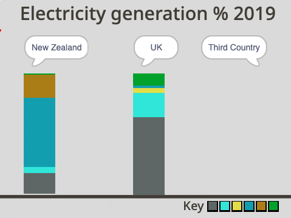

## तिसरा देश निवडा

या टप्प्यात, तुम्ही तुमचा स्वतःचा कॉलम चालू करत आहात.

country स्प्राईटला ग्राफिक नसल्याचे तुमच्या लक्षात येऊ शकते. याचे कारण असे की, प्रोग्राम मध्ये स्प्राईट हलल्यावर, तुम्हाला केवळ `Pen`{:class="block3extensions"} आणि स्पीच बबल संबंधित कृतीच बघण्याची आवश्यकता आहे, स्प्राईटच्या स्वतःच्या नाही.

आता तुम्हाला कॉश्चुम नसल्यासह नवीन स्प्राईट तयार करण्याची आवश्यकता आहे.

--- task ---

**Choose a Sprite** वर जा आणि **Paint** एडिटर निवडा.

{:width="300px"}

--- /task ---

तुमच्या नवीन स्प्राईटला नाव द्या. देशांची संख्या आणि ते वीज निर्मीतीसाठी वापरत असलेल्या संसाधन सहभागाची टक्केवारी दाखवणारी सारणी खाली आहे. सूची केलेल्या देशांपैकी कोणताही एक निवडा. तो तुमचा देश असू शकतो (तो आधीच दर्शवला नसल्यास), शेजारचा देश असू शकतो, तुम्ही भेट दिलेला एखादा देश असू शकतो, किंवा कोणत्याही एका संसाधनाचा मोठ्या प्रमाणात वापर झालेला देश सुद्धा असू शकतो.

--- task ---

खालील सारणीची तपासणी करा आणि आलेखासाठी कोणत्या देशाचा तुम्हाला वापर करायचा आहे ते ठरवा.

संसाधन प्रकार | Brazil | Canada | Iceland | India | Ireland | Norway | Singapore | S.Africa | USA |
| --- | :---: | :---: | :---: | :---: | :---: | :---: | :---: | :---: | :---: |
**Non-renewable** | 18 | 34 | 0 | 81 | 64 | 2 | 99 | 94 | 83 |
**Wind** | 9 | 5 | 0 | 5 | 32 | 4 | 0 | 3 | 7 |
**Solar** | 1 | 1 | 0 | 3 | 0 | 0 | 1 | 1 | 2 |
**Hydro** | 63 | 58 | 70 | 11 | 4 | 94 | 0 | 2 | 7 |
**Geothermal** | 0 | 0 | 30 | 0 | 0 | 0 | 0 | 0 | 0 |
**Bioenergy** | 9 | 2 | 0 | 0 | 0 | 0 | 0 | 0 | 1 |


--- /task ---

--- task ---

तुम्ही निवडलेल्या देशाच्या नावासह **Sprite1** रीनेम करा. या संसाधनामध्ये, हा स्प्राईट **Third Country** स्प्राईटचा संदर्भ देईल.

{:width="300px"}

--- /task ---

प्रोग्राम रन झाल्यावर, तुम्हाला Stage वरील **Third Country** स्प्राईट पोजिशनवर जायला हवा आहे आणि, स्पीच बबलच्या वापराने, त्याचे नाव म्हणा, जसेकी **New Zealand** आणि **UK**स्प्राईट.

--- task ---

**Third Country**स्प्राईटसाठी **Code** एडिटरवर जा.

खालील ब्लॉक्स जोडा: `when green flag clicked`{:class="block3events"}, `go to x:`{:class="block3motion"} `200` `y:`{:class="block3motion"} `70`, आणि `say`{:class="block3looks"} ब्लॉक तुम्ही निवडलेल्या देशाचे नाव टाईप करण्यासाठी:

```blocks3
when flag clicked
go to x: (200 )y: (70)
say [Third Country] ::looks
```

--- /task ---

--- task ---

तुमचा प्रोग्राम रन करा. स्प्राईट अदृश्य असले पाहीजे आणि त्याे शीर्षक Stage च्या उजव्या वरच्या बाजूला दिसायला हवे. उदाहणार्थ "Third Country".

{:width="300px"}

--- /task ---

--- save ---
