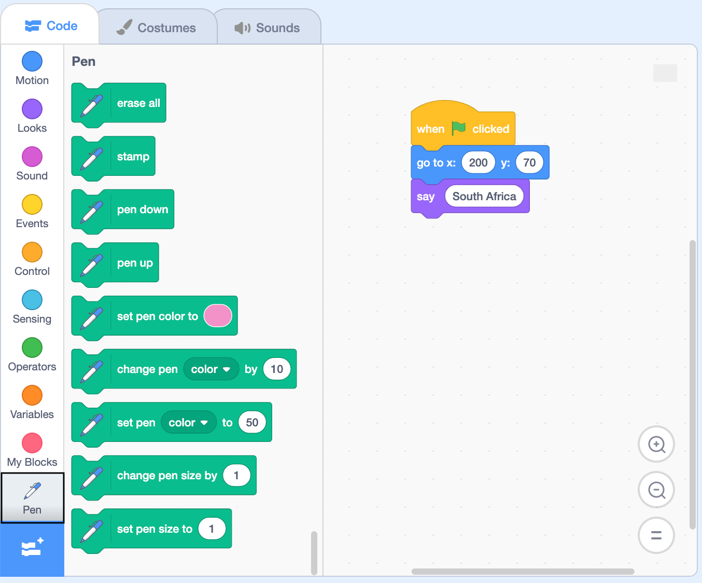

## पेन तयार करा

या टप्प्यात, तुम्ही Stage वर काढण्यासाठी `Pen`{:class="block3extensions"} एक्सटेंशन ब्लॉक्स कसे वापरायचे ते शिकूया.

प्रथम, **Third Country** स्प्राईट आलेखाच्या खाली हलवा जेणेकरून तो कॉलम काढण्याच्या योग्य पोजिशन मध्ये असेल.

--- task ---

`when green flag clicked`{:class="block3events"} ब्लॉकच्या खाली, तीन `Motion`{:class="block3motion"} ब्लॉक्स इंसर्ट करा:
+ `go to x: y:`{:class="block3motion"} ब्लॉक, व्हॅल्यूज `x:`{:class="block3motion"} `120` आणि `y:`{:class="block3motion"} `-140` ला बदला
+ `set rotation style`{:class="block3motion"} ब्लॉक, आणि ड्रॉप-डाऊन मेनू मधून `don't rotate`{:class="block3motion"} निवडा
+ `point in direction 90`{:class="block3motion"} ब्लॉक

```blocks3
when flag clicked
+ go to x:(120) y: (-140)
+ set rotation style [don't rotate v]
+ point in direction (90)
go to x: (200) y: (70)
say [Third Country]
```

--- /task ---

आता `Pen`{:class="block3extensions"} एक्सटेंशन ब्लॉक्स मेनू जोडा.

--- task ---

**Code** टॅबवर क्लिक करा तुमच्या **Third Country** स्प्राईटसाठी, आणि त्यानंतर `Pen`{:class="block3extensions"} एक्सटेंशन ब्लॉकवर क्लिक करा (स्क्रीनच्या डाव्या कोपऱ्यात खाली).

{:width="400px"}

--- /task ---

पेन तयार करा आणि त्याची साईज सेट करा.

--- task ---

`set pen size to 1`{:class="block3extensions"} ब्लॉक जोडा, आणि व्हॅल्यू `2` ला बदला जेणेकरून पेन थोडा जाड असेल. काढण्यासाठी तयार होण्यासाठी `pen down`{:class="block3extensions"} ब्लॉक इंसर्ट करा.

```blocks3
when flag clicked
go to x:(120) y: (-140)
set rotation style [don't rotate v]
point in direction (90)
+set pen size to (2)
+pen down
go to x: (200) y: (70)
say [Third Country]
```

--- /task ---

प्रोग्राम Stage वरून पेनच्या खूणा पुसतो आणि हिरव्या झेंड्यावर क्लिक केल्यावर पेन वर उचलला जातो याची तुम्ही खात्री करणे आवश्यक आहे.

--- task ---

तुमच्या कोडच्या वरच्या भागात `erase all`{:class="block3extensions"} ब्लॉक आणि `pen up`{:class="block3extensions"} ब्लॉक जोडा आणि `when green flag clicked`{:class="block3events"} ब्लॉकच्या खाली.

```blocks3
when flag clicked
+ erase all
+ pen up
go to x:(120) y: (-140)
set rotation style [don't rotate v]
point in direction (90)
set pen size to (2)
pen down
go to x: (200) y: (70)
say [Third Country]
```

--- /task ---

पेन प्रत्येक संसाधन काढत असल्यामुळे त्याचा रंग बदलेल. विविध देशांमध्ये तयार झालेल्या संसाधनांची तुलना करण्यासाठी, प्रत्येक संसाधन दर्शविणारा रंग प्रत्येक देशासाठी सारखाच असायला हवा. पेन ने वर्गवारी काढून झाल्यानंतर, तो बॅकड्रॉपचा रंग राखाडी करेल.

--- task ---

तुमच्या कोडमध्ये `set pen colour to`{:class="block3extensions"} सात ब्लॉक्स जोडा. ते सहा वर्गवारी, तसेच बॅकग्राऊंड दर्शवण्यासाठी अतिरीक्त रंग दर्शवतील.

```blocks3
when flag clicked
pen up
go to x:(120) y: (-140)
set rotation style [don't rotate v]
point in direction (90)
set pen size to (2)
pen down
+ set pen color to []
+ set pen color to []
+ set pen color to []
+ set pen color to []
+ set pen color to []
+ set pen color to []
+ set pen color to []
go to x: (200) y: (70)
say [Third Country]
```

--- /task ---

तुम्ही आता संसाधनांसाठी निवडलेले वेगवेगळे रंग दर्शवण्यासाठी प्रत्येक ब्लॉकचा रंग बदलण्याची आवश्यकता आहे.

--- task ---

पहिल्या `set pen colour to`{:class="block3extensions"} ब्लॉकवर क्लिक करा आणि **Colour picker** टूल निवडा. तुमच्या की मधील पहिल्या संसाधनावर क्लिक करा. त्यानंतर वर्तुळ तुम्ही निवडलेल्या रंगात वळेल.

प्रत्येक संसाधनासाठी हे पुन्हा करा, जेणेकरून तुम्ही संसाधन रंगांच्या क्रमाचा गोंधळ होणार नाही.

सातव्या `set pen colour to`{:class="block3extensions"} ब्लॉकसाठी बॅकड्रॉप रंगाचा वापर करणे विसरू नका, तुम्हाला ते Stage च्या बॅकग्राऊंडवर कोठेही फिरवून मिळू शकते.

--- /task ---

कॉलम काढून पूर्ण झाल्यानंतर पेन उचला.

--- task ---

तुमच्या कोडला `pen up`{:class="block3extensions"} ब्लॉक जोडा.

```blocks3
when flag clicked
pen up
go to x:(120) y: (-140)
set rotation style [don't rotate v]
point in direction (90)
set pen size to (2)
pen down
set pen color to [#5e6766]
set pen color to [#37e4db]
set pen color to [#e4d748]
set pen color to [#169bb0]
set pen color to [#ab7519]
set pen color to [#00a42c]
set pen color to [#dadada]
+pen up
go to x: (200) y: (70)
say [Third Country]
```

--- /task ---

--- task ---

**Third Country** स्प्राईट सेटअप झाला असेल तरीसुद्धा, तो आलेखावर दिसत नाही कारण तुम्ही कोणताही संसाधन डेटा इनपुट केलेला नाही. तुम्हाला डेटा इनपुट करण्याची आणि पुढील टप्प्यात तुमचा कोड तपासण्याची आवश्यकता असेल.

--- /task ---

--- save ---
