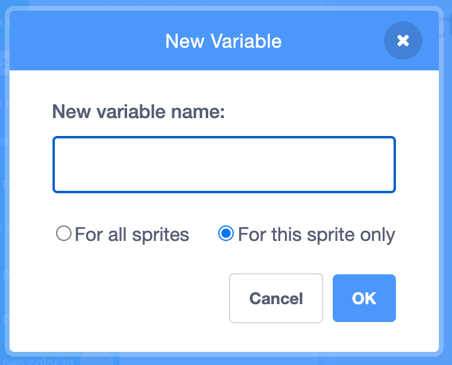

## रिसोर्स व्हेरिएबल्स तयार करा

या टप्प्यात, तुम्ही **Third Country** स्प्राईटसाठी नवीन रिसोर्स व्हेरिएबल तयार करणार आहात. तुम्ही व्हेरिएबल्स ला व्हॅल्यू जोडाल, आणि त्यानंतर **Third Country** स्प्राईटसाठी कॉलम काढण्यास त्या व्हॅल्यूंचा वापर कराल.

प्रथम, तुम्ही अनवीकरणयोग्य संसाधनांसाठी व्हेरिएबल तयार कराल.

--- task ---

`Variables`{:class="block3variables"} ब्लॉक्स मेनूवर क्लिक करून नवीन व्हेरिएबल तयार करा.

त्यानंतर **Make a Variable** बटनावर क्लिक करा.

--- /task ---

तुम्हाला व्हेरिएबल साठी शीर्षकाची आवश्यकता आहे. व्हेरिएबल केवळ याच स्प्राईटसाठी तयार झाल्याची तुम्ही खात्री करायला हवी जेणेकरून तुम्ही या स्प्राईटसाठी व्हॅल्यू अपडेट केल्यावर, तो इतरांसाठी ती बदलणार नाही. इतर स्प्राईट्सला शीर्षक `nonrenewable`{:class="block3variables"} असलेले व्हेरिएबल असले तरीही, प्रत्येक व्हेरिएबलला प्रत्येक देशासाठी वेगवेगळी व्हॅल्यू असते.

--- task ---

या व्हेरिएबल ला म्हणा `nonrenewable`.

**महत्वाचे**: **For this sprite only** क्लिक करा.

त्यानंतर **OK** वर क्लिक करा.

{:width="400px"}

--- /task ---

उर्वरीत resource व्हेरिएबल तयार करा.

--- task ---

त्याचप्रकारे नवीन व्हेरिएबल तयार करा. प्रत्येक नवीन व्हेरिएबल साठी **For this sprite only** निवडण्याचे लक्षात ठेवा:
+ `wind`{:class="block3variables"}
+ `solar`{:class="block3variables"}
+ `hydro`{:class="block3variables"}
+ `geothermal`{:class="block3variables"}
+ `bioenergy`{:class="block3variables"}

--- /task ---

व्हेरिएबल्स दिसण्यापासून लपवा.

--- task ---

सर्व नवीन ऊर्जा व्हेरिएबल्स `Variables`{:class="block3variables"} ब्लॉक्स मेनूमध्ये सूचीबद्ध केलेले आहेत. ते Stage वर आपोआप दाखवते जातात, परंतु तुम्हाला या प्रोजेक्टसाठी ते दाखवण्याची आवश्यकता नाही.

व्हेरिएबल दिसण्यापासून लपवण्यासाठी प्रत्येक व्हेरिएबलच्या पुढे असलेल्या चेकबॉक्स वर क्लिक करा.

--- no-print ---


--- /no-print ---

--- /task ---

आता, तुम्ही निवडलेल्या देशासाठी तुम्ही संसाधन डेटा इनपुट करू शकता. तुम्हाला डेटा इनपुट करण्यास मदत करण्यासाठी खाली पुन्हा सारणी आहे.

संसाधन प्रकार | Brazil | Canada | Iceland | India | Ireland | Norway | Singapore | S.Africa | USA | | --- | :---: | :---: | :---: | :---: | :---: | :---: | :---: | :---: | :---: | **Non-renewable** | 18 | 34 | 0 | 81 | 64 | 2 | 99 | 94 | 83 | **Wind** | 9 | 5 | 0 | 5 | 32 | 4 | 0 | 3 | 7 | **Solar** | 1 | 1 | 0 | 3 | 0 | 0 | 1 | 1 | 2 | **Hydro** | 63 | 58 | 70 | 11 | 4 | 94 | 0 | 2 | 7 | **Geothermal** | 0 | 0 | 30 | 0 | 0 | 0 | 0 | 0 | 0 | **Bioenergy** | 9 | 2 | 0 | 0 | 0 | 0 | 0 | 0 | 1 |

--- task ---

प्रत्येक संसाधनासाठी एक याप्रमाणे सहा `set my variable to`{:class="block3variables"} ब्लॉक्स जोडा. उदाहरणार्थ खालील कोड **Third Country** स्प्राईट साठी South Africa निवडतो, परंतु तुम्ही तुमच्या निवडलेल्या देशासाठी आकडे इनपुट कराल.

```blocks3
when flag clicked
erase all
+set (nonrenewable) to (94)
+set (wind) to (3)
+set (solar) to (1)
+set (hydro) to (2)
+set (geothermal) to (0)
+set (bioenergy) to (0)
pen up
go to x:(120) y: (-140)
set rotation style [don't rotate v]
point in direction (90)
set pen size to (2)
pen down
set pen color to [#5e6766]
set pen color to [#37e4db]
set pen color to [#e4d748]
set pen color to [#169bb0]
set pen color to [#ab7519]
set pen color to [#00a42c]
set pen color to [#dadada]
pen up
go to x: (160) y: (70)
say [Third Country]
```

--- /task ---

--- task ---

संसाधनांची मूल्ये 100 पर्यंत जोडली जातात हे दोनदा तपासा.

--- /task ---

--- save ---
