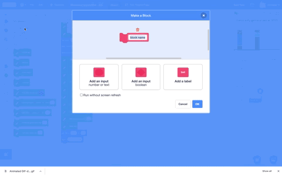

## तीसरा कॉलम काढा

आता, **Third Country** साठी कॉलम काढण्यास आधीच्या टप्प्यात तुम्ही तयार केलेल्या रिसोर्स व्हेरिएबलचा वापर करण्याची वेळ आहे.

Scratch मध्ये, तुम्ही ब्लॉक्स तयार करू शकता जो नवीन स्क्रिप्ट चालू करतो आणि या नवीन स्क्रिप्ट मध्ये कोणताही Scratch ब्लॉक्स जोडा. त्यानंतर तुम्ही तुमच्या प्रोग्राम मध्ये कोठेही स्क्रिप्टचा पुन्हा वापर करू शकता.

--- task ---

`My Blocks`{:class="block3myblocks"} मेनू वर जा आणि **Make a Block** वर क्लिक करा. ब्लॉकला `draw` नाव द्या आणि **Add an input number or text** वर क्लिक करा. व्हॅल्यू `number or text` ही `amount` ला बदला, त्यानंतर **OK** वर क्लिक करा.

--- no-print ---



--- /no-print ---

तुम्ही `define`{:class="block3myblocks"} ब्लॉक बघाल जो **Third Country** स्प्राईटच्या Code एरियात तयार करण्यात आला आहे:

```blocks3
define draw (amount)
```

--- /task ---

कॉलम मध्ये पहिली लाईन तयार करा, पेन डाऊन करून **Third Country** स्प्राईटवर जा, त्यानंतर तो गोल फिरवा, आणि Stage वर हळूवार जा.

--- task ---

तीन `Motion`{:class="block3motion"} ब्लॉक्स तुमच्या नवीन`draw`{:class="block3extensions"} ब्लॉकला जोडा: `move`{:class="block3motion"} `50` `steps`{:class="block3motion"}, `turn right`{:class="block3motion"} `180` `degrees`{:class="block3motion"}, आणि `change y by`{:class="block3motion"} `2`:

```blocks3
define draw (amount)
+move (50) steps
+turn right (180) degrees
+change y by (2)
```

--- /task ---

प्रत्येक संसाधनासाठी योग्य संख्या काढण्यासाठी नवीन ठरवलेला `draw`{:class="block3myblocks"} ब्लॉक वापरा.

--- task ---

`My Blocks`{:class="block3myblocks"} मेनू मधून, `draw`{:class="block3myblocks"} ब्लॉक इंसर्ट करा प्रत्येक `set pen color to`{:class="block3extensions"} ब्लॉक्सच्या नंतर. खालील क्रमात `draw`{:class="block3myblocks"} ब्लॉक्समध्ये प्रत्येक व्हेरिएबल ड्रॅग करा:
+ `nonrenewable`{:class="block3variables"}
+ `wind`{:class="block3variables"}
+ `solar`{:class="block3variables"}
+ `hydro`{:class="block3variables"}
+ `geothermal`{:class="block3variables"}
+ `bioenergy`{:class="block3variables"}.

अंतिम उर्वरीत `draw`{:class="block3myblocks"} ब्लॉकमध्ये, व्हॅल्यू `1` टाईप करा. कॉलमचा शेवट पुसण्यासाठी हे लाईन म्हणजेच बॅकड्रॉपसाठी सारखा रंग जोडते:

```blocks3
when flag clicked
erase all
set (nonrenewable) to (17)
set (wind) to (17)
set (solar) to (17)
set (hydro) to (17)
set (geothermal) to (17)
set (bioenergy) to (15)
pen up
go to x:(120) y: (-140)
set rotation style [don't rotate v]
point in direction (90)
set pen size to (2)
pen down
set pen color to [#5e6766]
+draw (nonrenewable)
set pen color to [#37e4db]
+draw (wind)
set pen color to [#e4d748]
+draw (solar)
set pen color to [#169bb0]
+draw (hydro)
set pen color to [#ab7519]
+draw (geothermal)
set pen color to [#00a42c]
+draw (bioenergy)
set pen color to [#dadada]
+draw (1)
pen up
go to x: (160) y: (70)
say [Third Country]
```

--- /task ---

--- task ---

तुमचा प्रोग्राम रन करा. **Third Country** स्प्राईटमध्ये, तुम्हाला पेन प्रत्येक संसाधनासाठी केवळ एक बारीक लाईन काढत असल्याचे दिसायला हवे. प्रत्येक संसाधनासाठी पेन ने योग्य प्रमाण काढण्यासाठी, तुम्हाला प्रत्येक संसाधन प्रकाराच्या प्रमाणासाठी तुम्ही `repeat`{:class="block3control"} सेट करण्याची आवश्यकता आहे.

--- /task ---

तुमचा `draw`{:class="block3myblocks"} ब्लॉक्स प्रत्येक संसाधनासाठी विद्युतचे प्रमाण स्टोअर करण्यासाठी सेट केलेला आहे, परंतु तुम्ही ठरवलेला कोड अजुनही केवळ एकदाच रन होतो, प्रत्येक वेळी तो तुमच्या स्क्रिप्ट मध्ये दिसतो. स्टोअर केलेल्या `amount`{:class="block3myblocks"} चा कितीवेळा `draw`{:class="block3myblocks"} ब्लॉक स्वतः रीपीट होईल हे नियंत्रीत करण्यासाठी वापर करा.

--- task ---

`define`{:class="block3myblocks"} ब्लॉकच्या खाली `repeat`{:class="block3control"} ब्लॉक जोडा. गोलाकार ब्लॉक `amount`{:class="block3myblocks"} `define`{:class="block3myblocks"} ब्लॉक मधून `repeat`{:class="block3control"} ब्लॉक मध्ये ड्रॅग करा:

--- no-print ---


--- /no-print ---

```blocks3
define draw (amount)
+repeat (amount)
move (50) steps
turn right (180) degrees
change y by (2)
end
```

--- /task ---

--- task ---

तुमच्या प्रोजेक्टची तपासणी करा. **Third Country** स्प्राईट साठीचा कॉलम आता पूर्ण व्हायला हवा, आणि तुम्ही निवडलेल्या व्हॅल्यू दाखवायला हव्या. तुम्ही प्रत्येक संसाधनावर फिरता तेव्हा, लेबल दिसले पाहिजे.

--- /task ---

--- save ---
