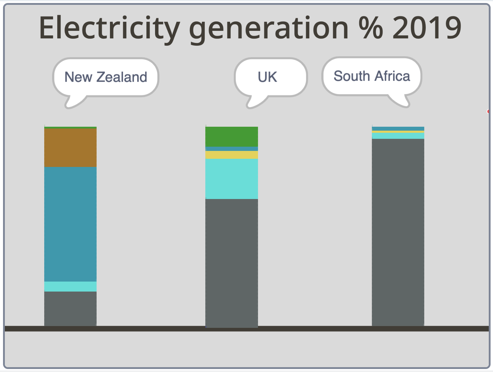

## పరిచయం

ప్రపంచవ్యాప్తంగా ఉన్న దేశాలు విద్యుత్తును ఉత్పత్తి చేయడానికి ఉపయోగించే సహజ వనరుల రకం మరియు పరిమాణంపై నిజమైన డేటాను ఇన్‌పుట్ చేయడానికి Scratch ని ఉపయోగించండి. ఆపై, యానిమేటెడ్ డేటా విజువలైజేషన్ ఉపయోగించి ఫలితాలను సరిపోల్చండి. విద్యుత్ చాలా ముఖ్యమైనది. ఎంతైనా, మీరు ఉపయోగిస్తున్న కంప్యూటర్‌కు ఇది శక్తినిస్తుంది!

పర్యావరణంపై వివిధ మార్గాల్లో ప్రభావం చూపే వివిధ సహజ వనరుల నుంచి విద్యుత్తు ఉత్పత్తి అవుతుంది. శిలాజ ఇంధనాలు (fossil fuels) (బొగ్గు, గ్యాస్ మరియు చమురు) (coal, gas, and oil) మరియు అణుశక్తి (nuclear energy) వంటి ప్రకృతి భర్తీ చేయలేని వనరులను ఉపయోగించి పునరుత్పాదకం కాని శక్తి ఉత్పత్తి చేయబడుతుంది. పునరుత్పాదక శక్తిని గాలి (పవన శక్తి), సూర్యుడు (సౌరశక్తి), నీరు (జలశక్తి), భూమి (భూఉష్ణ శక్తి) మరియు కలప మరియు పంటలు (బయోఎనర్జీ) వంటి సేంద్రియ పదార్థాల ద్వారా ఉత్పత్తి చేయవచ్చు.

ఈ ప్రాజెక్ట్ యునైటెడ్ నేషన్స్ సస్టైనబుల్ డెవలప్‌మెంట్ గోల్స్‌లో మూడింటిపై దృష్టి పెడుతుంది:
+ [ Affordable and Clean Energy](https://www.undp.org/sustainable-development-goals#affordable-and-clean-energy){:target="_blank"}
+ [ Responsible Consumption and Production](https://www.undp.org/sustainable-development-goals#responsible-consumption-and-production){:target="_blank"}
+ [ Climate Action](https://www.undp.org/sustainable-development-goals#climate-action){:target="_blank"}

ఇది ఇంటర్నేషనల్ ఎనర్జీ ఏజెన్సీ ద్వారా సంకలనం చేయబడిన డేటాను ఉపయోగిస్తుంది.

### మీరు ఏమి చేయబోతున్నారు

--- no-print ---

యానిమేషన్‌ను ప్రారంభించడానికి ఆకుపచ్చ జెండాపై క్లిక్ చేయండి. ఇది రంగుల శ్రేణిని గీయడం పూర్తయిన తర్వాత, రంగులు సూచించే వనరులను అన్వేషించడానికి మీ మౌస్ లేదా టచ్‌స్క్రీన్‌ని ఉపయోగించండి. మూడు దేశాలలో పునరుత్పాదక మరియు పునరుత్పాదకం కాని శక్తి వినియోగాన్ని సరిపోల్చండి.

<iframe src="https://scratch.mit.edu/projects/427746039/embed" allowtransparency="true" width="485" height="402" frameborder="0" scrolling="no" allowfullscreen></iframe>

--- /no-print ---

--- print-only ---

{:width="450px"}

--- /print-only ---

--- collapse ---
---
title: మీకు కావల్సినవి
---

#### హార్డ్‌వేర్

+ Scratch ని అమలు చేయగల సామర్థ్యం ఉన్న కంప్యూటర్ లేదా టాబ్లెట్

#### సాఫ్ట్‌వేర్

+ Scratch 3 ( [online](https://scratch.mit.edu/){:target="_blank"} లేదా [offline](https://scratch.mit.edu/download){:target="_blank"})

### డౌన్‌లోడ్‌లు

+ మీరు ఆఫ్‌లైన్‌లో పని చేస్తుంటే, [ప్రాజెక్ట్ స్టార్టర్ ఫైల్](https://rpf.io/p/te-IN/electricity-generation-go){:target="_blank"}ని డౌన్‌లోడ్ చేయండి

--- /collapse ---

--- collapse ---
---
title: మీరు నేర్చుకోబోయేది
---

+ `My Blocks`{:class="block3myblocks"}ని ఉపయోగించి మీ ప్రోగ్రామ్‌ని ఎలా నిర్వహించాలి
+ `Pen`{:class="block3extensions"} ఎక్స్ టెన్షన్ బ్లాక్‌లతో పేర్చబడిన బార్ గ్రాఫ్‌లను ఎలా గీయాలి
+ వాస్తవ ప్రపంచ డేటాను (సంఖ్యలు) యానిమేటెడ్ మరియు ఇంటరాక్టివ్ డేటా విజువలైజేషన్‌గా ఎలా మార్చాలి

--- /collapse ---

--- collapse ---
---
title: అధ్యాపకులకు అదనపు సమాచారం
---

మీరు [పూర్తయిన ప్రాజెక్ట్‌ను ఇక్కడ](https://rpf.io/p/te-IN/electricity-generation-get){:target="_blank"} వీక్షించవచ్చు.

మీరు ఈ ప్రాజెక్ట్‌ను ప్రింట్ చేయాలనుకుంటే, దయచేసి [ప్రింటర్ అనుకూల వెర్షన్](https://projects.raspberrypi.org/te-IN/projects/electricity-generation/print){:target="_blank"}ని ఉపయోగించండి.

--- /collapse ---
