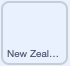
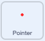

## రంగులు ఎంచుకోండి

ఈ ప్రాజెక్ట్ కోసం, మీరు యానిమేటెడ్ మరియు ఇంటరాక్టివ్ డేటా విజువలైజేషన్ చేస్తారు. సమాచారం దృశ్యమానంగా సూచించబడినప్పుడు, ప్రత్యేకించి అది చాలా సంఖ్యలను కలిగి ఉన్నప్పుడు తరచుగా అర్థం చేసుకోవడం సులభం. అందుకే పై చార్ట్‌లు మరియు గ్రాఫ్‌లు చాలా సమాచారాన్ని అందిస్తాయి. సమాచారాన్ని ఒకదానితో ఒకటి పోల్చడానికి అవి మీకు సహాయపడతాయి. కంప్యూటర్‌లతో, మీరు యానిమేటెడ్ లేదా ఇంటరాక్టివ్‌గా ఉండే ఉత్తేజకరమైన డేటా విజువలైజేషన్‌లను సృష్టించవచ్చు. ఈ ప్రాజెక్ట్ రెండింటినీ చేస్తుంది!

విద్యుత్‌ను ఉత్పత్తి చేయడానికి మూడు దేశాలు ఉపయోగించే వనరులను పోల్చి చూసే యానిమేటెడ్ మరియు ఇంటరాక్టివ్ డేటా విజువలైజేషన్‌ను రూపొందించడానికి మీరు పేర్చబడిన కాలమ్ గ్రాఫ్‌ని ఉపయోగిస్తారు.

--- task ---

**Online:** Scratch లో [స్టార్టర్ ప్రాజెక్ట్ ](http://rpf.io/electricity-generation-on){:target="_blank"} ని తెరవండి.

**Offline:** Scratch యొక్క ఆఫ్ లైన్ ఎడిటర్ లో [ప్రాజెక్టు స్టార్టర్ ఫైల్](http://rpf.io/p/te-IN/electricity-generation-go){:target="_blank"} ని తెరవండి. మీకు అవసరమైతే, మీరు [ఇక్కడ Scratch ను డౌన్ లోడ్ చేసి ఇన్‌స్టాల్ చేయవచ్చు.](https://scratch.mit.edu/download){:target="_blank"}.

--- /task ---

మీరు "Electricity generation % 2019" శీర్షికతో బూడిదరంగు నేపథ్యాన్ని చూడాలి. పేజీ దిగువన ఒక క్షితిజ సమాంతర రేఖ ఉంది.

{:width="400px"}

--- task ---

ఆకుపచ్చ జెండాను క్లిక్ చేయడం ద్వారా మీ ప్రాజెక్ట్ను అమలు చేయండి. కాలమ్ యొక్క యానిమేషన్ అదృశ్య పెన్ ద్వారా డ్రా చేయబడింది. ఇది విద్యుత్తును ఉత్పత్తి చేయడానికి New Zealand వనరుల వినియోగాన్ని చూపుతుంది. మీరు మీ మౌస్‌ని ఉపయోగించి ఇంటరాక్టివ్ కాలమ్‌ను పరిశోధించవచ్చు.

{:width="400px"}

New Zealand తమ విద్యుత్తును చాలావరకు జలవిద్యుత్‌ని ఉపయోగించి ఉత్పత్తి చేస్తుంది, అందుకే పైన ఉన్న కాలమ్‌లో చాలా వరకు ఊదా రంగు ఉంది.

మీరు కాలమ్‌ను పరిశోధించిన తర్వాత, ప్రోగ్రామ్‌ను ఆపివేయడానికి Stage పైన ఉన్న రెడ్ స్టాప్ బటన్‌పై క్లిక్ చేయండి.

--- /task ---

Stage దిగువన, మీరు ప్రతి వనరును సూచించే చతురస్రంతో ఖాళీ కీ ని చూస్తారు: తరిగిపోయే వనరులు, గాలి, సౌర, జల, భూఉష్ణ మరియు బయో ఎనర్జీ. ప్రస్తుతం గ్రాఫ్‌లో ఉపయోగించనప్పటికీ, కీ అన్ని వనరులను చూపుతుంది. ఎందుకంటే దేశాలు విద్యుత్‌ను ఉత్పత్తి చేసే విధానాన్ని ఎప్పటికప్పుడు మారుస్తూ ఉంటాయి మరియు పునరుత్పాదక వనరుల వైపు మొగ్గు చూపుతాయి.

తర్వాత మీరు మీ గ్రాఫ్‌లోని ప్రతి వనరులను సూచించడానికి రంగులను ఎంచుకుంటారు.

--- task ---

**Non-renewable** sprite లో **Costumes** ట్యాబ్‌పై క్లిక్ చేయండి. Paint editor మధ్యలో, ఏ రంగు లేని చతురస్రం ఉంది. **Fill** కలర్ చూజర్ పై క్లిక్ చేసి, Color, Saturation మరియు Brightness స్లయిడర్‌లను మార్చడం ద్వారా మీకు నచ్చిన రంగును సృష్టించండి.


--- /task ---

--- task ---

**Fill** టూల్‌ని ఎంచుకుని (ఇది పెయింట్ డబ్బాలా కనిపిస్తోంది) మరియు square costume లోపల క్లిక్ చేయండి. Stage పై కీ లోని మొదటి చతురస్రం కొత్త రంగుకి మారడం మీరు చూస్తారు.


--- /task ---

మీరు గ్రాఫ్‌లో తరిగిపోయే శక్తిని సూచించడానికి కొత్త రంగును ఎంచుకున్నారు. తర్వాత, మీరు **New Zealand** sprite లో వనరును మార్చాలి.

--- task ---

కోడ్‌ను వీక్షించడానికి **New Zealand** sprite యొక్క **Code** ట్యాబ్‌పై క్లిక్ చేయండి. మొదట `set pen color to`{:class="block3extensions"} బ్లాకుని కనుగొనండి మరియు `draw`{:class="block3myblocks"} `nonrenewable`{:class="block3variables"} బ్లాకుని బార్ గ్రాఫ్ రంగులు కల కోడ్ యొక్క విభాగం లో సెట్ చేయండి.



```blocks3

+set pen color to [#FCB711]
+draw (nonrenewable) ::custom
set pen color to [#F37021]
draw (wind) ::custom
set pen color to [#CC004C]
draw (solar) ::custom
set pen color to [#6460AA]
draw (hydro) ::custom
set pen color to [#0089D0]
draw (geothermal) ::custom
set pen color to [#0DB14B]
draw (bioenergy) ::custom

```

--- /task ---

--- task ---

మొదటి `set pen colour`{:class="block3extensions"} బ్లాక్ యొక్క రంగుల సర్కిల్‌పై క్లిక్ చేసి, మూడు రంగుల స్లయిడర్‌ల క్రింద ఉన్న **Colour picker** tool ని ఎంచుకోండి. మీరు ఆ రంగును ఎంచుకోవడానికి కీ లో **Non-renewable** sprite పై హోవర్ చేసే వరకు మౌస్ పాయింటర్‌ను తరలించండి.


మీరు ఎంచుకున్న **Non-renewable** వనరు రంగు ఇప్పుడు `set pen colour`{:class="block3extensions"} బ్లాక్‌లో కనిపించాలి:


```blocks3

set pen color to [#5e6766]
draw (nonrenewable) ::custom
```

--- /task ---

--- task ---

మీ ప్రాజెక్ట్‌ను మళ్లీ పరీక్షించండి. తరిగి పోయే వనరు New Zealand కోసం ఇప్పుడు మీ కొత్త రంగులో డ్రా చేయబడింది. మీ కాలమ్‌పై కర్సర్ ఉంచండి మరియు మీరు మీ కొత్త రంగును తాకినప్పుడు "non-renewable" స్పీచ్ బబుల్ లేదని మీరు గమనించవచ్చు. మీరు మీ పరీక్షను పూర్తి చేసిన తర్వాత Stage పైన ఉన్న ఎరుపు రంగు స్టాప్ బటన్‌పై క్లిక్ చేయండి.


--- /task ---

తరువాత, **Pointer** spriteలో రంగును మార్చడం ద్వారా తరిగి పోయే వనరు కోసం ఇంటరాక్టివ్ లేబుల్‌ను సృష్టించండి.

--- task ---

**Pointer** sprite పై క్లిక్ చేసి, రంగులు సెట్ చేయబడినప్పుడు కోడ్ విభాగాన్ని కనుగొనండి. `say Non-renewable`{:class="block3looks"} బ్లాకు పైన I`touching color`{:class="block3sensing"} బ్లాకులో, సర్కిల్ పైన క్లిక్ చేయండి మరియు **Colour picker** సాధనాన్ని ఉపయోగించి, కీ నుంచి కొత్త కలర్ ను ఎంచుకోండి:




```blocks3
+if {touching color (#5e6766)?} then
say [Non-renewable]
end
if {touching color (#F37021)?} then
say [Wind]
end
if {touching color (#CC004C)?} then
say [Solar]
end
if {touching color (#6460AA)?} then
say [Hydro]
end
if {touching color (#0089D0)?} then
say [Geothermal]
end
if {touching color (#0DB14B)?} then
say [Bioenergy]
end
if {touching color (#dadada)?} then
say ()
end

```


--- /task ---

--- task ---

మీ ప్రాజెక్ట్‌ను మళ్లీ పరీక్షించండి. మీరు మీ New Zealand కాలమ్‌లోని రిసోర్స్‌పై హోవర్ చేసినప్పుడు ఇంటరాక్టివ్ లేబుల్ "Non-renewable" అని చెప్పాలి. మీరు మీ పరీక్షను పూర్తి చేసిన తర్వాత Stage పైన ఉన్న ఎరుపు రంగు స్టాప్ బటన్‌పై క్లిక్ చేయండి.

--- /task ---

ఇప్పుడు ఇతర వనరులను సూచించడానికి మీ స్వంత రంగులను ఎంచుకోండి. ఉదాహరణకు, అవి ఎలా మారతాయో చూపించడానికి ప్రతి వనరు వేరే రంగులో ఉండాలని మీరు అనుకుంటున్నారా? లేదా పునరుత్పాదక ఇంధన వనరులన్నీ ఒకే రంగు యొక్క వివిధ ఛాయల్లో ఉండేలా మరియు తరిగి పోయే వనరులు వేరొక రంగులో ఉండాలని మీరు అనుకుంటున్నారా?

--- task ---

రిసోర్స్ sprite ల కోసం పై దశలను పునరావృతం చేయండి: **Wind**, **Solar**, **Hydro**, **Geothermal**, మరియు **Bioenergy**. ముందుగా మీ resource sprite లో రంగును మార్చాలని గుర్తుంచుకోండి, ఆపై దానిని కూడా అప్‌డేట్ చేయడానికి **New Zealand** sprite మరియు **Pointer** sprite లో ఆ రిసోర్స్ కోడ్‌ను కనుగొనండి.


--- /task ---

--- task ---

మీ ప్రాజెక్ట్‌ను మళ్లీ పరీక్షించండి. మీరు అన్ని వనరుల కోసం ఊహించిన విధంగా గ్రాఫ్ కనిపిస్తోంది మరియు ఇంటరాక్టివ్ ఉందో లేదో తనిఖీ చేయండి.

--- /task ---

--- save ---
