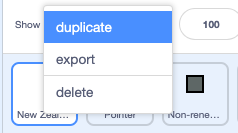

## UK కాలమ్‌ని జోడించండి

ఈ దశలో, మీరు UK కాలమ్‌ని జోడించి డేటాతో నింపబోతున్నారు, తద్వారా మీరు New Zealand నుండి UKతో ఫలితాలను పోల్చవచ్చు.

మీరు UK కోసం ఒక నిలువు వరుసను సృష్టించబోతున్నారు. దీన్ని చేయడానికి, మీరు **New Zealand** sprite ను కాపీ చేస్తారు.

--- task ---

**New Zealand** sprite పై క్లిక్ చేసి, **duplicate** ని ఎంచుకోవడానికి రైట్-క్లిక్ చేయండి.

{:width="300px"}

--- /task ---

--- task ---

కొత్త sprite `UK` పేరు మార్చండి.

--- /task ---

ప్రోగ్రామ్‌ని అమలు చేయండి. **UK** sprite ప్రోగ్రామ్ లో ఉన్నప్పటికీ, అది అమలులో లేనట్లు కనిపించడాన్ని మీరు చూస్తారు. ఎందుకంటే గ్రాఫ్‌లోని **New Zealand** sprite కాలమ్ కింద **UK** sprite కాలమ్ చేయబడింది. **UK** sprite చూడగలిగేలా, మీరు **UK** sprite యొక్క నిలువు వరుసను Stage పై డ్రా అవడం ప్రారంభించిన స్థానాన్ని తరలించాలి.

--- task ---

**UK** sprite యొక్క **Code** ట్యాబ్‌కి వెళ్లండి.

--- /task ---

--- task ---

స్క్రిప్టు పైభాగంలో `go to x: y: `{:class="block3motion"} బ్లాక్‌ కోసం వెదకండి. ఇది `x:`{:class="block3motion"} `-200` మరియు `y:`{:class="block3motion"} `-140` విలువలను కలిగి ఉంది. `x`{:class="block3motion"} విలువను `-20`కి మాత్రమే మార్చండి. `y`{:class="block3motion"} విలువ `-140` వద్ద ఉండగలదు:


```blocks3
go to x: (-20)y: (-140)
```

--- /task ---

--- task ---

ఆకుపచ్చ జెండాపై క్లిక్ చేయండి. మీరు ఇప్పుడు **New Zealand** sprite కాలమ్‌కు కుడి వైపున **UK** sprite కాలమ్‌ను చూడగలరు.

{:width="400px"}

--- /task ---

అయినప్పటికీ, ఇది UKకి సంబంధించిన కాలమ్ అని స్పష్టంగా తెలియదు, ఎందుకంటే టైటిల్ ఇప్పటికీ **New Zealand** sprite కాలమ్ వెనుక దాచబడింది. మీరు దానిని చూడగలిగేలా Stage పై టైటిల్ కనిపించే స్థానాన్ని మీరు తరలించాలి.

--- task ---

మళ్ళీ, **UK** sprite యొక్క **Code** ట్యాబ్‌కి వెళ్లండి. పొడవైన స్క్రిప్ట్ చివర `go to x:`{:class="block3motion"} `-200` `y:`{:class="block3motion"} `70` బ్లాకుని కనుగొనండి. `x`{:class="block3motion"} విలువను మాత్రమే `-20`కి మార్చండి. `y`{:class="block3motion"} విలువ `70` దగ్గరనే ఉండవచ్చు:


```blocks3
go to x: (-20)y: (70)
```

--- /task ---

--- task ---

ఆకుపచ్చ జెండాపై క్లిక్ చేయండి. మీరు ఇప్పుడు కుడివైపు నిలువు వరుస పైన **UK** sprite శీర్షిక ను చూడగలరు. లేదు! ఇది ఇప్పటికీ "New Zealand" అని చెబుతోంది.

{:width="400px"}

--- /task ---

మీరు `say`{:class="block3looks"} బ్లాక్‌లోని వచనాన్ని మార్చాలి, తద్వారా అది "UK" అని చెప్పబడుతుంది.

--- task ---

`go to x:`{:class="block3motion"} `-20` `y:`{:class="block3motion"} `70` కింద, `say`{:class="block3looks"} బ్లాకును జోడించండి మరియు `UK` అని టైపు ఛేయండి. స్పీచ్ బబుల్ మధ్యలో "UK" అనే శీర్షిక ఉండేలా, ముందుగా మీ కీబోర్డ్‌లోని స్పేస్ బార్‌ను నాలుగు సార్లు నొక్కి, ఆపై `UK`అని టైప్ చేయండి:


```blocks3
go to x: (-20) y: (70)
+ say [UK]
```
--- /task ---

--- task ---

ఆకుపచ్చ జెండాపై క్లిక్ చేయండి. మీరు ఇప్పుడు **UK** sprite శీర్షికను స్పీచ్ బబుల్ మధ్యలో మరియు కుడివైపు నిలువు వరుసకు ఎగువన చూడగలరు.

{:width="300px"}

--- /task ---

**UK** sprite యొక్క కాలమ్ ఇప్పటికీ **New Zealand** sprite యొక్క శక్తి విలువలను చూపుతున్నందున నిలువు వరుసలు ఒకే విధంగా ఉన్నాయి.

{:width="400px"}

--- task ---

**UK** sprite యొక్క **Code** ట్యాబ్ లోపల, ప్రతి రిసోర్స్ వేరియబుల్ యొక్క విలువను చూపే ఆరు `set`{:class="block3variables"} బ్లాకుల శ్రేణి పరిశోధించండి. ప్రతి బ్లాక్‌లోని విలువ మొత్తం మీద (100%) వనరు యొక్క శాతాన్ని (%) సూచిస్తుంది. `set`{:class="block3variables"} బ్లాక్‌లు ఇప్పటికీ **New Zealand** కోసం డేటాను చూపుతున్నాయని గుర్తుంచుకోండి:


```blocks3
set [nonrenewable v] to (18)
set [wind v] to (5)
set [solar v] to (0)
set [hydro v] to (57)
set [geothermal v] to (19)
set [bioenergy v] to (1)
```
--- /task ---

**UK** sprite ప్రోగ్రామ్‌లో, మీరు `set`{:class="block3variables"} బ్లాక్ విలువలను దిగువ పట్టికలో ఇచ్చిన విలువలతో భర్తీ చేయాలి.

వనరు రకం | UK |
- | - |
**Non-renewables** | 64 |
**Wind** | 20 |
**Solar** | 4 |
**Hydro** | 2 |
**Geothermal** | 0 |
**Bioenergy** | 10 |

<br/><br/>

--- task ---

మొదటి బ్లాక్ `set non-renewable`{:class="block3variables"}కి సెట్ చేయండి, `64`విలువను జోడించండి. UK లో విద్యుత్తును ఉత్పత్తి చేయడానికి ఉపయోగించే వనరులలో 64 శాతం తరిగిపోయే వనరులు ప్రాతినిధ్యం వహిస్తాయని ఈ విలువ సూచిస్తుంది:


```blocks3
set [nonrenewable v] to (64)
```

--- /task ---

--- task ---

మిగిలిన `set`{:class="block3variables"} బ్లాక్‌లను ఉపయోగించి అన్ని వనరుల కోసం విలువలను పూర్తి చేయడానికి పై పట్టికను చూడండి. మీ ప్రాజెక్ట్ ఇలా కనిపించాలి:


```blocks3
set [nonrenewable v] to (64)
set [wind v] to (20)
set [solar v] to (4)
set [hydro v] to (2)
set [geothermal v] to (0)
set [bioenergy v] to (10)
```

--- /task ---

--- task ---

మీరు విలువలను సరిగ్గా ఇన్‌పుట్ చేశారని తనిఖీ చేయండి. డబుల్ చెక్ చేసే వరకు విలువలను జోడించండి: 64 + 20 + 4 + 2 + 0 + 10 = 100. మొత్తం ఎల్లప్పుడూ 100 ఉండాలి ఎందుకంటే ప్రతి బ్లాక్‌లోని విలువ మొత్తం మీద వనరు యొక్క శాతం (%) సహకారాన్ని సూచిస్తుంది, ఇది 100 శాతం.

--- /task ---

--- task ---

New Zealand మరియు UK శక్తిని ఉత్పత్తి చేయడానికి ఉపయోగించే వనరులను సరిపోల్చడానికి ప్రోగ్రామ్‌ను అమలు చేయండి. New Zealand కంటే UK ఎక్కువ బయోఎనర్జీని ఉపయోగిస్తుందని మీరు గమనించవచ్చు. New Zealand విద్యుత్తును ఉత్పత్తి చేయడానికి UK కంటే చాలా ఎక్కువ జలశక్తిని ఉపయోగిస్తుందని మీరు గమనించవచ్చు.

{:width="400px"}

ప్రతి దేశం విద్యుత్తును ఉత్పత్తి చేయడానికి ఎంత పునరుత్పాదకం కాని శక్తిని ఉపయోగిస్తుందో పరిశోధించండి. పునరుత్పాదకం కాని వనరులను ఉపయోగించడాన్ని దేశాలు ఎలా పోల్చాయి?

--- /task ---

--- save ---
