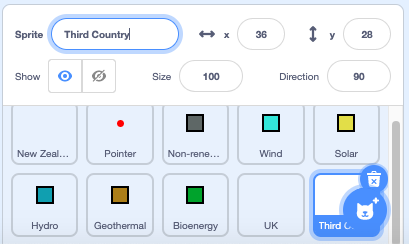
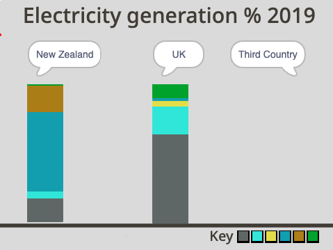

## మూడవ దేశాన్ని ఎంచుకోండి

ఈ దశలో, మీరు మీ స్వంత నిలువు వరుసను సృష్టించడం ప్రారంభించబోతున్నారు.

Country sprite లకు గ్రాఫిక్ లేదని మీరు గమనించి ఉండవచ్చు. ఎందుకంటే ప్రోగ్రామ్‌లో sprite లు కదులుతున్నప్పుడు, మీరు వాటి సంబంధిత చర్యల `Pen`{:class="block3extensions"} మరియు స్పీచ్ బబుల్‌ని మాత్రమే చూడాలి, sprite ని కాదు.

ఇప్పుడు మీరు costume లేకుండా కొత్త sprite ని సృష్టించాలి.

--- task ---

**Choose a Sprite** ని ఎంచుకోండి మరియు **Paint** ఎడిటర్‌ను ఎంచుకోండి.

{:width="300px"}

--- /task ---

మీ కొత్త sprite కి పేరు పెట్టండి. అనేక దేశాలు మరియు అవి విద్యుత్తును ఉత్పత్తి చేయడానికి ఉపయోగించే వనరుల శాతాన్ని జాబితా చేసే పట్టిక క్రింద ఉంది. జాబితా చేయబడిన దేశాలలో ఏదైనా ఒకదాన్ని ఎంచుకోండి. మీరు (ఇది ఇప్పటికే ప్రాతినిధ్యం వహించకపోతే), పొరుగు దేశం వారు కావచ్చు, మీరు ఎక్కడో సందర్శించిన దేశం కావచ్చు లేదా వనరులలో ఒకదానిని పెద్ద మొత్తంలో ఉపయోగించే దేశం కావచ్చు.

--- task ---

దిగువ పట్టికను పరిశోధించి, మీరు గ్రాఫ్ కోసం ఏ దేశాన్ని ఉపయోగించాలనుకుంటున్నారో నిర్ణయించుకోండి.

Resource type | Brazil | Canada | Iceland | India | Ireland | Norway | Singapore | S.Africa | USA | | --- | :---: | :---: | :---: | :---: | :---: | :---: | :---: | :---: | :---: | **Non-renewable** | 18 | 34 | 0 | 81 | 64 | 2 | 99 | 94 | 83 | **Wind** | 9 | 5 | 0 | 5 | 32 | 4 | 0 | 3 | 7 | **Solar** | 1 | 1 | 0 | 3 | 0 | 0 | 1 | 1 | 2 | **Hydro** | 63 | 58 | 70 | 11 | 4 | 94 | 0 | 2 | 7 | **Geothermal** | 0 | 0 | 30 | 0 | 0 | 0 | 0 | 0 | 0 | **Bioenergy** | 9 | 2 | 0 | 0 | 0 | 0 | 0 | 0 | 1 |

--- /task ---

--- task ---

మీరు ఎంచుకున్న దేశం పేరుతో **Sprite1** పేరు మార్చండి. ఈ వనరులో, ఈ sprite **Third Country** sprite గా సూచించబడుతుంది.

{:width="300px"}

--- /task ---

ప్రోగ్రామ్ రన్ అయినప్పుడు, మీరు **Third Country** sprite, Stage పై ఒక స్థానానికి వెళ్లాలని మరియు స్పీచ్ బబుల్‌ని ఉపయోగించి, **New Zealand** మరియు **UK** sprite ల మాదిరిగానే దాని పేరును చెప్పాలని మీరు కోరుకుంటారు.

--- task ---

**Third country** sprite కోసం **code** ఎడిటర్‌కి వెళ్లండి.

మీరు ఎన్నుకొన్న దేశం పేరు టైప్ చేయడానికి, `when green flag clicked`{:class="block3events"}, `go to x:`{:class="block3motion"} `200` `y:`{:class="block3motion"} `70`, మరియు ఒక `say`{:class="block3looks"} బ్లాకుని జోడించండి:

```blocks3
when flag clicked
go to x: (200 )y: (70)
say [Third Country] ::looks
```

--- /task ---

--- task ---

ప్రోగ్రామ్‌ని అమలు చేయండి. Sprite కనిపించకుండా ఉండాలి మరియు Stage కి ఎగువ కుడి వైపున కల దాని శీర్షికను చెప్పాలి. ఉదాహరణ "Third Country" అని చెబుతుంది.

{:width="300px"}

--- /task ---

--- save ---
