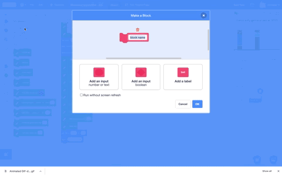

## మూడవ నిలువు వరుసను గీయండి

ఇప్పుడు మీరు **Third Country** sprite కోసం నిలువు వరుసను గీయడానికి మునుపటి దశలో సృష్టించిన రిసోర్స్ వేరియబుల్‌లను ఉపయోగించాల్సిన సమయం వచ్చింది.

Scratchలో, మీరు కొత్త స్క్రిప్ట్‌ను ప్రారంభించే బ్లాక్‌ను తయారు చేయవచ్చు మరియు ఈ కొత్త స్క్రిప్ట్‌లో ఏవైనా Scratch బ్లాక్‌లను జోడించవచ్చు. మీరు మీ ప్రోగ్రామ్‌లో ఎక్కడైనా స్క్రిప్ట్‌ని మళ్లీ ఉపయోగించుకోవచ్చు.

--- task ---

`My Blocks`{:class="block3myblocks"} మెనుకి వెళ్లి **Make a Block**పై క్లిక్ చేయండి. బ్లాక్ పేరును `draw` అనండి, మరియు **Add an input number or text** పై క్లిక్ చేయండి. విలువను `number or text` నుండి `amount` కి మార్చండి, ఆపై **OK** క్లిక్ చేయండి.

--- no-print ---



--- /no-print ---

**Third Country** sprite కోడ్ ఏరియాలో కొత్త `define`{:class="block3myblocks"} బ్లాక్ సృష్టించబడిందని మీరు చూస్తారు:

```blocks3
define draw (amount)
```

--- /task ---

నిలువు వరుసలో మొదటి పంక్తిని సృష్టించడానికి, **Third Country** sprite ని పెన్ డౌన్ తో తరలించి, ఆపై దాన్ని గుండ్రంగా తిప్పి, Stage పైకి కొద్దిగా తరలించండి.

--- task ---

ఈ మూడు `Motion`{:class="block3motion"} బ్లాకులను మీ కొత్త `draw`{:class="block3extensions"} బ్లాకు: `move`{:class="block3motion"} `50` `steps`{:class="block3motion"}, `turn right`{:class="block3motion"} `180` `degrees`{:class="block3motion"}, మరియు `change y by`{:class="block3motion"} `2`:

```blocks3
define draw (amount)
+move (50) steps
+turn right (180) degrees
+change y by (2)
```

--- /task ---

ప్రతి వనరు కోసం సరైన సంఖ్యలో లైన్లను గీయడానికి మీ కొత్తగా నిర్వచించిన `draw`{:class="block3myblocks"} బ్లాక్‌ని ఉపయోగించండి.

--- task ---

`My Blocks`{:class="block3myblocks"} మెను నుండి, ప్రతి `set pen color to`{:class="block3extensions"} బ్లాకుల తర్వాత, ఒక `draw`{:class="block3myblocks"} బ్లాకుని చొప్పించండి. కింది క్రమంలో ప్రతి వేరియబుల్‌ను `draw`{:class="block3myblocks"} బ్లాక్‌లకు లాగండి:
+ `nonrenewable`{:class="block3variables"}
+ `wind`{:class="block3variables"}
+ `solar`{:class="block3variables"}
+ `hydro`{:class="block3variables"}
+ `geothermal`{:class="block3variables"}
+ `bioenergy`{:class="block3variables"}.

చివరిగా మిగిలిన `draw`{:class="block3myblocks"} బ్లాక్‌లో, `1`విలువను టైప్ చేయండి. ఇది నిలువు వరుస చివరను క్లీన్ అప్ చేయడానికి బ్యాక్‌డ్రాప్‌కు సమానమైన రంగులో ఉండే లైన్‌ను జోడిస్తుంది:

```blocks3
when flag clicked
erase all
set (nonrenewable) to (17)
set (wind) to (17)
set (solar) to (17)
set (hydro) to (17)
set (geothermal) to (17)
set (bioenergy) to (15)
pen up
go to x:(120) y: (-140)
set rotation style [don't rotate v]
point in direction (90)
set pen size to (2)
pen down
set pen color to [#5e6766]
+draw (nonrenewable)
set pen color to [#37e4db]
+draw (wind)
set pen color to [#e4d748]
+draw (solar)
set pen color to [#169bb0]
+draw (hydro)
set pen color to [#ab7519]
+draw (geothermal)
set pen color to [#00a42c]
+draw (bioenergy)
set pen color to [#dadada]
+draw (1)
pen up
go to x: (160) y: (70)
say [Third Country]
```

--- /task ---

--- task ---

ప్రోగ్రామ్‌ని అమలు చేయండి. **Third Country** sprite లో, ప్రతి వనరు కోసం పెన్ కేవలం ఒక సన్నని గీతను గీస్తుందని మీరు చూడాలి. ప్రతి వనరు కోసం పెన్ సరైన మొత్తాన్ని డ్రా చేయడానికి, మీరు `repeat`{:class="block3control"} ని ప్రతి వనరు రకం యొక్క మొత్తానికి సెట్ చేయాలి.

--- /task ---

మీ `draw`{:class="block3myblocks"} బ్లాక్‌లు ప్రతి వనరు కోసం విద్యుత్ మొత్తాన్ని నిల్వ చేయడానికి సెటప్ చేయబడ్డాయి, అయితే మీరు నిర్వచించిన కోడ్ ఇప్పటికీ మీ స్క్రిప్ట్‌లో కనిపించిన ప్రతిసారీ ఒకసారి మాత్రమే నడుస్తుంది. `draw`{:class="block3myblocks"} బ్లాక్ ఎన్నిసార్లు పునరావృతం అవుతుందో నియంత్రించడానికి నిల్వ చేయబడిన `amount`{:class="block3myblocks"}ని ఉపయోగించండి.

--- task ---

`define`{:class="block3myblocks"} బ్లాక్ కింద `repeat`{:class="block3control"} బ్లాక్‌ను జోడించండి. రౌండెడ్ బ్లాకు `amount`{:class="block3myblocks"} ను `define`{:class="block3myblocks"} నుండి `repeat`{:class="block3control"} block లోనికి డ్రాగ్ చేయండి:

--- no-print ---


--- /no-print ---

```blocks3
define draw (amount)
+repeat (amount)
move (50) steps
turn right (180) degrees
change y by (2)
end
```

--- /task ---

--- task ---

మీ ప్రాజెక్ట్‌ను పరీక్షించండి. **Third Country** sprite కోసం నిలువు వరుస ఇప్పుడు పూర్తి కావాలి మరియు మీరు ఎంచుకున్న విలువలను చూపాలి. మీరు ప్రతి వనరుపై హోవర్ చేసినప్పుడు, లేబుల్ కనిపించాలి.

--- /task ---

--- save ---
